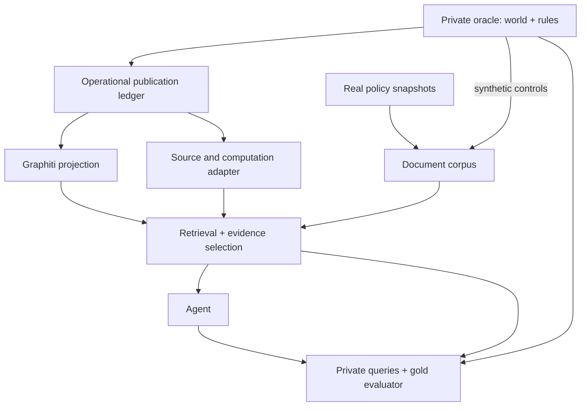
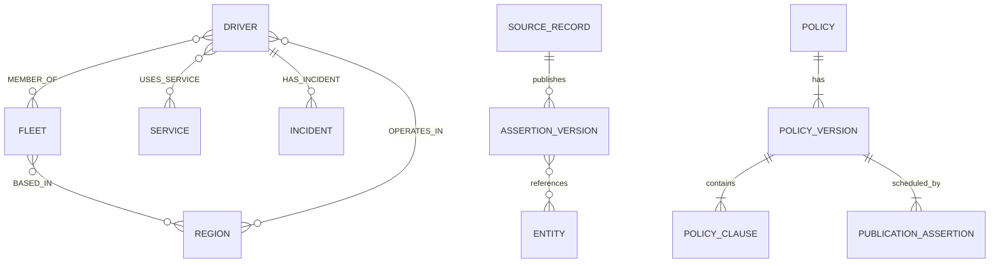
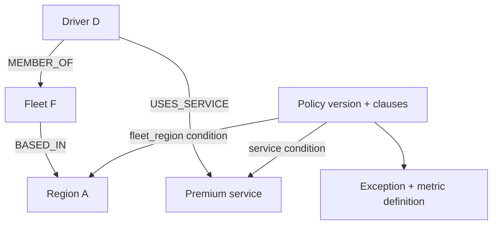

# GSM — Synthetic Schema and Data Design

**Schema v1.1 — FROZEN cho phạm vi đã qua compatibility audit**  
**Document revision:** v1.1.1 · 16/09/2026 — đồng bộ corpus profiles; business schema, T01–T07 và bindings không đổi.  
**Audit ID:** `gsm-policy-compat-20260916-v1` · **Ngày:** 16/09/2026

Mục tiêu là xây dữ liệu tổng hợp có nguồn policy và gold kiểm chứng được cho document retrieval, temporal KG retrieval, hybrid context và agent reasoning. Bản này thay thế trạng thái candidate mở rộng trước đó bằng **phạm vi đã chọn sau audit**. Dự án vẫn kéo dài khoảng sáu tuần, giữ Graphiti làm graph reference và không xây memory framework mới.

| Kết quả quyết định | Phạm vi chốt |
| --- | --- |
| Policy audit | 6 families ứng viên, 6 source snapshots, 41 clause locators, 56 hàng condition |
| Decisions | 12 USE, 3 AMEND, 8 CONVENTION, 33 DEFER; đây là quyết định thiết kế, không phải số tính năng đã triển khai |
| Task whitelist | 7 task templates T01–T07 thuộc 4 families; 2 families còn lại hoãn decision/numeric tasks |
| Minimal amendments | AM1 source snapshot/locators; AM2 reported measures; AM3 driver program; AM4 task/binding metadata. Chỉ thêm **hai operational predicates**: REPORTED_MEASURE và DRIVER_PROGRAM |
| Giữ nền tảng v1.0 | IDs, scope, immutable ledger, four clocks, provenance, source precedence, coverage, semantic gold; legacy trip/incident/state và derived cancel_rate_30d |
| Hoãn khỏi implementation bắt buộc | Offer lifecycle, online sessions, revenue entries, raw ratings, service-unit events, payroll/attendance, cohort chi tiết, scoped-policy override engine |
| Đã kiểm tra khi viết tài liệu | 25 worked examples: arithmetic, period/entity matching, finite ledger prefixes và proof requirements |
| Chưa được chứng nhận | Generator/Graphiti conformance, model performance, full dataset release, production data mapping, SLA hoặc quyền lợi thực tế |

`MUST` là contract; `SHOULD` là mặc định có thể cấu hình có ghi nhận. **Freeze chỉ áp dụng schema và task semantics được chọn**, không phê duyệt các hàng DEFER. Mọi driver/event/report trong benchmark là dữ liệu tổng hợp. Nguồn policy là snapshot được người dùng cung cấp; không khẳng định đó là nội dung website mới nhất hoặc toàn bộ lịch sử policy.

Đối chiếu chính: `docs/01_problem_and_evaluation.md`, `docs/research/gsm_retrieval_research.md`, `docs/research/gsm_paper_matrix.xlsx`. Ma trận paper tiếp tục xếp Graphiti, document baseline và temporal evaluation vào ưu tiên đầu; các hàng LongMemEval/TG-RAG hỗ trợ protocol update/abstention, KG²RAG hỗ trợ kiểm tra bridge/evidence organization. Không dùng paper để tự định nghĩa công thức nghiệp vụ còn thiếu.

## 0. Policy → Required Data Compatibility Audit

### 0.1. Baseline đối chiếu, dữ liệu và cách ra quyết định

Baseline của cột Existing là **schema v1.0 trước amendments**, SHA-256 `ce941c78c877aa7f2fa0d8c58d25bbf72c790afa20c56e0775170aa60bdcba79`. Không dùng fields trong candidate v1.1 để chứng minh chính amendment đó đã tồn tại.

| Mã | Định nghĩa |
| --- | --- |
| D — Direct | v1.0 có đúng loại dữ liệu/semantics; không đồng nghĩa đã có dữ liệu thật hoặc adapter chạy được |
| R — Derivable | Có thể tính từ primitives v1.0 nếu source population/coverage đủ |
| M — Missing | Thiếu observable/type/definition cần thiết |
| U — Undefined | Nguồn chưa xác định đủ nghĩa, denominator, calendar, composition hoặc version; thêm field đơn thuần không giải quyết được |
| DOC / NONE | DOC: nội dung đã có trong attachment. NONE: chưa có operational sample/generator output được kiểm chứng cho observable này; ví dụ nhỏ trong tài liệu không thay dataset |
| USE | Dùng lại semantics v1.0 hoặc clause đã kiểm text; AM1 về nguồn áp dụng chung |
| AMEND | Có task được chọn cần extension tối thiểu đã xác định |
| CONVENTION | Dùng dưới convention công khai đã pin; có thể đồng thời cần AM2/AM3. Không gọi convention là định nghĩa nội bộ GSM |
| DEFER | Không triển khai/chấm decision task này trong release v1.1; lưu blocker và nguồn để mở lại sau |
| Gold E / D | E=evidence gold; D=decision/numeric gold. “Có” nghĩa là thiết kế khả thi với input đúng contract, chưa tuyên bố đã sinh toàn bộ gold dataset |

Một hàng chỉ có một decision chính; precedence khi có nhiều vấn đề là DEFER → CONVENTION → AMEND → USE. Đơn vị audit là **family × task × condition**. Một condition có thể dùng được cho Q1 nhưng chưa đủ để chấm một quyết định tổng hợp; các hàng ghi rõ sự khác nhau đó.

### 0.2. Sáu families ứng viên và lý do chọn

Family là một cơ chế/quy tắc nghiệp vụ tương đối độc lập. Một bài P05 chứa nhiều families; P172/P23 liên quan cùng chương trình, nhưng grouping này **không tự tạo supersession edge**. Các mã Pxx là prefix file, không phải số hiệu policy GSM hoặc ID paper.

| Family | Nội dung | Nguồn / edition ứng viên | Năng lực đánh giá | Quyết định |
| --- | --- | --- | --- | --- |
| PF01 | Doanh số tối thiểu / truy thu phần thiếu | P154; P05 phần khoán tuần | Ngưỡng số, scope ngày/vùng, correction làm đổi số tiền | T01/T02 giữ; D01 hoãn |
| PF02 | Tỷ lệ vận hành / chế tài | P151; P05 phần auto-accept | Strict threshold, metric theo thời điểm, wrong-version distractor | T03 giữ; D02 phạt tuần/streak hoãn |
| PF03 | Thưởng tuần theo điểm và chất lượng | P05 phần thưởng + FAQ | Definition retrieval, clock/unit mismatch, một điều kiện numeric | T04/T05 giữ; D03 full reward hoãn |
| PF04 | Thưởng vượt ngày công và thông báo tạm dừng | P172 + P23 | Document change, entity scope, fleet identity; giới hạn lịch sử | T06/T07 giữ; D04 payout/actual effective-time hoãn |
| PF05 | Đảm bảo thu nhập theo nhóm tài xế | P26 | Cohort/window/conjunction phức tạp; kiểm soát scope expansion | D05 hoãn toàn bộ decision/numeric tasks |
| PF06 | Chia sẻ doanh số theo dịch vụ | P05 phần chia sẻ | Revenue basis và gross/net; kiểm tra nhu cầu dựng accounting data | D06 hoãn; giữ nguồn làm corpus có provenance |

Bộ chọn bao phủ scope, threshold, metric window, document definitions, phiên bản và thay đổi phạm vi. Đây là representativeness theo **năng lực kiểm thử**, chưa phải phân bố truy vấn/doanh nghiệp GSM. Chỉ chọn các tác vụ khả thi bên dưới; không phải cứ đủ sáu families là phải triển khai mọi field chúng có thể cần.

### 0.3. Source snapshots và mức kiểm chứng

ZIP có 224 bài riêng và một file tổng hợp; file tổng hợp lặp lại nội dung các bài và không được index như evidence độc lập. Snapshot identity dùng raw bytes/hash; “ngày đăng” chỉ là metadata của trang. `captured_at` chưa có bằng chứng thì unknown. `dataset_release_at` là đồng hồ thực nghiệm riêng.

| Source | Tên / URL nguồn | Ngày đăng trong file | Edition benchmark bất biến | Review |
| --- | --- | --- | --- | --- |
| P154 | [Doanh số tối thiểu Hà Nội](https://www.greensm.com/vn-vi/news/cap-nhat-quy-dinh-doanh-so-toi-thieu-tai-ha-noi) | 2025-06-19 | `snap-154-d4af28195271` | TEXT đã đọc, không OCR |
| P151 | [Quy định vận doanh](https://www.greensm.com/vn-vi/news/cap-nhat-quy-dinh-van-doanh) | 2025-07-15 | `snap-151-063bee730825` | TEXT đã đọc; OCR chưa kiểm ảnh |
| P05 | [Thu nhập/vận doanh Bike Hà Nội–TP.HCM](https://www.greensm.com/vn-vi/news/cap-nhat-chinh-sach-thu-nhap-van-doanh-ha-noi-ho-chi-minh-dong-nai) | 2026-08-15 | `snap-05-a4bc920aa65c` | TEXT đã đọc; OCR chưa kiểm ảnh |
| P172 | [Thưởng vượt ngày công](https://www.greensm.com/vn-vi/news/thuong-khi-vuot-ngay-cong-tai-tphcm) | 2025-04-18 | `snap-172-7c3be60e9040` | TEXT đã đọc; OCR chưa kiểm ảnh |
| P23 | [Tạm dừng thưởng vượt ngày công](https://www.greensm.com/vn-vi/news/cap-nhat-chinh-sach-thu-nhap-tam-dung-chinh-sach-thuong-vuot-ngay-cong) | 2026-06-12 | `snap-23-b62fd1ddee0c` | TEXT đã đọc; OCR chưa kiểm ảnh |
| P26 | [Điều kiện đảm bảo thu nhập Taxi](https://www.greensm.com/vn-vi/news/bac-tai-xanh-taxi-cap-nhat-dieu-kien-chinh-sach-dam-bao-thu-nhap-thang6-2026) | 2026-06-09 | `snap-26-c308c04cb3de` | TEXT đã đọc; OCR chưa kiểm ảnh |

| Source | Archive member chính xác | SHA-256 raw bytes |
| --- | --- | --- |
| P154 | `PolicyGreenSM/154_2025-06-19_[HÀ NỘI] CẬP NHẬT QUY ĐỊNH DOANH SỐ TỐI THIỂU.md` | `d4af281952715d325bf533c265e3b046cda622b3bd51e05d066d61b64439c033` |
| P151 | `PolicyGreenSM/151_2025-07-15_[QUAN TRỌNG] CẬP NHẬT QUY ĐỊNH VẬN DOANH.md` | `063bee7308254d5dbf4fc3c93edb0c1f902e80c3444082a83a686687d3be1368` |
| P05 | `PolicyGreenSM/05_2026-08-15_Cập Nhật Chính Sách Thu Nhập Và Vận Doanh – Vững Vàng Th.md` | `a4bc920aa65c42d81ac04e6b7594a74efc61fc7c2116bdbb1653c02ca5cecc4e` |
| P172 | `PolicyGreenSM/172_2025-04-18_Thưởng ngay 200.000VNĐ cho mỗi ngày vượt ngày công chuẩ.md` | `7c3be60e90400504db49b83e2fb6eb0f745ae173d751f5b5351d3ca1f1c23c8d` |
| P23 | `PolicyGreenSM/23_2026-06-12_Cập nhật chính sách thu nhập_ TẠM DỪNG CHÍNH SÁCH THƯỞNG.md` | `b62fd1ddee0ca6a0a75d3ccb6dfc85156c819560c233111a3995f862006103b4` |
| P26 | `PolicyGreenSM/26_2026-06-09_[Bác Tài Xanh Taxi] Cập nhật điều kiện chính sách đảm bả.md` | `c308c04cb3de5e219c5488d8091bcfd08fea673f1007f669ba9ba065e7a01315` |

Archive SHA-256: `cfe9e4555dbedf81396004c7a7d0ace52dcbb1deb758110c4aded3b6741ba9c9`.

Review method: đọc text attachment, đối chiếu điều kiện/nguồn và kiểm tra anchors chính xác bằng script. Chưa có business sign-off từ GSM, chưa đối chiếu ảnh gốc và chưa kiểm tra phiên bản live. Vì vậy, **không condition nào chỉ có OCR được đưa vào task whitelist**. P172 ngày đăng tháng 4 nhưng ảnh trích nêu hiệu lực tháng 8; giữ cả hai observations, không tự dựng lịch sử nội dung tháng 4.

### 0.4. Task whitelist và giới hạn claim

| Task | Family | Query được chốt | Đầu ra / loại gold | Ngoài phạm vi của task |
| --- | --- | --- | --- | --- |
| T01 | PF01 | Policy P154 được chỉ định nói gì về scope, ngày vận doanh và công thức truy thu? | Q1; clause/definition/formula evidence, source-grounded | Không hỏi policy đang áp dụng trong production |
| T02 | PF01 | Áp dụng công thức của edition P154 được cấp cho số liệu ngày của D trong scenario | Q4; amount/không áp dụng/thiếu/conflict; conditional_binding. Q6/Q7 variants cho corrections/missing | Không xác minh thành phần doanh số app, actual wallet charge hoặc current policy |
| T03 | PF02 | Theo riêng rule auto-accept trong edition P151, reported AR tại checkpoint có thỏa ngưỡng không? | Q4; condition_met và action literal; conditional_binding | Không phạt tuần, không xác nhận hệ thống thật đã bật tính năng |
| T04 | PF03 | FAQ P05 dùng mốc giờ nào, đơn vị nào cho đa điểm, tính rating/tuần ra sao? | Q1; definition/clock/unit evidence, source-grounded | Không tự tính points từ trips, không dùng bảng OCR làm numeric gold |
| T05 | PF03 | Reported weekly rating của D có đạt **riêng điều kiện >4,85** trong FAQ không? | Q4; rating_condition_met/thiếu/conflict; conditional_binding | Không kết luận đủ điều kiện thưởng tuần hay số tiền thưởng |
| T06 | PF04 | Thông báo P23 nêu nhóm Depot nào và kỳ áp dụng nào? | Q1; scope set và literal “kỳ lương tháng 6/2026”, source-grounded | Không chuyển kỳ lương thành UTC dates |
| T07 | PF04 | Theo fleet registry và state tại T được cấp, D có thuộc **nhóm đối tượng thông báo P23 nêu** không? | Q4; in_notice_scope/thiếu/conflict; conditional_binding. Q6 khi đổi membership | Không khẳng định thông báo đang effective tại T hoặc Depot 2 vẫn được thưởng |

`source_grounded` mô tả grounding vào snapshot đã đọc, không xác nhận production truth. T02/T03/T05/T07 phải có premise/convention công khai trong query hoặc application context. Task phrasing phải giữ “riêng điều kiện”/“phạm vi thông báo” khi tương ứng. Public inputs không chứa private task/family/gold labels.

Q2, Q3, Q5 và temporal foundation vẫn được kiểm tra qua state/trip/incident/bridge fixtures v1.0 trong track `synthetic_control`. Không ép T07 thành multi-hop nếu policy đã xác định chính xác Fleet IDs và một membership edge đã đủ; minimal proof phải được chấp nhận.

### 0.5. Compatibility matrix theo condition

Trong cột v1.0/data, D/R/M/U là schema support, DOC/NONE là data availability. “E có” chỉ áp dụng claim được source hỗ trợ; không lan sang full eligibility hoặc payout.

#### PF01 — Doanh số tối thiểu / truy thu phần thiếu

| Row / task | Condition / source | Required observable | v1.0 / data | Decision | Amendment | Gold E/D |
| --- | --- | --- | --- | --- | --- | --- |
| C01 / T01/T02 | Xác định đúng snapshot/edition được hỏi; `s154.date` | Doc snapshot, clause, source hash và known release | D / DOC | USE | AM1 cho corpus thật | E có; D chỉ edition được chỉ định |
| C02 / T02 | Đối tác Bike; `s154.scope` | driver.program tại kỳ xét | M / NONE | AMEND | AM3 DRIVER_PROGRAM | E/D khả thi với fact tổng hợp |
| C03 / T02 | Phạm vi Hà Nội; `s154.region` | OPERATES_IN, ID vùng, interval phủ ngày xét | D / NONE | USE | Dùng region fact v1.0; BC03 | E/D khả thi; chưa có operational data |
| C04 / T02 | Ngày hoạt động có phát sinh doanh số; `s154.day` | Báo cáo operating_day=true/false cho đúng ngày | M / NONE | CONVENTION | AM2 RM_OPDAY; BC02 | D có điều kiện; không suy từ thiếu trips |
| C05 / T02 | Doanh số ngày theo đại lượng policy nêu; `s154.revenue` | R_reported, VND, đúng driver/ngày, definition/source | U / NONE | CONVENTION | AM2 RM_REVENUE; BC02 | D có điều kiện; không kiểm thành phần app |
| C06 / T02 | 280.000/ngày; 20% phần thiếu; `s154.charge` | Clause + các operands C02–C05 | D / DOC | USE | F_REV; AM4 binding công thức | E có; D exact khi đủ premises |
| C07 / T02 | Window và rounding không làm đổi nghĩa; `s154.day`, `s154.charge` | Ngày local, scope ổn định, amount rational | U / NONE | CONVENTION | BC01/BC03/BC05 | Exact arithmetic; chưa là wallet settlement |
| C08 / D01 | Mức khoán tuần theo vùng ở P05; `s05.target` | R_week, scope và bảng đã kiểm ảnh | U / NONE | DEFER | Không thêm weekly revenue definition | E/D hoãn: OCR |
| C09 / D01 | Mức truy thu theo streak và nhóm sinh viên; `s05.streak`, `s05.student` | Streak theo calendar + student status | M / NONE | DEFER | Không thêm student/streak model | D hoãn; regular tuần ≥5 chưa rõ |
| C10 / D01 | P05 thay thế P154 vào lúc nào?; `s154.date`, `s05.target` | Lịch publications/supersession và scope đầy đủ | U / NONE | DEFER | Không tự tạo replacement link | D hoãn; ngày mới hơn không đủ bằng chứng |

#### PF02 — Tỷ lệ vận hành / chế tài

| Row / task | Condition / source | Required observable | v1.0 / data | Decision | Amendment | Gold E/D |
| --- | --- | --- | --- | --- | --- | --- |
| C11 / T03 | Đối tác Bike; `s151.scope` | DRIVER_PROGRAM tại thời điểm báo cáo | M / NONE | AMEND | AM3 | E/D khả thi trong fixed-edition task |
| C12 / T03 | Tỷ lệ chấp nhận được báo cáo cho kỳ xét; `s151.auto` | AR_reported rational, window, known time, provenance | U / NONE | CONVENTION | AM2 RM_ACCEPTANCE; BC02 | D có điều kiện; denominator nội bộ không được suy |
| C13 / T03 | AR <50%, không phải ≤50%; `s151.auto` | Clause + reported rate đúng kỳ | D / DOC | USE | F_AUTO trong AM4 | E có; D exact dưới BC02 |
| C14 / T03 | Đề xuất tính năng đến 23h59; `s151.auto` | Literal action/end-time trong source; report checkpoint | D / DOC | CONVENTION | BC04; không dựng lịch thực thi | Kết luận điều kiện; không kiểm actuator/SLA |
| C15 / D02 | CR và/hoặc AR <70%; `s151.bad`, `s151.ocr` | Xác minh composition body/ảnh và metric definitions | U / NONE | DEFER | Không thêm CR/raw offer construction | E body có; D phạt hoãn |
| C16 / D02 | Bình quân đơn trên ngày vận doanh; `s151.avg` | Order population, N_orders, N_op_days | U / NONE | DEFER | Không mặc định completed trips là đơn | D hoãn: nghĩa đơn/ngày chưa chốt |
| C17 / D02 | Vi phạm 03 ngày/tuần; `s151.high` | Bad-day flags, window, định nghĩa ≥3 hay đúng 3 | U / NONE | DEFER | Không tự dùng convention ≥3 trong core | D hoãn |
| C18 / D02 | Mức 100.000/200.000 theo nhóm 5 đơn; `s151.high`, `s151.low` | Các premises C15–C17 và clauses | D / DOC | DEFER | Không thêm weekly penalty model | E có; D chưa đủ dependencies |
| C19 / D02 | 03 tuần liên tiếp ở nhóm dưới 5 đơn; `s151.low` | Tuần liên tiếp đầy đủ và reset semantics | M / NONE | DEFER | Không thêm streak computation | D hoãn |
| C20 / D02 | Ngưỡng 70% ở bản P05 năm 2026; `s05.auto` | Ảnh và relation giữa editions | U / DOC | DEFER | Không coi P151 là current policy | D hoãn; không latest-wins |

#### PF03 — Thưởng tuần theo điểm và chất lượng

| Row / task | Condition / source | Required observable | v1.0 / data | Decision | Amendment | Gold E/D |
| --- | --- | --- | --- | --- | --- | --- |
| C21 / T04 | Giờ tra điểm là lúc khách đặt; `s05.clock` | Chính clause trả lời clock; không cần trip thật | D / DOC | USE | AM1; không thêm requested_at | E/D Q1 có |
| C22 / T04 | Đa điểm theo điểm giao hoàn thành; `s05.units` | Clause về counting unit | D / DOC | USE | AM1; không thêm service-unit logs | E/D Q1 có |
| C23 / T04 | Chỉ ratings phát sinh; không đánh giá không là 0; `s05.rating`, `s05.unrated` | FAQ clauses, definition | D / DOC | USE | AM1 | E/D Q1 có |
| C24 / T05 | Rating trung bình tuần đã báo cáo; `s05.rating` | Rating_reported hoặc explicit undefined, đúng W | M / NONE | CONVENTION | AM2 RM_RATING; BC02 | D riêng điều kiện sao khả thi có điều kiện |
| C25 / T05 | Rating >4,85; `s05.rating` | Exact rational score + threshold clause | D / DOC | USE | F_RATING trong AM4 | E có; D điều kiện riêng, không full eligibility |
| C26 / T04/T05 | Tuần thứ Hai–Chủ Nhật, không cộng dồn; `s05.rating`, `s05.week` | Exact W; local calendar và snapshot | D / DOC | CONVENTION | BC01; không thêm payroll calendar | E có; D có convention timezone |
| C27 / D03 | Tự tính điểm theo dịch vụ/giờ; `s05.points`, `s05.clock` | Request time + service + completed-unit set + reviewed table | M / NONE | DEFER | Không thêm offers/units/point schedule | D hoãn; Q1 clock vẫn giữ |
| C28 / D03 | Đổi points thành tier reward; `s05.tier` | Points đúng và tier table đã review | U / NONE | DEFER | Không freeze các tier OCR | E/D hoãn ảnh |
| C29 / D03 | HCM ≥5 ngày, có Thứ Bảy hoặc Chủ Nhật; `s05.hcm` | Week workday register, definition và ảnh | U / NONE | DEFER | Không thêm workday calendar/attendance | E/D hoãn |
| C30 / D03 | AR/CR theo vùng và toàn bộ conditions thưởng; `s05.rating`, `s05.hcm` | Rates, scope, days và composition clauses | U / NONE | DEFER | Không mở RM_COMPLETION/full reward evaluator | E một số clauses có; D full eligibility hoãn |

#### PF04 — Thưởng vượt ngày công và thông báo tạm dừng

| Row / task | Condition / source | Required observable | v1.0 / data | Decision | Amendment | Gold E/D |
| --- | --- | --- | --- | --- | --- | --- |
| C31 / T06 | Thông báo nêu Depot 1/6/7, HCM cũ; `s23.scope` | Source clause và địa danh đúng snapshot | D / DOC | USE | AM1 | E/D mô tả thông báo có |
| C32 / T07 | Nhóm tài xế Taxi; `s23.scope` | DRIVER_PROGRAM tại T | M / NONE | AMEND | AM3 | D scope membership khả thi |
| C33 / T07 | Driver thuộc Depot nào tại T?; `s23.scope` | MEMBER_OF, canonical Fleet ID, known/valid time | D / NONE | USE | Giữ temporal relation v1.0 | D khả thi; dữ liệu driver còn tổng hợp |
| C34 / T07 | Map Depot 1/6/7 HCM cũ vào IDs; `s23.scope` | Registry names/aliases/source-backed mention mapping | D / NONE | CONVENTION | BC06; public mapping, không precompute eligibility | D scope-only; chưa phải mapping production |
| C35 / T07 | Depot 2 không trong tập được thông báo nêu; `s23.scope` | Resolved fleet ID và tập được liệt kê trong clause | D / DOC | USE | F_SCOPE; không tạo withdrawal edge | D not_in_list; không suy còn được thưởng |
| C36 / T06 | Thông báo ghi kỳ lương tháng 6/2026; `s23.date` | Literal về kỳ áp dụng trong clause | D / DOC | USE | AM1; không quy đổi kỳ thành timestamps | E/D mô tả literal có |
| C56 / D04 | Bounds thực tế của kỳ lương tháng 6/2026; `s23.date` | Payroll calendar đã xác nhận | U / NONE | DEFER | Không bổ sung payroll calendar | D applicability theo instant hoãn |
| C37 / D04 | Scope/hiệu lực P172 và nối với P23; `s172.scope`, `s172.date`, `s23.scope` | Ảnh đã review + version/schedule relation | U / NONE | DEFER | Không freeze scoped override model | D hoãn; posted date ≠ image effective date |
| C38 / D04 | Mốc ngày công chuẩn từng kỳ; `s172.days`, `s23.norm` | Norm definition/value và calendar kỳ | U / NONE | DEFER | Không thêm WorkdayNormDefinition | D hoãn; không mặc định 26 |
| C39 / D04 | Ngày vượt phải đủ điều kiện chấm công; `s172.attendance` | Attendance definition và records theo ngày | U / NONE | DEFER | Không thêm attendance model | D hoãn |
| C40 / D04 | Cap 800.000 và tính tiền thưởng; `s172.cap` | Reviewed amount rule + C38/C39 | U / NONE | DEFER | Không freeze formula ngày vượt | E/D hoãn ảnh/dependencies |

#### PF05 — Đảm bảo thu nhập theo nhóm tài xế

| Row / task | Condition / source | Required observable | v1.0 / data | Decision | Amendment | Gold E/D |
| --- | --- | --- | --- | --- | --- | --- |
| C41 / D05 | Nhóm mới/tái tuyển/kinh nghiệm/chuyển dịch vụ; `s26.groups` | Cohort facts và precedence khi chồng nhóm | U / NONE | DEFER | Không thêm generic DRIVER_ATTRIBUTE | D hoãn; OCR và cohort semantics |
| C42 / D05 | Service và vùng áp dụng từng nhóm; `s26.scope` | Catalog/version vùng + eligibility clauses | D / NONE | DEFER | Tái dùng catalogs nếu mở sau | E/D hoãn ảnh; không cần entity type mới |
| C43 / D05 | Tập nghề hoặc 02 tháng từ chuyển; `s26.window` | Training intervals, conversion events, month arithmetic | U / NONE | DEFER | Không thêm engagement-event model | D hoãn |
| C44 / D05 | Online >8h cho nhóm có yêu cầu; `s26.conditions` | Online metric có definition hoặc session union | M / NONE | DEFER | Không thêm ONLINE_SESSION/RM_ONLINE | D hoãn; tránh áp điều kiện sang nhóm 3 |
| C45 / D05 | AR/CR ≥90%; `s26.conditions` | Rates đúng population/day và cohort | U / NONE | DEFER | Không mở completion-rate definitions | D hoãn |
| C46 / D05 | Completed trips ≥6/10/5 tùy nhóm; `s26.conditions` | Distinct terminal outcomes + full-window coverage | R / NONE | DEFER | Có thể derive từ v1.0; chưa bật rule OCR | E/D hoãn ảnh; không cần Trip node |
| C47 / D05 | Doanh số trung bình/chuyến ≥100.000; `s26.conditions` | Matched-trip revenue basis và denominator | U / NONE | DEFER | Không thêm revenue entries/trip allocation | D hoãn |
| C48 / D05 | Tuân thủ 100% phân công/phân ca; `s26.compliance` | Compliance definition và source attestation | U / NONE | DEFER | Không thêm compliance boolean mặc định true | D hoãn |
| C49 / D05 | Floor và tiền net/gross/thu nhập cũ; `s26.floor` | Reviewed floor clauses; fiscal/payroll definitions | U / NONE | DEFER | Không thêm payroll/tax fields | E/D hoãn ảnh |
| C50 / D05 | Khoản bù thực nhận; `s26.floor` | Base earnings, payout equation, exclusions, prorating | U / NONE | DEFER | Không tạo max(floor−revenue,0) | D blocked: nguồn chưa cung cấp công thức |

#### PF06 — Chia sẻ doanh số theo dịch vụ

| Row / task | Condition / source | Required observable | v1.0 / data | Decision | Amendment | Gold E/D |
| --- | --- | --- | --- | --- | --- | --- |
| C51 / D06 | Rate chia sẻ 70/72/75% theo dịch vụ; `s05.share` | Reviewed full table và service mapping | U / NONE | DEFER | Không freeze rate lookup từ OCR | E/D hoãn ảnh |
| C52 / D06 | Revenue trước khuyến mại/chiết khấu; `s05.basis` | Revenue basis đã định nghĩa components | U / DOC | DEFER | Không thêm component ledger | E văn bản có; D monetary hoãn |
| C53 / D06 | Các phí yêu cầu đặc biệt được tính; `s05.share` | Component definitions và entries | M / NONE | DEFER | Không thêm REVENUE_ENTRY | E/D hoãn ảnh/basis |
| C54 / D06 | Mức chia sẻ chưa khấu trừ PIT/VAT; `s05.share` | Gross/net boundary, tax basis và rounding | U / NONE | DEFER | Không thêm tax calculation | D net payout hoãn |
| C55 / D06 | Ghi nhận, refunds và period allocation; `s05.basis`, `s05.share` | Recognition window/corrections/adjustment rules | U / NONE | DEFER | Không tự định nghĩa toàn bộ accounting model | D hoãn: thiếu định nghĩa |


### 0.6. Minimal amendments được chọn

| Amendment | Requirement được phục vụ | Thay đổi được freeze | Những phần candidate bị loại khỏi core |
| --- | --- | --- | --- |
| AM1 | Source/version/clauses cho mọi T01–T07; C01/C21–C23/C31/C36 | Snapshot metadata, normalized locator, review status, raw-snapshot DocumentRevision variant; reuse ARTIFACT_PUBLICATION cho source visibility | Không dựng lịch sử website, không tự tạo hiệu lực/supersession hoặc approve OCR |
| AM2 | C04/C05/C12/C24 và period constraints | Một typed ReportedMeasure qua REPORTED_MEASURE, whitelist bốn measure definitions; không lẫn với derived metric | Không thêm offers, decisions, assignments, sessions, revenue entries, ratings hoặc unit logs |
| AM3 | C02/C11/C32 | DRIVER_PROGRAM với hai enum pilot `bike_partner/taxi_driver`, interval và source | Không thêm generic attribute registry, student/training/experience/conversion/compliance model |
| AM4 | T01–T07, C06/C13/C25/C34/C35, independent gold | Private TaskBinding + public conventions/definitions + explicit answer scope. Không thêm business database | Không triển khai generic financial DSL, point schedule engine, payroll, attendance hoặc scoped override engine |

AM2 cho phép **truy xuất số liệu đã được nguồn báo cáo**. Nó không chứng minh cách app GSM tính số liệu đó. Nếu sau này muốn kiểm tra phép tính từ raw events, phải mở task tương ứng và audit lại dependencies trước khi thêm schema. Không phát hành public `eligible_for_policy` hoặc final reward/penalty observation để trả sẵn đáp án hybrid.

### 0.7. Conventions được chốt cho phạm vi này

| ID | Convention đã chọn | Giới hạn |
| --- | --- | --- |
| BC01 | UTC canonical; business timezone Asia/Ho_Chi_Minh; ngày `[00:00,00:00 kế tiếp)`, tuần `[Thứ Hai 00:00,Thứ Hai kế tiếp)` | Timezone/instant normalization là lựa chọn benchmark; giữ source date precision. Không quy đổi payroll cycle chưa biết |
| BC02 | Reported values được dùng đúng nghĩa đã khai báo trong public definition; R/app-like revenue, AR, rating và operating-day attestation do simulator cấp | Không tái tính/khẳng định internal denominator hoặc accounting basis; track conditional_binding |
| BC03 | T02 dùng cùng ngày cho R và operating-day; driver program và operating region phải ổn định/phủ cả ngày trong fixtures | Không tự phân bổ doanh số khi driver đổi vùng giữa ngày; trường hợp đó chưa là numeric core |
| BC04 | T03 đánh giá rule trên rate báo cáo tại checkpoint với window chính xác được cấp; output giữ literal “đến 23h59” | Không chọn giây kết thúc hay mô phỏng lệnh bật tính năng |
| BC05 | So sánh/công thức exact rational; raw R không âm, nguyên VND trong pilot; kết quả giữ rational nếu cần | Không suy wallet rounding. Fixtures tính tiền mẫu dùng R bội số 5 để amount nguyên |
| BC06 | Entity/fleet registry tổng hợp map names/aliases → opaque entity IDs, có provenance công khai | Không phải ID production; không chứa PolicyID → tập Depot đủ điều kiện. T07 phải retrieve thông báo để biết nhóm được nêu, không chứng minh lịch sử payout |
| BC07 | Với policy thật, tasks chỉ hỏi nội dung hoặc áp dụng **edition được cấp dưới giả định nêu rõ**; synthetic releases không được backdate thành ngày website thật xuất hiện | Không tự diễn giải old edition là policy hiện hành. Real historical publication completeness còn chưa biết |

Nếu một premise không được cấp công khai, evaluator không được lấp bằng convention private. Chưa hiểu policy hoặc chưa annotation xong không tự trở thành Q7 gold “insufficient”; chỉ tạo Q7 bằng thiếu/conflict có chủ đích trong một task đã xác định đủ semantics.

### 0.8. Clause locator registry

Offsets là `[start,end)` theo Unicode code points sau duy nhất phép CRLF→LF; `line` tính từ 1. Raw hash vẫn dùng bytes nguyên bản. TEXT/OCR là nguồn của span, không phải confidence score. Mỗi ID dưới đây phải có `source_snapshot_id` và hash tương ứng khi xuất dataset.

| Clause ref | Source | Line / offsets | Kind | Nội dung xác định |
| --- | --- | --- | --- | --- |
| `s154.scope` | P154 | 19; [778,828) | TEXT | Đối tác Tài xế Green SM Bike |
| `s154.region` | P154 | 17; [750,776) | TEXT | Hà Nội |
| `s154.date` | P154 | 15; [709,748) | TEXT | Ngày hiệu lực được văn bản nêu |
| `s154.charge` | P154 | 23; [853,1097) | TEXT | Mức 280.000 VND/ngày và 20% phần thiếu |
| `s154.day` | P154 | 29; [1224,1298) | TEXT | Ngày hoạt động có phát sinh doanh số |
| `s154.revenue` | P154 | 31; [1300,1404) | TEXT | Liên hệ mục Doanh số trên ứng dụng |
| `s151.scope` | P151 | 15; [656,705) | TEXT | Đối tác Tài xế Bike |
| `s151.auto` | P151 | 21; [767,921) | TEXT | AR dưới 50%, auto-accept đến 23h59 |
| `s151.bad` | P151 | 23; [923,1037) | TEXT | CR và/hoặc AR dưới 70% |
| `s151.high` | P151 | 25; [1039,1158) | TEXT | 5 đơn/ngày trở lên, 100.000/tuần, vi phạm 03 ngày |
| `s151.low` | P151 | 27; [1160,1370) | TEXT | Dưới 5 đơn/ngày, 200.000, 3 tuần liên tiếp |
| `s151.avg` | P151 | 31; [1380,1434) | TEXT | Số đơn trên ngày vận doanh/tuần |
| `s151.ocr` | P151 | 54; [2136,2304) | OCR | Ảnh trích chỉ nêu AR; chưa đối chiếu ảnh |
| `s05.clock` | P05 | 131; [6769,6921) | TEXT | Tra điểm theo giờ khách đặt |
| `s05.units` | P05 | 130; [6641,6768) | TEXT | Điểm giao hoàn thành |
| `s05.rating` | P05 | 134; [7363,8019) | TEXT | Rating >4,85, thứ Hai–Chủ Nhật và rates theo vùng |
| `s05.week` | P05 | 135; [8020,8345) | TEXT | Tuần độc lập, không cộng dồn |
| `s05.unrated` | P05 | 136; [8346,8561) | TEXT | Không rating không phải 0 sao |
| `s05.basis` | P05 | 132; [6922,7132) | TEXT | Doanh số trước khuyến mại/chiết khấu |
| `s05.points` | P05 | 82; [3201,3320) | OCR | Bảng điểm theo dịch vụ/khung giờ |
| `s05.tier` | P05 | 56; [1976,2021) | OCR | Bảng tier thưởng tuần |
| `s05.hcm` | P05 | 68; [2529,2705) | OCR | 5 ngày, Thứ Bảy hoặc Chủ Nhật, rates/rating |
| `s05.target` | P05 | 105; [4698,4973) | OCR | Doanh số khoán tuần theo vùng |
| `s05.streak` | P05 | 106; [4974,5257) | OCR | Các mức 25/30/35/40% theo tuần liên tiếp |
| `s05.student` | P05 | 108; [5261,5395) | OCR | Ngoại lệ sinh viên từ tuần 3 |
| `s05.auto` | P05 | 121; [6118,6307) | OCR | Ngưỡng auto-accept 70% trong bản 2026 |
| `s05.share` | P05 | 40; [1319,1571) | OCR | Chia sẻ doanh số, phí đặc biệt, PIT/VAT |
| `s23.scope` | P23 | 23; [1019,1133) | TEXT | Taxi, Depot 1/6/7, TP.HCM theo địa giới cũ |
| `s23.date` | P23 | 25; [1135,1187) | TEXT | Từ kỳ lương tháng 6/2026 |
| `s23.norm` | P23 | 27; [1189,1353) | TEXT | Ngày đạt mức khoán theo policy thu nhập Taxi |
| `s172.scope` | P172 | 27; [789,907) | OCR | Depot HCM 1/2/6/7 |
| `s172.date` | P172 | 28; [908,968) | OCR | Hiệu lực ảnh 26/08/2025 khác ngày đăng |
| `s172.days` | P172 | 33; [1036,1121) | OCR | Vượt mốc ngày công chuẩn ít nhất một ngày |
| `s172.attendance` | P172 | 34; [1122,1213) | OCR | Đủ điều kiện chấm công |
| `s172.cap` | P172 | 36; [1217,1277) | OCR | Cap 800.000 VND/tháng |
| `s26.groups` | P26 | 28; [1184,1296) | OCR | Nhóm mới/tái tuyển; các nhóm khác cùng bảng |
| `s26.scope` | P26 | 39; [2247,2668) | OCR | Phạm vi dịch vụ/khu vực của ba nhóm |
| `s26.window` | P26 | 40; [2669,3146) | OCR | Tập nghề hoặc 02 tháng từ chuyển đổi |
| `s26.floor` | P26 | 42; [3191,3427) | OCR | Các mức đảm bảo, net/gross/thu nhập cũ |
| `s26.conditions` | P26 | 43; [3428,4085) | OCR | Online, rates, số chuyến, doanh số trung bình |
| `s26.compliance` | P26 | 45; [4089,4162) | OCR | Phân công và phân ca |

## 1. Design principles

Thiết kế đi từ năng lực truy vấn đến bằng chứng cần thiết, rồi mới chọn đối tượng dữ liệu. Một thành phần chỉ được giữ nếu tạo ra một phép thử có ích mà thành phần đơn giản hơn không đáp ứng được.

1. **Truth độc lập với ngôn ngữ:** structured ledger và rule evaluator xác định đáp án; LLM chỉ diễn đạt hoặc trích xuất.
2. **Identity, time và provenance là dữ liệu bắt buộc:** tên giống nhau hoặc text tương tự không đủ chứng minh hai facts tương đương.
3. **Bằng chứng theo vai trò:** policy clause, state fact, bridge, event và aggregate không phải các ranking items có thể tùy ý thay thế nhau.
4. **History bất biến:** correction thêm phiên bản và lineage; không ghi đè nguồn cũ.
5. **Đo từng tầng:** construction, retrieval, selection và reasoning có đầu vào/đầu ra riêng để quy lỗi.
6. **Độ khó có kiểm soát:** dữ liệu thường, hard negatives và fault scenarios đều có mẫu số và seed; không cố tình làm lexical retrieval thất bại.
7. **Tái sử dụng công nghệ:** Graphiti vẫn là graph baseline. Schema không yêu cầu viết database, memory framework hoặc thuật toán graph mới.

## 2. Assumptions, limitations and contract clarifications

**Đã biết về dự án:** thời gian khoảng sáu tuần; mục tiêu là agent tích hợp document memory và temporal KG; Graphiti là reference hiện có; chưa có dữ liệu vận hành hoặc schema nội bộ GSM; đã có corpus policy công khai trong attachment. Công thức/business semantics chưa rõ được xử lý theo audit mục 0.

**Chốt cho thực nghiệm:** dữ liệu chủ yếu tiếng Việt; thời gian chuẩn UTC, có timezone nguồn; tenant tổng hợp gọi là `scope_id`; identity và enum do generator quản lý. Chưa có cơ sở coi phân bố tài xế, sự kiện, truy vấn hoặc latency target là đại diện GSM.

Ba điểm của contract trước được làm rõ, không đổi mục tiêu đánh giá:

- Các trường `PENDING schema` được chốt bằng schema tổng hợp này. Mapping sang production tiếp tục chưa biết; không chờ schema GSM để triển khai.
- “Gold KG” trong ablation được hiểu là **KG dựng đúng từ dữ liệu operational đã được phép biết**, không phải graph chứa toàn bộ hidden truth. Nếu hai KG được cấp lượng thông tin khác nhau, không thể quy chênh lệch điểm cho extraction.
- Không có record không đồng nghĩa với không có sự kiện. Phủ định và aggregate đầy đủ cần bằng chứng về phạm vi dữ liệu đã được bao phủ.

Thông tin về một hệ thống simulation tài xế có sẵn chỉ xác lập một nguồn đầu vào tiềm năng. Chưa có schema/sample hoặc mô tả khả năng của hệ thống đó, nên không giả định nó cung cấp temporal revisions, policy rules hay gold evidence. Có thể tái sử dụng sau khi map và kiểm tra theo contract này.

## 3. Final schema and component review

Chọn **một entity registry nhỏ + immutable publication ledger + temporal assertion view + policy documents + derived artifacts**. Đây là schema dữ liệu, không phải một framework memory mới.

| Thành phần đề xuất | Quyết định v1.1 | Evidence/query được phục vụ | Lý do và giới hạn |
| --- | --- | --- | --- |
| Driver | Giữ entity | Identity, state, behavior; Q2–Q7 | Stable ID; trạng thái thay đổi nằm ở assertions |
| Fleet | Giữ entity | Disambiguation; bridge Driver → Fleet → Region; Q2/Q5 | Tạo multi-hop có ý nghĩa mà không cần vehicle simulator |
| Region, Service | Giữ catalog entities | Applicability, distractors, joins; Q1/Q4/Q5 | Tên có thể thay đổi; join bằng ID |
| Vehicle, `DRIVES` | Tiếp tục ngoài core | Chưa có yêu cầu riêng không thể kiểm tra qua Fleet/Service | Không sinh lịch phân xe, GPS hoặc vehicle lifecycle |
| DriverEvent | Giữ record, không thêm business node mặc định | Quan sát và lịch sử; Q3/Q6 | Episode/source record lưu nguồn; event facts có ID riêng |
| Trip | Chỉ giữ `trip_id` trong event qualifiers | Khử trùng và denominator; Q3 | Không tạo Trip table/node hay simulator điều phối |
| Incident | Giữ entity nhẹ | Ngoại lệ, mở/đóng/mở lại; Q3/Q4/Q6/Q7 | Có identity để phân biệt hai vụ việc và sửa đúng vụ |
| DriverState | Temporal view, không mutable truth table | Historical state; Q2/Q4/Q6 | Tránh current-state overwrite phá lịch sử |
| Policy, PolicyVersion, PolicyClause | Giữ logical records và documents | Rule, version, exception; Q1/Q4/Q6 | Clause text là evidence; rule AST chỉ evaluator được đọc |
| BehaviorMetric | Giữ artifact có lineage | Aggregate/window; Q3/Q4 | Không coi số tổng hợp là raw observation |
| ProfileSummary | Giữ typed artifact | Profile retrieval và stale summary; Q3/Q6 | Dẫn tới metrics/events; không thay thế nguồn |
| Inference/Hypothesis | Một loại profile artifact, mặc định tắt | Unsupported-inference tests; Q3/Q7 | Không được trở thành oracle fact |
| Source registry, coverage certificate | Bổ sung metadata/records | Provenance, conflict, phủ định; Q3/Q7 | Cần để phân biệt thiếu dữ liệu với kết luận âm |

Chỉ thêm hai operational predicates ở mục 7.4 và metadata AM1/AM4. Không thêm lương, thanh toán, online, raw revenue/rating/offer lifecycle, GPS hoặc fraud simulator. Reported measures phục vụ retrieval; raw derivation mới chỉ giữ legacy cancel_rate_30d.

## 4. Four schemas and diagrams

| Lớp | Nội dung | Ai được truy cập? |
| --- | --- | --- |
| A — Oracle world | Synthetic entities/events/facts/reported values, approved task bindings, observation plan, proofs | Generator và evaluator; retrieval/agent MUST NOT truy cập |
| B — Operational input | Catalog đã công bố, source records, revisions, coverage, text observations | Ingestion và structured computation adapters trong scope/snapshot |
| C — KG projection | Nodes, temporal edges, episodes, source links, projection metadata | Graphiti adapter; chỉ từ B đã được công bố |
| D — Document projection | Policy versions/clauses, metadata, source locators | Document index/reader; không kèm private executable rules |



Các mũi tên từ oracle là bước sinh dữ liệu offline, không phải runtime tools. Policy thật đi từ immutable snapshot → reviewed text spans → private task bindings; không render lại để hợp AST. Synthetic control policies mới được render từ oracle. Mọi source/definition/document release đều chịu scope và known cutoff.



Sơ đồ biểu diễn quan hệ qua toàn lịch sử. Cardinality tại một thời điểm được quy định ở mục 7; quan hệ nhiều-nhiều trong lịch sử không cho phép một driver thuộc hai fleet đồng thời trong world sạch.

## 5. Common types, units and key rules

| Type | Định nghĩa canonical / ý nghĩa |
| --- | --- |
| ID | Opaque string unique trong world_id, bất biến; không mã hóa đáp án/split/fault |
| Timestamp | ISO 8601 có offset; UTC canonical, microsecond |
| Boundary | Tagged finite(at), unbounded hoặc unknown; unknown không là vô hạn |
| ValidExtent | point(at), interval(from,to), unknown hoặc not_applicable; interval `[from,to)` với finite from<to |
| KnownExtent | known_from finite; known_to finite/unbounded do ledger suy ra |
| TypedValue | Giữ entity_ref/enum/boolean/integer/rational/string; type tường minh |
| Rational | `{n: integer,d: positive integer}`; n/d rút gọn, exact comparisons; 90%=9/10 |
| MeasurementWindow | window_start/end finite, start<end, calendar_id, timezone; không được mặc định window gần nhất |
| Unit | Whitelist VND, fraction, stars_5, boolean cho reported definitions v1.1 |
| Locator | Source/version + record/assertion hoặc document/clause/span + hash; offset coordinate system phải khai báo |

Mọi record có schema_version, world_id; primary key `(world_id,id)`. Driver/Fleet/Incident có scope_id; references đúng type và scope. Region/Service có thể thuộc public shared catalog. Scope access do app cấp; business scope của policy không cấp quyền đọc.

Display names không là ID. Giữ logical identity khi correction thay value; content hash không gộp hai nguồn độc lập. Graphiti UUIDv5 namespace `(world_id,scope_id,mode,snapshot_id)` + canonical object/version ID. Physical UUID/chunk ID không là semantic gold.

BC01 calendar là public definition artifact cố định của benchmark. Chưa có payroll calendar hoặc Region GIS schema mới; “HCM cũ” là catalog ID/label riêng được giải thích trong registry, chưa map production boundaries.

## 6. Oracle schema and entity definitions

Oracle lưu chân lý cuối cùng của world riêng với những gì hệ thống được quan sát tại từng thời điểm. `WorldFact` không bị làm sai khi tạo noise; noise nằm trong observation/publication plan.

| Record | Trường ngoài common fields | Constraints |
| --- | --- | --- |
| `Entity` | `entity_id: ID`; `entity_type: DRIVER/FLEET/REGION/SERVICE/INCIDENT`; `scope_id: ID`; `existence: ValidExtent` | Không chứa mutable state làm ground truth thứ hai |
| `NameVersion` | `name_id: ID`; `entity_id: ID`; `text: string`; `kind: display/alias`; `locale: string`; `valid: ValidExtent`; publication lineage | Tên không unique; historical name phải giữ lịch sử |
| `WorldFact` | `world_fact_id: ID`; `subject_id: ID`; `predicate: enum`; `object: TypedValue`; `qualifiers: object`; `valid: ValidExtent` | True state tuân thủ ontology/cardinality; không chứa extraction confidence |
| `WorldEvent` | `world_event_id: ID`; `driver_id: ID`; `event_type: enum`; `event_time: Timestamp`; `attributes: object` | Sự kiện thật có identity độc lập với record quan sát nó |
| `ObservationPlan` | `observation_id: ID`; `world_refs: ID[]`; `source_id: ID`; `release_at: Timestamp`; `transform: enum`; `revision_targets: ID[]` | Private; ghi missing/late/correction/conflict injection và nguyên nhân |
| `PolicyRule` | `rule_id: ID`; `policy_version_id: ID`; `dsl_version: string`; `requires: AST`; `exceptions: AST[]`; `predicate_clause_map: object` | Private deterministic rule; không mount vào retrieval process |
| `WorldMetric` | Driver/window/definition; true numerator/denominator và source world-event set | Private diagnostic của derived metric; không thay observable reports |
| `WorldReportedValue` — AM2 | Driver, measure definition/version, window, typed source-reported value/status và planned revisions | Private structured input sinh report; không tự chứng minh raw events/business mechanism chưa được mô phỏng |

Catalog public chỉ chứa các entities/names đã công bố. Không xuất private existence end, future alias hoặc future assignment để hỗ trợ resolver. Public `NameVersion` là view của `ENTITY_NAME` assertions cùng publication lineage, không phải bảng mutable độc lập. Attributes như `status`, `category`, `fleet`, `region` được biểu diễn bằng assertions trong mục 7.

## 7. Relations, predicates and operational records

### 7.1. Closed predicate vocabulary

| Predicate | Subject → object / qualifiers | Cardinality và semantics | Query |
| --- | --- | --- | --- |
| `MEMBER_OF` | Driver → Fleet | Một fleet tại một instant trong world sạch; có thể unknown trong observations | Q2/Q5/Q6 |
| `BASED_IN` | Fleet → Region | Một base region tại một instant | Q5/Q6 |
| `OPERATES_IN` | Driver → Region | Một primary operating region; quy ước tổng hợp, không mô tả toàn bộ hoạt động thực tế | Q2/Q4/Q6 |
| `USES_SERVICE` | Driver → Service | Set-valued, có thể nhiều dịch vụ đồng thời | Q2/Q4/Q5 |
| `DRIVER_STATUS` | Driver → enum `active/suspended/inactive` | Single-valued tại instant | Q2/Q4/Q6 |
| `DRIVER_CATEGORY` | Driver → enum `standard/specialist` | Single-valued; chỉ là loại tổng hợp | Q2/Q4 |
| `HAS_INCIDENT` | Driver → Incident | Một owner bất biến cho mỗi incident trong world; assertion sai có thể bị correction | Q3/Q4/Q7 |
| `INCIDENT_STATUS` | Incident → enum `open/resolved` | Single-valued; reopen tạo interval mới | Q3/Q4/Q6 |
| `TRIP_OUTCOME` | Driver → Service; `trip_id`, `outcome: completed/cancelled`, `region_id`, `reason_code` | Point fact; một terminal outcome được chấp nhận cho mỗi trip | Q3/Q6 |
| `ENTITY_NAME` | Entity → string; `kind`, `locale` | Display/alias versions, có valid time | Q2/Q7 |
| `POLICY_PUBLICATION` | PolicyVersion → enum `issued/withdrawn`; source locator | Valid interval là lịch hiệu lực công bố; known interval là lịch biết phiên bản lịch đó | Q1/Q4/Q6 |
| `ARTIFACT_PUBLICATION` | Metric/Profile/Coverage và v1.1 Snapshot/Definition artifact → enum `available/retracted`; content locator | Công bố hoặc rút một artifact bất biến; logical known time theo ledger | Q3/Q6/Q7 |

`BASED_IN` và `OPERATES_IN` không đồng nghĩa: rule phải chỉ rõ dùng `fleet_region` hay `operating_region`. Không tự thêm `Driver ELIGIBLE_FOR Policy`, vì cạnh đó sẽ mã hóa sẵn kết luận hybrid.

Subject/object foreign keys được kiểm tra theo từng predicate: `POLICY_PUBLICATION` tham chiếu bảng PolicyVersion; `ARTIFACT_PUBLICATION` tham chiếu artifact tương ứng; các quan hệ nghiệp vụ tham chiếu Entity. Không ép mọi logical record thành business entity.

Fact keys được chốt theo semantics: state scalar và fleet/region assignment dùng `(subject_id, predicate)`; service membership thêm `service_id`; incident ownership dùng `incident_id`; trip outcome dùng `trip_id`; display name dùng `(entity_id, locale)`, alias thêm alias identity; policy/artifact publication dùng ID đối tượng được công bố. `logical_fact_id` ổn định cho key này; nhiều assertion versions hoặc sources có thể cùng key. State conflicts xét key và temporal overlap, không chỉ text. Với một event/trip ID duy nhất, các claims đang active nhưng khác `event_time` hoặc terminal outcome cạnh tranh về **cùng sự kiện**: resolve revision/authority/conflict trước khi lọc measurement window, kể cả hai point timestamps không trùng nhau. `reason_code` v1 là `driver_request/system_cancel/unspecified`, chỉ để thử evidence retrieval.

### 7.2. Source registry

| Trường | Type / quy định |
| --- | --- |
| `source_id`, `scope_id` | `ID`; nguồn tổng hợp như operational log, registry hoặc policy publisher |
| `source_kind` | Enum `registry/event_log/incident_log/policy_publisher/derived` |
| `authority_rank` | Integer; số nhỏ có ưu tiên cao hơn, cố định theo dataset |
| `allowed_predicates` | Enum list; không cho nguồn tùy ý phát biểu mọi domain |
| `can_correct_source_ids` | ID list; mặc định chỉ chính nguồn đó |
| `timezone` | IANA timezone dùng diễn giải input local times |

Precedence là quy ước công khai của benchmark, không dựa vào confidence LLM. Các nguồn có cùng rank cao nhất và giá trị xung đột tạo `unresolved_conflict`; không tự chọn record đến muộn nhất. Các source assertions thấp hơn vẫn giữ để audit.

### 7.3. Immutable publication ledger

| Record | Trường bắt buộc | Semantics |
| --- | --- | --- |
| `SourceRecord` | `record_id: ID`; `source_id: ID`; `scope_id: ID`; `known_at: Timestamp`; `commit_seq: int`; `operation: assert/replace/retract`; `target_assertion_ids: ID[]`; `assertions: AssertionPayload[]`; `raw_payload: object/string`; `payload_hash: string` | Một atomic commit; source record bất biến |
| `AssertionPayload` | `assertion_id: ID`; `logical_fact_id: ID`; `subject_id: ID`; `predicate: enum`; `object: TypedValue`; `qualifiers: object`; `valid: ValidExtent`; `event_time: Timestamp/null`; `source_refs: Locator[]` | Có ID trước projection; không dùng subject–predicate–object làm unique key |
| `AssertionVersion` | Payload + `record_id`, `source_id`, `scope_id`, `known_from`, `known_to`, `supersedes: ID[]` | Materialized view do reducer tạo từ ledger; không phải nguồn để ghi tay |
| `IngestionReceipt` | `run_id`; `record_id`; `received_at`; `indexed_at/null`; `status`; `attempts`; `error`; `projection_ids` | Đồng hồ thực của pipeline; không thay `known_at` tổng hợp |

`assert` không có targets; `replace` có targets và payload thay thế; `retract` có targets, không thêm payload. Một correction chỉ đóng các assertion IDs được chỉ định và được phép sửa. `known_at` của target phải sớm hơn thời điểm commit sửa; cùng timestamp chỉ cho các commits độc lập. Replacement một phần interval MUST công bố lại các đoạn không thay đổi cần giữ; không được làm mất lịch sử ngoài phần sửa.

Core giữ terminal trips, state/fleet/service changes, incident lifecycle và publications/revisions/retractions. v1.1 thêm reports và driver program theo mục 7.4, không thêm raw operational domains của các hàng DEFER.


### 7.4. Hai operational predicates được thêm sau audit

| Predicate / typed view | Fields ngoài base AssertionPayload/Version | Ý nghĩa và key |
| --- | --- | --- |
| `DRIVER_PROGRAM` / ProgramMembership | Driver → enum `bike_partner/taxi_driver`; valid interval, source_refs | Fact key `(driver_id,predicate)`; một program tại một instant trong pilot. Identity/state có nguồn, không phải kết luận eligible |
| `REPORTED_MEASURE` / ReportedMeasure | Driver → TypedValue; qualifiers gồm các fields bảng dưới | Fact key `(driver_id,definition_id,definition_version,window_start,window_end)`; một reported quantity cho một kỳ, nhiều sources có thể tạo conflict |

Không map DRIVER_CATEGORY=standard/specialist sang DRIVER_PROGRAM. SourceRegistry thêm kind `metric_feed` và allowlist hai predicates mới; source cấp program phải có registry authority. Enum/types/cardinality cũ không đổi.

| ReportedMeasure field | Type / required | Ý nghĩa / constraint |
| --- | --- | --- |
| assertion_id, logical_fact_id, record_id, source_id, scope_id | Từ immutable ledger | Revision/provenance có sẵn; không có mutable report table thứ hai |
| driver_id | ID, required; là subject_id | Entity đã resolve; không join bằng tên |
| definition_id, definition_version | ID/string, required | Chỉ bốn definitions mục 10.2 được bật trong core |
| window_start, window_end | Timestamp, required | Exact period; immutable trong logical key. Muốn chuyển report sang kỳ khác dùng atomic retract/replace + assertion cho key mới |
| calendar_id, timezone | ID/string, required | Theo public definition BC01; không lấy timezone server |
| reported_status | reported/undefined | undefined phải có reason; thiếu assertion là missing, không tự tạo undefined observation |
| reported_value | TypedValue, required | reported dùng đúng type của definition; undefined dùng enum `undefined`. Evidence API hiển thị numeric value=null khi undefined |
| unit | Enum, required | VND/fraction/stars_5/boolean phải khớp definition |
| undefined_reason | no_observations/not_computable/null | Required khi status=undefined; source claim, không suy từ semantic-search no hits |
| valid | Interval đúng measurement window | Chỉ phạm vi đại lượng được báo cáo; không diễn giải aggregate là state constant tại từng instant |
| event_time | null trong view chuẩn | Window mô tả measurement extent; không bịa raw event time |
| known_from/to, source_refs | Ledger view / locators | Logical publication lịch sử; wall-clock ingest nằm ở receipt |

Selection một report cần **exact driver + definition/version + window + allowed scope + known snapshot**, rồi source precedence. `valid_at` dùng cho state facts; không loại report chỉ vì instant query bằng window_end và không biến report thành scalar state. Hai top-rank sources báo values/status khác nhau cho cùng key tạo conflict. Correction/retraction dùng target assertion IDs; “report mới nhất” không được thay các quy tắc này.

Reported values là observed claims. Chúng không mang fabricated lineage tới raw events chưa được cấp. Một reader được trả report+definition+provenance; private policy result và gold proof không được xuất theo report. Giới hạn này áp dụng như nhau cho baseline/proposed và cả hai Graphiti modes.

### 7.5. Dataset availability gate

| Input | Có trong lần audit này | Điều kiện trước khi chạy benchmark |
| --- | --- | --- |
| Policy text snapshots | Có, các hashes/spans mục 0 | Xuất public release với transformations được pin |
| Real operational/simulator records | Chưa có sample đã map/kiểm | Không tuyên bố integration simulator hoàn tất |
| Synthetic state/trip/report inputs | Có worked examples; chưa có full dataset release | Generator tạo immutable ledger và pass schema/fixture validation |
| Graphiti projections | Không được tạo/kiểm mới trong task cập nhật tài liệu | Loader/index/search conformance riêng |

## 8. Entity resolution and name disambiguation

Thứ tự xử lý: lấy stable ID từ application context nếu có; kiểm tra scope/existence tại query time; nếu chỉ có mention thì sinh candidate bằng name/alias và lọc theo các điều kiện thực sự được cung cấp như fleet, region, service, time. Không lấy hidden gold entity để bổ sung context.

Chuẩn hóa Unicode NFC và casefold cho matching. Bỏ dấu hoặc typo matching chỉ mở rộng candidates; không tạo identity mới và không được dùng để chọn tùy tiện giữa các candidates còn hợp lệ. Query có ID/context mâu thuẫn với mention cần trả `ambiguous_request` với reason `context_conflict`.

| Record | Trường |
| --- | --- |
| Public mention input | `mention: string`; `supplied_entity_id: ID/null`; `context_constraints: object`; `valid_at`; `known_as_of`; `access_scope` |
| Resolution trace | `candidate_ids`; `matched_names`; `constraints_used`; `rejected_candidates/reasons`; `resolved_ids`; `status`; latency |
| Private resolution gold | `query_id`; `expected_candidate_ids`; `expected_resolved_ids`; `expected_status`; support atoms cho điều kiện phân biệt |

Ba lớp query mặc định dev: 80% có explicit ID/context, 15% mention phân giải duy nhất, 5% không thể phân giải. Đây là tỷ lệ thử nghiệm ban đầu; chưa có dữ liệu để gọi là tỷ lệ thực tế.

Collision rate 10% nghĩa là 10% **drivers tham gia nhóm trùng tên**, không phải xác suất một cặp tên trùng. Trong nhóm này, 50% được bố trí thêm collision cùng region; cần fleet/service/time để phân biệt hoặc cố ý giữ ambiguous. Alias 10% entities, đổi alias lịch sử 3% entities đủ điều kiện, typo 5% mention-only queries. `display_name` trùng cùng region không tự tạo conflict giữa facts của hai IDs.

Historical resolver chỉ dùng names và attributes hợp lệ theo cả `valid_at` và `known_as_of`. Bài missing evidence và bài ambiguous identity được gắn nhãn riêng dù cùng nằm trong Q7.

## 9. Temporal model and required scenarios

### 9.1. Four clocks

| Clock | Quy định |
| --- | --- |
| `event_time` | Khi sự kiện xảy ra; point event được chọn bằng `window_start ≤ event_time < window_end` |
| Valid time | Khi fact/quy định đúng trong nghiệp vụ; state interval là `[valid_from, valid_to)` |
| Known/transaction time | Khi một assertion version thuộc trạng thái thông tin đã công bố; `[known_from, known_to)` theo logical publication ledger |
| `ingestion_time` | Wall-clock khi run nhận input; `indexed_at` là khi kiểm tra quan sát được kết quả đúng |

Với interval fact, applicable tại `(t,a)` khi `valid_from ≤ t < valid_to` và `known_from ≤ a < known_to`, sau kiểm tra source precedence và scope. Unknown boundary không được diễn giải thành vô hạn. Query có thể vẫn trả uncertainty; generator không chấm fact có thời gian chưa xác định là chắc chắn applicable.

`valid_at` thiếu trong current query dùng `evaluation_now` đã pin. `known_as_of` thiếu dùng publication snapshot của run. “Ngày 2” được chuyển thành window theo timezone được cung cấp, không mặc định một instant UTC. Các facts dùng cho cùng trạng thái phải đồng thời hợp lệ; chuỗi sự kiện chỉ cần đúng thứ tự/window tương ứng.

### 9.2. Correction example

Ví dụ UTC, A/B là Region IDs. Ngày 3/8 nhận báo cáo driver chuyển A → B từ ngày 1/8; ngày 5/8 nhận correction rằng chuyển từ ngày 2/8. True world cuối cùng là B từ ngày 2/8.

| Assertion version | Valid interval | Known interval | Nguồn/revision |
| --- | --- | --- | --- |
| A₀ | `[01/07, ∞)` | `[01/07, 03/08)` | Báo cáo ban đầu |
| A₁ | `[01/07, 01/08)` | `[03/08, 05/08)` | Thay A₀, giữ phần trước chuyển |
| B₁ | `[01/08, ∞)` | `[03/08, 05/08)` | Báo cáo đến muộn |
| A₂ | `[01/07, 02/08)` | `[05/08, ∞)` | Correction thay A₁/B₁ |
| B₂ | `[02/08, ∞)` | `[05/08, ∞)` | Correction thay A₁/B₁ |

Tại valid time `01/08 12:00`, known-as-of `04/08` cho trạng thái **B**; known-as-of `06/08` cho **A**. Câu hỏi lịch sử “theo thông tin đã biết ngày 4” phải được chấm theo B dù world truth cuối cùng là A. Gold giữ riêng `world_answer` để phân tích, không phạt hệ thống vì thông tin chưa thể biết.

### 9.3. Scenario representation

| Scenario | Oracle và publication model | Expected check |
| --- | --- | --- |
| Future-effective | World transition tại t₂; assertion công bố tại t₁ < t₂ | Không dùng state mới tại t < t₂; vẫn có thể trả lời lịch đã công bố |
| Late arrival | World event tại t; record công bố tại a > t | Không xuất hiện trong prefix trước a; xuất hiện đúng event window sau a |
| Historical correction | World truth giữ nguyên; replace source assertion sai bằng các đoạn đúng | Valid-at cố định có thể đổi đáp án khi known-as-of đổi |
| State replacement | World transition thật; source kết thúc đoạn cũ và mở đoạn mới | Boundary chính xác, không chồng state sạch |
| Policy version change | Nội dung version mới và publication interval riêng | Đúng clause/version tại t và a |
| Overlap | Set-valued overlap hợp lệ; single-valued world overlap bị reject; source overlap có thể conflict | Không đồng nhất mọi overlap với lỗi |
| Retraction | Đóng known interval của assertion bị rút; không thêm fact ngược lại | Có thể từ answerable thành insufficient |
| Conflicting sources | Hai source claims trái nhau về cùng key/time; true world chỉ có một giá trị | Theo precedence hoặc unresolved conflict; không dùng hidden truth phân xử |
| Timezone/boundary | Canonical UTC + source timezone/offset; fixture sát nửa đêm, interval end và DST khi phù hợp | Không double-count ngày hoặc dùng closed upper bound |

### 9.4. Snapshot isolation and freshness

Historical benchmark dựng snapshot từ **publication prefix** `known_at ≤ known_as_of`, xử lý cùng timestamp theo atomic `commit_seq`. Snapshot trước correction không được chứa future `known_to`, future summaries hoặc embeddings sinh từ dữ liệu tương lai. Áp dụng cả với catalog, alias, policy metadata và cache, không chỉ graph edges.

V1 dùng một số checkpoint cố định trên quality suite; không tạo graph riêng cho từng query. Large stress ưu tiên current snapshot, báo riêng chi phí nhân bản snapshots. Live-update test phát records theo lịch load và đo `indexed_at − received_at`; không trừ timestamp nghiệp vụ tổng hợp khỏi wall-clock để tính update lag.


### 9.5. Real document clocks và measure windows

| Trường hợp | Quy định |
| --- | --- |
| Source posted date | Giữ nguyên date precision; không đồng nhất valid_from, captured_at hay known_from |
| Capture time chưa được crawl log chứng minh | unknown; không lấy file mtime/ZIP date làm bằng chứng |
| Dataset release | Logical known time cấp snapshot/report cho run; là convention thực nghiệm, không là lịch website thật |
| Policy real edition | T01–T07 hỏi source/condition được chỉ định theo BC07; chưa chấm lựa chọn policy thực sự current từ một crawl |
| Real historical version/supersession | Không đủ lịch sử thì không tạo gold chắc chắn; các D01/D04 vẫn deferred |
| Reported period | Match đúng measurement window và definition; known_as_of chọn version. Không dùng weekly metric như daily state |
| T02 scope qua ngày | Program và operating region phải có intervals bao phủ W trong frozen fixtures; không tính prorating |
| Temporal controls | Dùng synthetic policies/ledger có nhãn riêng để kiểm future-effective, correction, retraction, overlaps, conflict, timezone và version boundaries |

## 10. Reported measures, derived metrics, profiles and formulas

### 10.1. Phân biệt các tầng evidence

| Loại | Dữ liệu nói gì? | Có được kết luận gì? |
| --- | --- | --- |
| Raw observation | SourceRecord bất biến | Nguồn đã báo gì; chưa phân xử conflict |
| Validated fact | Assertion qua type/scope/temporal/authority checks | Fact theo observable information, không thay hidden world truth |
| Reported measure — AM2 | Nguồn báo một value/status cho một definition/window | Dùng con số được báo cáo theo BC02; chưa chứng minh tính từ raw events |
| Derived metric — v1.0 | Computation trên complete event population có lineage | Exact aggregate theo definition đã pin; không tính từ retrieved top-k |
| Profile summary | Template dựa trên source facts/metrics | Tóm tắt có citations; correction dependency làm stale |
| Hypothesis | Gắn nhãn inference; mặc định tắt | Không thay source fact hoặc điều kiện policy |

### 10.2. Bốn reported definitions được freeze

Các definitions là tài liệu công khai của benchmark, source_type=`benchmark_definition`; không giả làm điều khoản GSM. Số liệu ví dụ do structured world/publication plan sinh, LLM không tự tạo gold. Tên `RM_*` là definition IDs, không phải mã app production.

| Definition v1 | Type / unit / range | Grain và nghĩa được chốt | Formula / giới hạn |
| --- | --- | --- | --- |
| RM_REVENUE | integer, VND, ≥0 trong pilot | Một driver/ngày local; reported app-like Doanh số được giả định là operand R của P154 | Không có sum-of-entries formula trong core; không suy gross/net/components. BC02 |
| RM_OPDAY | boolean | Cùng driver/ngày; nguồn xác nhận có/không là ngày hoạt động có phát sinh doanh số theo scenario | Không suy false từ thiếu trip hoặc suy true từ revenue >0. Nguồn attestation độc lập, BC02 |
| RM_ACCEPTANCE | rational, fraction, 0≤n/d≤1 | Một driver/window từ đầu ngày đến checkpoint được request; chính reported rate được dùng để so threshold | Không tự chọn accepted/offered denominator; không suy từ cancel_rate_30d. BC02/BC04 |
| RM_RATING | rational, stars_5, 1≤n/d≤5 khi reported | Một driver/tuần Mon–Sun, bình quân khách hàng được báo cáo; undefined nếu nguồn báo chưa có đại lượng so sánh | Không có raw-rating derivation trong core; không rating không là 0. BC02 |

Một definition có `definition_id/version`, `name`, `measurement_kind=reported`, `value_type`, `unit`, `window_rule`, `calendar_id`, `allowed_range`, `undefined_semantics`, `source_quantity_binding`, `convention_ids`, `definition_document_locator/hash`. Không tái sử dụng MetricArtifact của derived metric để gắn một report thiếu raw lineage thành “đã tính và kiểm chứng”.

### 10.3. Derived metric giữ nguyên từ v1.0

| Record | Fields |
| --- | --- |
| MetricDefinition | definition_id/version, name, event_filter, dedup_key, numerator_rule, denominator_rule, window_rule, zero_denominator_policy, definition_document_locator |
| MetricArtifact | metric_id, driver_id, definition_id/version, window_start/end, known_as_of, numerator/denominator integer hoặc null, value rational/null, status complete/incomplete/conflict/undefined, source_set_id, coverage_ids, computed_at, published_known_at |
| ProfileArtifact | profile_id, driver_id, kind summary/hypothesis, text, window, known_as_of, dependency_ids, derivation_version, generated_at, published_known_at, current/stale/retracted view, claim_locators |

`cancel_rate_30d`: resolve source revisions/precedence theo trip_id **trước** lọc terminal-event time vào `W=[t−30×24h,t)`. Gọi C là distinct cancelled trips, F là distinct completed trips trong W:

| Quantity | Công thức đầy đủ | Undefined/missing handling |
| --- | --- | --- |
| Numerator | N=card(C) | Duplicate observations cùng trip không đếm thêm |
| Denominator | D=card(C)+card(F) | Một accepted terminal outcome/trip; event-time correction có thể đưa trip ra khỏi W |
| cancel_rate_30d | N/D | D=0 với coverage complete → undefined; missing coverage → incomplete; conflict ảnh hưởng population → conflict |

Incomplete/conflict/undefined không trả exact numeric answer; exact fields null, partial counts chỉ diagnostic. Giá trị này là legacy benchmark metric, không mặc định là tỷ lệ hủy của app GSM hoặc `1−completion_rate`.

### 10.4. Công thức được phép dùng trong tasks đã chọn

`T/F/U/C` giữ semantics mục 13. Các predicates được đánh giá sau identity, scope, exact period, known snapshot và source resolution. Một premise chắc chắn sai có thể đủ bác bỏ condition mà không cần các inputs không còn quyết định; unknown không tự thành false.

| Formula / task | Công thức và ý nghĩa | Điều kiện / output boundary |
| --- | --- | --- |
| F_REV / T02 | E=(program=bike_partner) AND (operating_region=HN suốt W) AND (RM_OPDAY=true). Nếu E=T và R xác định: `charge=max(280000−R,0)/5` VND | R là RM_REVENUE đúng W; thresholds từ s154.charge. E=F → expected_status=answerable, verdict=not_applicable, amount=null; E=U/C hoặc R thiếu/conflict cần thiết → status tương ứng. E=T,R≥280000 → amount=0, không phải missing |
| F_AUTO / T03 | `condition_met=(program=bike_partner) AND (RM_ACCEPTANCE<1/2)` | Đúng window/checkpoint, source s151.auto. True cho literal auto-accept tới 23h59; không execute. 1/2 không qua strict threshold |
| F_RATING / T05 | `rating_condition_met=(RM_RATING>97/20)` | Chỉ điều kiện sao của source s05.rating, không full reward eligibility. Undefined không có phép so sánh xác định; U/C giữ riêng |
| F_SCOPE / T07 | `in_notice_scope=(program=taxi_driver) AND (resolved_fleet_id ∈ ListedDepots(P23))` tại T/as-of a | ListedDepots lấy từ s23.scope + registry binding có nguồn. Membership f2=false chỉ bác bỏ scope thông báo, không chứng minh quyền lợi còn tồn tại |

Exact rational comparisons dùng cross multiplication, không lấy giá trị display đã làm tròn để quyết định. R trong pilot là VND integer; charge có thể giữ rational VND nếu không nguyên. Không chấm actual wallet payout/rounding. Không có registered formula về tuần vi phạm, điểm/tier thưởng, revenue share, ngày công hoặc income guarantee trong frozen core.

### 10.5. Artifact lifecycle

Metric/profile content bất biến; recompute tạo artifact ID mới và `supersedes_artifact_ids`, publication mới. Correction/retraction hoặc thay coverage làm dependencies stale ở snapshot mới; historical snapshots giữ đúng phiên bản từng biết. Summary dùng template từ facts/metrics/reports có citations; phải ghi rõ “nguồn báo cáo” khi input là ReportedMeasure.

On-demand computation ghi input snapshot/receipt; không tự trở thành memory đã công bố trong quá khứ. Public tools có thể retrieve report hoặc tính legacy metric, không gọi private policy evaluator trả charge/eligibility sẵn. Đo update lag và write amplification của artifacts bên cạnh retrieval accuracy.

## 11. Coverage, negative evidence and source-set lineage

Thêm coverage certificate để hỗ trợ phủ định và aggregate mà không trao hidden oracle cho agent.

| Record | Fields |
| --- | --- |
| `CoverageCertificate` | `coverage_id`, `scope_id`, `entity_ids`, `domain`, `predicates/event_types`, `window`, `source_ids`, `known_as_of`, `complete_through`, `status: complete/partial`, `source_set_id`, `publisher_source_id`, `publication_record_id` |
| `SourceSetManifest` | `source_set_id`, `member_count`, `member_hash`, `members_locator`, `selection_rule/version`, `snapshot_id` |

Certificate là record operational sinh bởi một nguồn có quyền chứng nhận phạm vi cụ thể; không chứng nhận toàn bộ thế giới doanh nghiệp. Với “không có incident open tại T”, cần complete incident-register coverage tại T và các trạng thái liên quan, hoặc một validated negative assertion có coverage lineage tương đương. Không tìm thấy incident qua semantic search không đủ.

Tương tự, thiếu cạnh `USES_SERVICE` không chứng minh driver không dùng dịch vụ đó nếu chưa có complete service-roster coverage. Scalar state có một giá trị khác đã được xác lập có thể bác bỏ phép `eq`; set-valued membership cần đầy đủ phạm vi hoặc bằng chứng âm có lineage. Negative assertion ở đây là kết quả derivation kèm certificate, không bổ sung một predicate nghiệp vụ ngầm.

Khi masking một record làm mất tính đầy đủ, generator MUST hạ coverage thành partial hoặc không công bố certificate. Không giữ certificate complete để vô tình cấp bằng chứng sai. Retraction/correction làm thay đổi tập nguồn phải tạo certificate/version mới.

Source-set members lưu đầy đủ ở artifact truy vết; evidence context dùng count/hash/locator và các events cần giải thích. Không nhét hàng triệu IDs vào prompt. Nếu query yêu cầu exact aggregate, computation adapter dùng toàn bộ visible set; nếu query chỉ hỏi ví dụ sự kiện, gold có thể chấp nhận tập nhỏ đủ chứng minh nhận định được hỏi.

ReportedMeasure không yêu cầu fabricated source-set về raw events: proof scalar gồm source report, definition, exact period, identity và known version. Coverage của **report registry** chỉ xác nhận phạm vi reports được công bố, không xác nhận underlying offers/revenue/ratings đầy đủ. Derived metric và các kết luận absence vẫn phải có coverage đúng domain như trên. Hai evidence paths này không được gộp trong score như thể cùng chứng minh raw computation.

## 12. Document schema, source visibility and task bindings

| Record | Fields / semantics | AM / visibility |
| --- | --- | --- |
| Policy | policy_id, title, document_type, scope_ids; family identity không dựa solely vào title | Giữ v1.0 |
| PolicyVersion | policy_version_id, policy_id, version_label, content_hash, language, clause_ids; thêm source_mode real_snapshot/synthetic_control, source_snapshot_id/null, official_version_label/null | AM1. Snapshot label thực nghiệm không giả số hiệu chính thức |
| PolicyPublication | View POLICY_PUBLICATION: assertion ID, policy_version_id, issued/withdrawn, valid/known extents, source_locator | Giữ v1.0. Không fabricate publication khi chưa có evidence; future/current là trạng thái suy ra |
| PolicyClause | Giữ clause_id, policy_version_id, section_id, order, kind, text, cross_references, content_hash; thêm source_locator/coordinate system và text_review_state | AM1. Raw/normalized hashes phân biệt; OCR còn pending |
| SourceDocumentSnapshot | snapshot_id, source_url, archive_member_path, raw_hash/locator, normalized_hash/locator, normalization_version, posted_date/precision, captured_at Boundary, dataset_release_at, language, content_kind, asset_urls, review_state | AM1. Không cần graph business node cho từng ảnh; chưa tải ảnh thì không giả có asset hash |
| DocumentRevision — legacy | revision_kind=policy_projection; giữ document_revision_id, policy_version_id, publication_assertion_id, renderer_version, text_locator/hash, metadata | Fields cũ tiếp tục required; thiếu tag ở dữ liệu v1.0 được hiểu legacy |
| DocumentRevision — mới | revision_kind=raw_snapshot; document_revision_id, snapshot_id, policy_version_id/null, observation_publication_assertion_id, renderer_version, text_locator/hash, metadata | AM1. Dùng ARTIFACT_PUBLICATION của Snapshot artifact cho known availability; valid=not_applicable. Không coi availability là normative effective time |
| TaskBinding | binding_id/version, task_id, policy_snapshot_ids, allowed_clause_refs, audit_row_ids, public_definition_refs, convention_ids, formula_id/null, answer_scope, required_roles, gold_track, status=included/deferred | AM4, private evaluator/generator. Không mount vào retrieval index |

`answer_scope` của T05 là rating_condition_only; T07 là notice_scope_only; T02/T03 là specified_rule_under_supplied_premises. Runtime query/application context phải diễn đạt cùng giới hạn này, nhưng không nhận gold task/family labels. Public metric definitions và conventions được cấp như source documents/context để agent có thể viện dẫn.

Các bindings dưới đây freeze ở version `1.0`; `required_roles` là tập vai trò tiềm năng, proof tối thiểu được rút gọn theo câu hỏi và short-circuit hợp lệ. T01 dùng phần **nội dung clause** của các conditions dùng chung với T02; không yêu cầu dựng driver/report để trả lời Q1. Mọi binding chỉ tham chiếu active audit rows; các variants thiếu/conflict giữ nguyên task semantics.

| Binding / task | Active audit rows / clauses | Formula / gold track | Required evidence roles |
| --- | --- | --- | --- |
| B01 / T01 | C01–C07; s154.date/scope/region/day/revenue/charge, chỉ nội dung được hỏi | null; source_grounded | Snapshot được chỉ định, visible source và clause/definition tương ứng |
| B02 / T02 | C01–C07; các clauses như B01 | F_REV; conditional_binding | Rule, public quantity/calendar definitions, program/region/day premises, revenue report đúng kỳ, provenance và known version |
| B03 / T03 | C11–C14; s151.scope/auto | F_AUTO; conditional_binding | Rule và program, rate report/definition, exact checkpoint window, provenance |
| B04 / T04 | C21–C23/C26; s05.clock/units/rating/unrated/week | null; source_grounded | FAQ clause và definition liên quan câu hỏi; source snapshot |
| B05 / T05 | C24–C26; s05.rating/week, s05.unrated khi cần giải thích undefined | F_RATING; conditional_binding | Strict rating condition, week/calendar, reported rating/status/definition, identity/provenance |
| B06 / T06 | C31/C36; s23.scope/date | null; source_grounded | Nhóm đối tượng hoặc kỳ lương **nguyên văn** tùy câu hỏi; source snapshot |
| B07 / T07 | C32–C35; s23.scope | F_SCOPE; conditional_binding | Nhóm nêu trong notice clause, program, membership tại T/as-of a, registry name→ID mapping và provenance |

Conventions được pin chung BC01–BC07; mỗi query chỉ đưa phần cần để hiểu premises, không đưa private expected result. B01/B04/B06 không có numeric formula. Bindings và audit labels thuộc evaluator; public interface không cung cấp endpoint trả đáp án từ binding.

| Dữ liệu | Public | Private |
| --- | --- | --- |
| Source IDs/hashes/URLs/clauses, availability và known facts | Có, lọc scope/snapshot | Có |
| Benchmark definitions/conventions cần để hiểu report | Có, provenance ghi benchmark | Có |
| Scope hints/registry names | Có để route/resolve; không phải eligibility verdict hoặc bản sao điều kiện đang được chấm | Có |
| Rule thresholds/exceptions | Trong documents cần retrieve | Typed evaluator binding có clause mapping |
| Formula outcome, minimal proof, expected status, injected faults | Không | Có |

Đối với real sources: snapshot → reviewed text spans → task binding. Đối với synthetic controls: rule AST → policy text với kiểm preservation. Bất kỳ biến thể ngưỡng/date/exception của policy thật phải có source_mode=synthetic_control, tên/ID riêng; không ghi đè nguồn GSM.

Riêng T07, registry công khai chứa mapping tên/alias của tất cả candidate fleets; **không xuất tập Depot đích của P23, điều kiện driver program hoặc kết quả scope vào structured KG/routing metadata**. Tập được nêu phải lấy từ `s23.scope`. Private B07 có thể lưu expected set để chấm, nhưng không đưa vào index; nếu không, task không còn kiểm complementary document–KG evidence.

Policy family grouping trong audit không chứng minh chronological version chain. Không tạo POLICY_SCOPE_OVERRIDE, payroll schedule hoặc completed program-replacement history trong v1.1 này. Core T07 retrieve thông báo và membership để trả scope condition; temporal policy-selection tests dùng legacy synthetic publications đã kiểm soát.

## 13. Deterministic policy applicability

Core giữ rule DSL v1.0 đóng: `all`, `any`, `not`, typed comparisons `eq/in/lt/le`. Operand paths giữ operating_region, fleet_region, services, driver_category, driver_status, derived metric và incident_open; thêm driver_program và bốn reported definitions. Không thêm arbitrary arithmetic DSL; chỉ F_REV/F_AUTO/F_RATING/F_SCOPE ở mục 10.4. `fleet_region` được resolve qua `MEMBER_OF → BASED_IN`, không lấy `OPERATES_IN` thay thế.

Default giới hạn depth 3, tối đa 6 leaf predicates và 2 exceptions mỗi rule. Đây là giới hạn generator để giữ proof tractable; đổi ngưỡng cấu hình không tự đổi semantics DSL. Không thực thi Python/SQL tùy ý trong rule.

Ví dụ AST private **synthetic control**, không là policy GSM; IDs chỉ minh họa:

```json
{
  "rule_id": "RULE_17",
  "policy_version_id": "PV_8",
  "dsl_version": "1.0",
  "requires": {
    "all": [
      {"id": "p1", "path": "fleet_region", "op": "eq", "value": "REG_A"},
      {"id": "p2", "path": "services", "op": "in", "value": ["SVC_PREMIUM"]},
      {"id": "p3", "path": "cancel_rate_30d", "op": "le", "value": {"n": 15, "d": 100}}
    ]
  },
  "exceptions": [
    {"id": "x1", "path": "incident_open", "op": "eq", "value": true}
  ],
  "predicate_clause_map": {
    "p1": ["CL_81"], "p2": ["CL_81"], "p3": ["CL_82"], "x1": ["CL_83"]
  }
}
```

`in` với set-valued `services` nghĩa là có ít nhất một service chung; với scalar nghĩa là scalar thuộc list. Type checker MUST từ chối phép so sánh không định nghĩa. `applies = requires AND NOT(any(exceptions))`; danh sách exceptions rỗng có giá trị false.

Leaf evaluator dùng bốn giá trị: `T`, `F`, `U` thiếu/không xác định và `C` xung đột chưa phân xử. `not` đổi T/F, giữ U/C. `all`: có F thì F; toàn T thì T; còn lại có C thì C, nếu không thì U. `any`: có T thì T; toàn F thì F; còn lại có C thì C, nếu không thì U. Nhờ đó một ngoại lệ chắc chắn đúng có thể chứng minh không áp dụng dù một điều kiện không quyết định khác còn thiếu.

T/F tạo answerable verdict với proof; U → `insufficient_evidence`; C → `unresolved_conflict`. Entity ambiguity được xử lý trước. Với synthetic/full-applicability tasks, resolver chọn publication tại `(t,a)` theo source precedence. Với T01–T07, thực hiện source visibility và explicit task semantics BC07; không tự nâng fixed-edition reasoning thành kết luận current applicability. Multiple issued versions cùng hiệu lực nhưng chưa có quan hệ thay thế/precedence rõ tạo version conflict; không chọn version label lớn nhất. Version được nêu cụ thể và có bằng chứng hết hiệu lực/withdrawn có thể trả answerable `not_effective`; không có publication evidence không được đổi thành “policy không tồn tại”. Query hỏi policy family mà thiếu lịch version đầy đủ trả insufficient khi không chứng minh được applicable version.

Chỉ synthetic policy được render từ AST và clause mapping; real-source tasks giữ text gốc và reviewed spans theo mục 12. Template renderer là đường mặc định; paraphrase LLM phải giữ đủ predicates, operators, numbers và exceptions qua validation/audit. Text không bảo toàn nghĩa bị loại hoặc sửa trước release, không dùng LLM judge làm nguồn chân lý duy nhất. Public computation tool có thể tính metric từ definition, nhưng MUST NOT gọi private applicability evaluator để trả sẵn đáp án Q4.

## 14. Graphiti projection and ingestion modes

### 14.1. Canonical mapping

| Canonical input | Episode | Entity node / edge | Time và provenance |
| --- | --- | --- | --- |
| Driver/Fleet/Region/Service/Incident được công bố | Catalog/source episode khi có source record | `EntityNode` với canonical ID và type | Neutral label; không ghi mutable current profile vào node làm nguồn duy nhất |
| Interval entity relation | Episode của SourceRecord | `EntityEdge` typed `MEMBER_OF`, `OPERATES_IN`… | Valid interval, canonical known interval, assertion/record IDs |
| Scalar status/category/program | Episode nguồn | Edge tới shared typed enum-value node | Enum nodes là chi tiết projection; giữ state history trên edge |
| Trip outcome | Episode nguồn | Driver → Service edge `TRIP_OUTCOME`, qualifiers trip/outcome/region | Point event time; parallel edges khác event/assertion IDs không được dedup mất |
| Incident | Episode open/update | Incident node, owner edge và status edges | Source-event links và intervals cho reopen/correction |
| PolicyVersion | Policy publication episode | Thin version node và `SCOPE_REGION/SCOPE_SERVICE` hints nếu có | Link tới document version/publication; không copy toàn bộ normative rule vào KG |
| Metric/profile | Artifact source episode | Có thể thêm artifact node + `HAS_METRIC/HAS_PROFILE` | Dependency IDs, window, known snapshot, evidence kind; source adapter vẫn truy vết được |
| ReportedMeasure | SourceRecord episode | Driver → typed value/undefined edge với measure definition/window và canonical IDs; public sidecar nếu cần | Không scalar-valid-at filter nhầm window; source/version/known time giữ nguyên; parallel sources không bị dedup mất |
| Source link | `EpisodicNode` | Episode–entity `MENTIONS` và edge provenance mappings | Nguồn là record/artifact thực; không dùng gold atom IDs làm runtime labels |

`SCOPE_REGION/SCOPE_SERVICE` là routing hints, không đặt tên `APPLIES_TO` như một verdict. Unsupported relations từ extractor phải được ghi construction error; không mặc định generic edge tương đương typed relation.

Canonical valid intervals ánh xạ sang `valid_at/invalid_at` của edge khi phù hợp API đã pin. Point event giữ `exp_event_time` và `exp_valid_kind=point`; không biến thành interval `[t,t)`. `exp_assertion_id`, `exp_record_id`, `exp_known_from/to`, source locators và explicit boundary kinds nằm trong supported custom attributes hoặc public sidecar theo UUID. Native `created_at/expired_at` không tự động được coi là logical known clock của simulator.

### 14.2. Mode A — structured deterministic construction

Đây là reference mặc định. Reducer đọc public ledger theo snapshot, tạo đúng nodes/edges/episodes bằng ID, giữ parallel facts và source revisions. Chọn adapter dùng native model CRUD với UUID xác định, không semantic entity dedup. API CRUD/model-save cụ thể phải được audit theo pinned package/backend. Adapter phải xây embeddings, indexes và source links cần cho search; gọi save đơn lẻ chưa chứng minh search đã sẵn sàng. [Graphiti CRUD documentation](https://help.getzep.com/graphiti/working-with-data/crud-operations)

Không gắn nhãn `add_triplet` là deterministic chỉ vì input có ba thành phần: API này có bước tìm/deduplicate nodes và edge. Chỉ dùng nếu conformance audit chứng minh giữ được các invariant cần thiết và ghi rõ chi phí; không phải đường chuẩn v1. JSON đưa vào `add_episode` vẫn là episode ingestion có extraction, không phải table loader xác định. [Adding fact triples](https://help.getzep.com/graphiti/working-with-data/adding-fact-triples), [Adding episodes](https://help.getzep.com/graphiti/core-concepts/adding-episodes)

Đây là adapter vào Graphiti, không phải graph database mới. Source precedence và logical known-time eligibility là explicit contract logic; không tuyên bố Graphiti tự bảo đảm toàn bộ bitemporal semantics.

### 14.3. Mode B — unstructured extraction

Render các operational records tương ứng thành event narrative/free-text observation rồi ingest qua `add_episode`; giữ explicit IDs khi nguồn thực nghiệm thực sự có chúng. Có thể dùng custom entity/edge types để ràng buộc extraction. JSON-episode extraction là một variant của B, không gộp vào A. [Custom entity and edge types](https://help.getzep.com/graphiti/core-concepts/custom-entity-and-edge-types)

A và B MUST nhận cùng scope, publication cutoff, source assertions và document corpus. Text B phải bảo toàn thông tin của record A; nếu một variant cố ý bỏ ID hoặc timestamp thì đó là thí nghiệm input-information riêng. Không dùng oracle để âm thầm sửa entity merges của B. Evaluator được map extracted outputs về source truth để chấm, nhưng mapping gold không được sửa graph runtime.

Historical snapshots của cả hai modes chỉ ingest prefix tương ứng. `reference_time` episode không thay được cả valid time và known time. Không dùng bulk episode path cho correction/retraction test trước khi kiểm chứng invalidation behavior trên package/backend đã pin. [Episode ingestion and bulk behavior](https://help.getzep.com/graphiti/core-concepts/adding-episodes)

### 14.4. Adapter conformance before data loading

Pin Graphiti package/commit, backend, models và index configuration. Chạy fixture kiểm tra: hai driver trùng tên vẫn là hai IDs; hai trips cùng subject/relation/object vẫn là hai events; point/interval không nhập nhằng; corrections/retractions giữ history; source links truy vết được; scope và known snapshot không rò dữ liệu; indexed queries thấy đúng records.

Nếu API không đáp ứng, sửa adapter hoặc ghi unsupported capability và failed gate. Không đổi canonical schema để che lỗi mapping. `group_id` dùng namespace theo scope/mode/snapshot, không tự được coi là ACL hoặc physical sharding; không mặc định chia một namespace cho mỗi driver.


Kết quả T1/T2 người dùng báo cáo trên graphiti-core 0.30.2 chỉ ràng buộc Mode B/configuration đã thử; T2 historical correction là construction failure. T3–T10 bị quota chặn không là capability verdict. Task cập nhật schema này không tái chạy các tests hoặc chứng minh Mode A đã pass. Adapter mới còn phải kiểm DRIVER_PROGRAM, reported period matching và source revisions trước benchmark.

## 15. Document projection and corpus boundaries

Synthetic policy projection giữ legacy version/publication/renderer contract. Real corpus dùng raw_snapshot revision khi normative publication chưa xác định; source availability theo ARTIFACT_PUBLICATION. Mọi output có raw/normalized hash và transformation history.

Chunker xuất chunk_id, document_revision_id, clause_ids, span_start/end, token_count, metadata/hash; table/FAQ rows giữ header và question–answer association. Mapping many-to-many; gold theo semantic source spans không phụ thuộc chunking. Không index file tổng hợp như evidence độc lập.

Release 05 v0.2.0 pin toàn bộ 224 bài riêng cho `retrieval_full`, cấu hình baseline document/hybrid mặc định sau khi pipeline hoạt động; `debug_core` dùng sáu snapshot P154/P151/P05/P23/P172/P26 để conformance/debug. Audited subset=6; primary-gold source subset=4 (P154/P151/P05/P23), và chỉ reviewed TEXT spans được dùng làm primary gold. P172/P26 là distractors đã audit; 218 bài bổ sung không có executable binding hoặc primary gold trong release này. Tất cả profiles giữ ba synthetic version documents và 12 definitions riêng theo 05; raw/normalized copies không được đếm như hai nguồn độc lập.

Tasks T01–T07 ràng buộc source/edition rõ nên không gán unreviewed articles thành gold cho current-policy selection. `Unreviewed` không có nghĩa irrelevant; passage cùng nội dung nhưng sai source/scope không tự thay gold. Các claim/alternative supports ảnh hưởng gold phải review và version trước khi dùng để chấm. Precision/MRR/nDCG thiếu judgments xử lý theo 01 §8.2; không tự gán relevance=0 cho mọi bài ngoài audited subset. OCR passages có nhãn source kind; primary numeric gold không dựa OCR chưa kiểm. OCR-present flag không là measured OCR quality; quality chưa đo thì unknown. Không làm sạch bằng cách xóa exceptions hoặc tự sửa ngưỡng.

Giữ nguyên operational facts/revisions và task semantics khi so hai profiles, không cam kết giữ byte hash hoặc source-record count của release sáu bài cũ. Các snapshot bổ sung có ARTIFACT_PUBLICATION và source catalog/availability được pin; không tạo normative POLICY_PUBLICATION giả. Một canonical snapshot package có thể chứa toàn bộ nguồn đã visible; runtime document access phải là giao của snapshot/scope allowlist với active corpus profile. Profile là cấu hình retrieval có manifest/hash, không phải ScenarioManifest mutation hoặc world mới. Full corpus/other-profile manifests thuộc archive/setup; runtime chỉ nhận active visible view, không thấy future members hoặc profile dùng để suy gold. `gold_bearing`, `retrieval_only`, relevance và task bindings chỉ ở evaluator; provenance/review_state trung tính vẫn được giữ theo source contract.

Benchmarks fixed-edition có thể dễ hơn bài chọn policy hiện hành: phải báo giới hạn này và kết quả strong BM25+dense+reranking baseline. Không cố làm lexical retrieval thất bại bằng xóa tên/version. Synthetic controls tạo temporal version/distractor challenges riêng; không giả có real version history chưa thu được.

Các public definition documents BC/RM được tính vào corpus/token/index/cost. Không xuất TaskBinding AST, audit-row/task/fault labels hoặc final policy verdict trong retriever metadata.

Khi so `debug_core` với `retrieval_full`, graph construction và operational input hash phải giữ cố định; không tự extract 218 bài thêm thành graph facts hoặc scope hints ở một profile. Nếu nghiên cứu policy-to-graph extraction, đó là experiment riêng có construction audit. Tăng corpus document không thay các trục KG scalability ở §22. Document discovery cần subset riêng; không bỏ source reference khỏi 42 fixtures để cố làm baseline khó hơn.

## 16. Graph–document join and applicability bridge

Một bridge hợp lệ gồm: canonical entity đã resolve; source-backed facts/paths cho operand của rule; document version/clause dùng cùng canonical dimension IDs; temporal compatibility tại query; cùng access scope; và các exceptions/definitions quyết định kết luận. Với T01–T07, chọn snapshot được chỉ định và kiểm availability/BC07; chỉ các task full-applicability mới yêu cầu chứng minh normative policy publication có hiệu lực tại `(t,a)`.



Ví dụ synthetic control với rule mục 13: tại `(T,A)`, D thuộc F, F based in Region A, D dùng Premium, metric đầy đủ là `10/100`, và incident register chứng minh không có open incident. Bundle phải có rule/exception clauses, hai cạnh fleet bridge, service fact, metric/definition lineage và negative incident coverage. Khi đủ, kết luận applies=true.

Nếu có open incident hợp lệ, exception clause + incident evidence + policy version có thể đủ chứng minh applies=false; không ép lấy mọi điều kiện không còn quyết định. Nếu chỉ biết không tìm thấy incident nhưng coverage thiếu, không được kết luận applies=true.

Hai evidence items cùng nhắc “Hà Nội” không tạo bridge; `OPERATES_IN=A` cũng không thay được path `MEMBER_OF → BASED_IN=A`. Scope hints giúp tìm document, không tự chứng minh applicability. Q4 benchmark chính MUST giữ ít nhất một rule/exception thiết yếu chỉ xuất hiện trong document evidence; không đưa sẵn toàn bộ đáp án vào KG.

## 17. Gold evidence representation

Gold có hai lớp: chân lý world để kiểm tra generator và **đáp án có thể chứng minh từ thông tin được phép quan sát** để chấm hệ thống. Khi record bị che, evaluator không dùng world truth để lấp chỗ trống. Với conflict ngang quyền, hidden true source không được làm tie-breaker.

| Private record | Fields |
| --- | --- |
| `SupportAtom` | `atom_id`, `predicate`, `arguments`, `temporal_scope`, `polarity`, `evidence_role`, `equivalence_class`, `source_support_options` |
| `GoldAnswer` | Giữ fields v1.0: query_id, expected_status, answer_type/value, world_answer, rubric_version, proof_id, missing_roles, conflict_groups, resolution_gold_id; thêm task_binding_version, gold_track, answer_scope, convention_refs, unit/rounding_status |
| `EvidenceProof` | `proof_id`, `query_id`, `proof_dag`, `minimal_sets`, `required_temporal_relations`, `accepted_derivations` |
| `ProjectionLink` | `canonical_source_id/version`, `projection_kind`, `projection_id`, `locator`, `projection_config_hash`, `snapshot_id` |
| `GoldSupportLink` | `atom_id`, `canonical_source_refs`, `clause_spans`, `equivalent_supports` |

Support atoms diễn đạt nội dung như `member_of(D,F,at=T,known=A)`, `based_in(F,R,at=T,known=A)`, `policy_clause(PV,exception)` hoặc `metric(D,definition,W,A,n,d) hoặc reported(D,definition,W,A,value,status)`. Không lấy chunk ID, Graphiti UUID hoặc text phrasing làm identity của atom. Atom phải giữ source/role constraints cần thiết; hai nguồn xung đột không bị gộp thành một “fact giống text”.

`ProjectionLink` public chỉ nối nguồn với projection để audit; `GoldSupportLink` private mới nối nguồn với yêu cầu gold. Mapping là many-to-many: atom có thể được hỗ trợ bởi clause, structured assertion hoặc một derivation; không bắt mọi atom đi qua đủ event → graph → document.

Proof dùng AND cho các vai trò đồng thời cần thiết, OR cho alternative supports hoặc các đường chứng minh khác nhau. Materialize các minimal sets trên fixtures nhỏ; proof DAG là biểu diễn đầy đủ khi số alternatives lớn. Không chấm sai một proof hợp lệ chỉ vì nó không nằm trong danh sách đã cắt ngắn.

Với query answerable, giữ định nghĩa contract: `Complete(S,q)=1` nếu atoms hợp lệ từ S chứa ít nhất một sufficient proof; minimal coverage tính theo bộ chứng minh phù hợp nhất. Cạnh thiếu direction/type/time không hoàn thành path. Equivalent source diễn đạt cùng claim có thể thay thế nhau khi provenance/authority thỏa contract; raw record và fact trích từ chính nó không thành hai chứng cứ độc lập.

Với `insufficient_evidence`, gold ghi missing roles và available partial evidence; với `unresolved_conflict`, ghi conflicting assertions/sources; với `ambiguous_request`, ghi candidate identities và constraints chưa đủ. Các trường hợp này **không dùng một minimal set rỗng để nhận điểm sufficiency tuyệt đối**. Answerable false cũng khác insufficient: kết luận false phải có proof âm hợp lệ hoặc điều kiện/ngoại lệ bác bỏ được.

Matcher ưu tiên canonical source/clause/derivation mapping xác định. Với free-text extraction không map chắc chắn, ghi unjudged và audit; không tự coi một entailment score hoặc một LLM judge là ground truth.


### 17.1. Gold cho scoped policy tasks

| Track | Tasks / claim | Nguồn truth |
| --- | --- | --- |
| source_grounded | T01/T04/T06; phát biểu nội dung source được chỉ định | Reviewed TEXT clauses, immutable snapshot và source visibility |
| conditional_binding | T02/T03/T05/T07 và update/missing/conflict variants của chúng | Public synthetic ledger/reports + clauses + conventions được cấp cho cả agent và evaluator |
| synthetic_control | Legacy state/event/derived metric/bridge/temporal policy fixtures | Structured world/publication ledger và synthetic rules tách nguồn |

Report-based gold kiểm chứng điều agent có thể kết luận từ reported input, không kiểm raw metric computation. Raw-derived gold của cancel_rate_30d có proof/coverage riêng. Cùng một score không được diễn giải là cả hai năng lực.

Lỗi “không biết annotation” ở evaluator phải hoãn task, không tự tạo Q7 expected insufficient. Q7 hợp lệ khi task đã có semantics và public evidence bị thiếu/conflict có kiểm soát. T05/T07 không được nhận task-success nếu agent mở rộng đúng kết luận thành full eligibility/payout không được hỗ trợ.

Mỗi numeric proof giữ condition clauses, operand definition/window, driver identity, necessary state/program, reported/derived provenance và known snapshot. Không bắt reader lấy nguyên event set khi report observation đã là authorized input; cũng không dùng report observation để thay proof tái tính raw aggregate khi task yêu cầu.

### 17.2. Worked examples input → evidence → gold đã kiểm tra

Mỗi EX là một fixture world độc lập; tên D/f1/f2 chỉ là ký hiệu minh họa, IDs release phải opaque. W là ngày 14/09/2026 ở Asia/Ho_Chi_Minh, UTC `[2026-09-13T17:00Z,2026-09-14T17:00Z)`. WW là tuần local `[07/09,14/09)`, UTC `[06/09 17:00Z,13/09 17:00Z)`. WA từ đầu ngày local 14/09 đến 10:00, UTC `[13/09 17:00Z,14/09 03:00Z)`.

Document release thực nghiệm là 16/09/2026 00:00Z. A0=16/09 12:00Z, A1=17/09 12:00Z; đây là logical fixture clocks. Báo cáo đầu được assert lúc 16/09 01:00Z; correction/retraction được publish 17/09 01:00Z. Các mốc này không được gọi là ngày website/source thực sự được ghi nhận.

| Fixture / task | Input | Evidence cần thiết | Expected gold |
| --- | --- | --- | --- |
| EX01 / T02 | D là Bike partner, HN cả W; operating_day=true; R=200.000 | s154.scope + s154.region + s154.day + s154.revenue + s154.charge; program/region facts + RM_OPDAY + RM_REVENUE đúng W/source/known | answerable; charge=16.000 VND, conditional on BC02 |
| EX02 / T02 | Cùng premises; R=280.000 | s154.scope + s154.region + s154.day + s154.revenue + s154.charge; program/region facts + RM_OPDAY + RM_REVENUE đúng W/source/known | answerable; charge=0 VND |
| EX03 / T02 | Cùng premises; R=300.000 | s154.scope + s154.region + s154.day + s154.revenue + s154.charge; program/region facts + RM_OPDAY + RM_REVENUE đúng W/source/known | answerable; charge=0 VND; không âm |
| EX04 / T02 | Nguồn xác nhận operating_day=false; R không được cung cấp | s154.day + explicit RM_OPDAY=false | expected_status=answerable; verdict=not_applicable; amount=null, không tự phạt 56.000 |
| EX05 / T02 | R=200.000 nhưng thiếu operating_day | Các clauses và R; thiếu role ngày vận doanh | insufficient_evidence; amount=null |
| EX06 / T02 | R chỉ thuộc driver d2; query driver d1 | Driver identity + partial evidence; wrong-driver record không hỗ trợ | insufficient_evidence cho doanh số d1 |
| EX07 / T03 | Bike partner; AR_reported=49/100, đúng WA | s151.scope + s151.auto + program fact + RM_ACCEPTANCE/definition | condition_met=true; giữ literal đến 23h59, không execute |
| EX08 / T03 | Cùng premises; AR_reported=1/2 | Như EX07 | condition_met=false; strict boundary |
| EX09 / T03 | Query WA, chỉ có rate của W | s151.auto; thiếu rate đúng window | insufficient_evidence; không dùng window gần nhất |
| EX10 / T05 | Rating_reported=97/20 cho WW | s05.rating + s05.week + reported rating/definition/source | rating_condition_met=false; không kết luận full reward |
| EX11 / T05 | Rating_reported=49/10 cho WW | Như EX10 | rating_condition_met=true; không kết luận full reward |
| EX12 / T05 | Nguồn báo rating undefined/no_observations | s05.unrated + report undefined, đúng WW | insufficient_evidence cho phép so sánh; không coi là 0 sao |
| EX13 / T02/Q6 | W cố định; known_as_of=A0 trước correction | s154.charge + r1 và các scope/day premises | charge=16.000; evidence r1 |
| EX14 / T02/Q6 | W cố định; known_as_of=A1 sau correction | s154.charge + r2; source correction targets r1 | charge=8.000; evidence r2; artifact cũ stale |
| EX15 / T02/Q6 | Query đúng known_at của correction | r2 phải active tại inclusive known_from | Sử dụng r2=240.000, không dùng r1 |
| EX16 / T02/Q7 | Hai nguồn ngang rank: 200.000 và 240.000 cho cùng driver/W | Cả r1 và r3; source authority metadata | unresolved_conflict; amount=null; không latest-wins |
| EX17 / T02/Q7 | R bị retract, không có replacement | Retraction lineage + các premises còn lại | insufficient_evidence; retract không tạo R=0 |
| EX18 / T07 | Taxi driver MEMBER_OF f1; registry map f1=Depot HCM 1 | s23.scope + DRIVER_PROGRAM + MEMBER_OF + source-backed registry mapping | in_notice_scope=true tại T; chưa kết luận policy đang hiệu lực |
| EX19 / T07 | Taxi driver MEMBER_OF f2=Depot HCM 2 | s23.scope + member/program/mapping | in_notice_scope=false; không suy còn được thưởng |
| EX20 / T07 | Bike partner MEMBER_OF f1 | s23.scope + DRIVER_PROGRAM=bike_partner | in_notice_scope=false do điều kiện nhóm |
| EX21 / T04 | Hỏi mốc giờ để quy đổi điểm | s05.clock | customer_request_time; không cần sinh offer/trip logs |
| EX22 / T04 | Hỏi đơn vị đếm cho chuyến đa điểm | s05.units | completed_delivery_points; không cần raw unit events |
| EX23 / FND/Q3 | 10 distinct terminal trips: 2 cancelled, 8 completed; coverage đầy đủ | TRIP_OUTCOME IDs + M01 definition + coverage + source set | cancel_rate_30d=1/5; legacy derived aggregate |
| EX24 / FND/Q5 | Synthetic rule yêu cầu fleet_region=B; MEMBER_OF D→F, BASED_IN F→B | Synthetic rule clause + cả hai edges và provenance | applies=true khi các premises khác đủ; đây là synthetic control |
| EX25 / FND/Q5 | Thiếu BASED_IN; có OPERATES_IN(D,B) | Synthetic clause + partial path; OPERATES_IN không thay fleet_region | insufficient_evidence cho fleet_region; missing bridge |

Kết quả kiểm tra offline: 25/25 ví dụ khớp expected arithmetic/selection predicates; các active audit rows đều có TEXT anchors. Script finite-prefix áp dụng assert/replace/retract trước query, dùng exact fractions và không gọi Graphiti/LLM. Đây là kiểm tra semantics của ví dụ và thiết kế proof; chưa là end-to-end ingestion/retrieval test, chưa là full gold generator hoặc independent production audit. Các fixture này phải được port sang implementation conformance suite khi code được xây.

## 18. Query generation and public/private separation

Query policy thật chỉ sinh từ whitelist T01–T07; legacy foundation dùng synthetic_control. Query có predicate, scope, entity/time requirements và proof đã xác định; sau đó mới render/paraphrase. World, observation plan và rule evaluator xác định gold độc lập với LLM viết query.

| File/record | Nội dung | Runtime access |
| --- | --- | --- |
| `RuntimeQuery` | Giữ v1.0 fields; application_context có thể cấp source/edition, measurement window, convention document refs và answer scope thực sự được người dùng/app nêu | Có; không có private task/family labels |
| `QueryGold` | `query_id`, `primary_family`, `secondary_tags`, `expected_status`, `gold_answer_id`, `proof_id`, `gold_entities`, `gold_time`, `scenario_id`, `split_group` | Không |
| `QueryGenerationTrace` | Template/paraphrase version, seed stream, sampled task, source world refs, injected perturbations, validation result | Không |

`query_family` là nhãn evaluator, không được truyền cho rule router như một hint miễn phí. Nếu app thực sự cung cấp `query_type_hint`, phải lưu nguồn của hint và phân biệt với gold family.

Thứ tự gán primary family để tránh đếm trùng: Q7 nếu nhiệm vụ chính là thiếu/conflict/ambiguity; Q6 nếu hỏi thay đổi/known-as-of; Q5 nếu proof bắt buộc có bridge path nhiều cạnh; Q4 nếu còn lại cần policy + entity; Q3 nếu history/metric/profile; Q2 nếu state; Q1 nếu document. Giữ secondary tags như `hybrid`, `temporal`, `multi_hop`, `identity`, `negative`. Phân bố Q1–Q7 chốt theo manifest, báo macro và per-family; chưa có trọng số nghiệp vụ GSM.

Sinh paired cases có kiểm soát: đổi fact/exception quyết định phải làm verdict đổi; thêm distractor không liên quan phải giữ verdict; correction chỉ làm đổi các queries có temporal/dependency overlap phù hợp. Ambiguous mention cần ít nhất hai candidates thật sự tương thích với toàn bộ public context, không chỉ có cùng tên.

Chia split theo scenario group, driver cohort, policy family/near-duplicate family và template family; time-shift holdout là một stratum riêng, không trộn thành tuyên bố đồng thời độc lập mọi trục. Counterfactual siblings cùng split. Test corpus có thể chứa quá khứ cần cho query lịch sử; điều cấm là dùng test answers/templates để tune hoặc cung cấp future evidence vượt snapshot.

Query không được nhắc hidden event ID, version hoặc detail chỉ oracle biết, trừ khi chính tác vụ được thiết kế là lookup với ID được cấp. Public IDs không mã hóa expected status; split labels và perturbation metadata chỉ ở evaluation side. Lưu nguyên văn paraphrases đã duyệt để chạy lại, không gọi LLM sinh lại test query mỗi run.

## 19. Query–schema coverage matrix

| Family | Oracle/operational objects | Required graph/source structure | Required documents | Temporal/gold support |
| --- | --- | --- | --- | --- |
| Q1 | Policy snapshot/content version, clause/definition; publication khi task hỏi actual applicability | Optional version/scope hints; không cần driver graph | Conditions, exceptions, definition, previous versions | T01/T04/T06: specified snapshot + source availability; full-applicability task: applicable publication tại `(t,a)`; chấp nhận alternative clauses |
| Q2 | Driver, names, state assertions, source registry | Canonical ID; typed state relations; source links | Không bắt buộc | Historical aliases, single-valued state, valid/known intervals |
| Q3 | Trip events, Incident, reported measure hoặc derived metric/profile, coverage/source sets đúng loại | Event access; incident state; metric/profile dependencies; structured full-window computation | Metric definition khi task yêu cầu | Windows, revisions, exact counts, summary freshness, inference labels |
| Q4 | Driver state/program + approved policy task + report/metric hoặc exception | Region/service/status facts; incident evidence; source-backed join | Applicable rule/exception clauses thiết yếu | Compatible fact/version times; proof true/false/unknown/conflict |
| Q5 | Driver, Fleet, Region, Service và policy operands | Ví dụ `MEMBER_OF → BASED_IN`; direction/type/path giữ nguyên | Clause sử dụng đúng operand của path | Mỗi cạnh hợp lệ theo task time; alternative paths/proofs |
| Q6 | World transitions, source revisions, publications, artifact dependencies | Before/after facts và source lineage; cache/summary checks | Policy date/content revision | Future, late, correction, retraction, two-clock comparisons |
| Q7 | Observation plan, collision groups, source authority, coverage | Candidate identities; conflicting facts; partial source sets | Conflicting policy versions hoặc missing clause khi phù hợp | Evidence-conditioned status; không dùng hidden truth hoặc empty proof |

Source registry, IDs, scope và projection links là yêu cầu xuyên suốt. Vehicle/Trip nodes không cần cho bất kỳ đường đánh giá bắt buộc nào trong matrix này.

## 20. Failure injection parameters

Fault injection tác động vào observations, text hoặc workload; không tùy tiện làm oracle self-contradictory. Mọi tỷ lệ ghi cả eligible population, attempted count và realized count. Conflict defaults áp vào scalar state/program, reported measure cùng key/window, trip outcome, incident và synthetic policy publication; hai service memberships khác nhau không tự là conflict.

| Parameter | Dev default / mẫu số | Tác động cần đo |
| --- | --- | --- |
| `name_collision_rate` | 0.10 drivers tham gia nhóm trùng tên | Entity merge/wrong entity/clarification |
| `same_region_collision_share` | 0.50 collision drivers | Context không đủ để resolution |
| `alias_rate`, `historical_alias_rate` | 0.10 và 0.03 eligible entities | Alias matching và historical attributes |
| `typo_rate` | 0.05 mention-only queries | Lexical robustness; không biến thành bài OCR |
| `policy_near_variant_share` | 0.25 policy families có sibling khác một dimension | Wrong applicability/exception |
| `old_version_query_share` | 0.25 policy-bearing queries được thiết kế có old-version distractor | Correct-version retrieval; không phải tỷ lệ mọi chunk |
| `late_arrival_rate` | 0.05 eligible initial event records | Known-time eligibility và update lag |
| `correction_rate`, `retraction_rate` | 0.02 và 0.01 initial assertion groups đủ điều kiện; chọn loại loại trừ nhau | Revision lineage, stale context, false negation |
| `conflict_rate` | 0.02 eligible fact keys/windows | Thêm assertion khác nguồn cùng authority, cần abstention |
| `missing_data_rate` | 0.03 eligible observation groups | Insufficiency; coverage cũng phải thay đổi |
| `unknown_time_rate` | 0.00 dev; diagnostic đến 0.02 eligible observations | Unknown ≠ unbounded |
| `extra_document_ratio` | 0.30 so với base document revisions | Thêm hard negatives có kiểm soát; không làm đổi gold gốc |
| `event_weight_sigma` | 1.0 cho lognormal activity weights | History skew và hot drivers |
| `fleet_rank_alpha` | 1.1 trên finite fleet ranks | Degree/fan-out skew |

Late arrival có thể đi cùng correction, nhưng target phải được công bố trước record sửa. Corrections và retractions không cùng áp vào một initial version trong default recipe; chain dài hơn là fixture riêng. State conflict phải ảnh hưởng cùng fact key và temporal overlap; khác driver hoặc các state intervals không giao nhau không phải conflict. Event claims cùng unique event ID nhưng khác timestamp phải được phân xử trước time-window filtering như mục 7.1.

Random rates không bảo đảm xuất hiện rare cases. Vì vậy luôn có deterministic acceptance fixtures cho mọi temporal scenario, conflict, insufficient, ambiguous, zero denominator và missed exception. Không tăng/giảm noise sau khi thấy test score; tune trên dev và freeze release.

## 21. Generation distributions and control knobs

Các phân bố dưới đây là **stress distributions** cho expansion sau pilot, không có tuyên bố fit GSM. Không dùng chúng để thay đổi điều khoản policy thật hoặc công thức đã audit:

- **Driver activity và events:** chọn active mask Bernoulli; sample lognormal positive weights cho active drivers; phân bổ fixed trip-event budget bằng multinomial theo weights, có cap/reallocation xác định. Mean thực tế là budget chia số drivers, không ghi một “Zipf mean” thiếu định nghĩa. Config bất khả thi với caps phải fail.
- **Thời điểm:** sample ngày theo calendar weights và giờ theo mixture uniform + morning/evening peaks; default weekend weight 0.8. Jitter seconds độc lập. Event chỉ sinh khi world state cho phép; generator không cần GPS hay traffic simulation.
- **Outcome:** xác suất cancellation theo driver lấy từ Beta(2,18), sau đó sample outcome; controlled change points tạo trend fixtures. Đây là heterogeneity thử nghiệm, không phải dự báo hành vi thật.
- **Fleet sizes/graph degree:** dùng finite rank weights `rank^(−alpha)` rồi multinomial; shuffle ID-to-rank mapping để ID không tiết lộ degree. Region/service assignments dùng categorical weights có thể skew. Không tăng degree bằng cách vi phạm single-fleet hoặc single-region invariant.
- **Synthetic-control policy applicability:** sample scope/conditions/thresholds, sau đó đo realized applicability trên world. Dev có strata broad/selective/exception-heavy; chỉ dùng rejection sampling có giới hạn, ghi attempts. Không dùng tỷ lệ applies mong muốn để sửa test answers.
- **Language:** nhiều template families, từ vựng và paraphrase styles; schema facts giữ nguyên. Near duplicates có kiểm soát, không chỉ nhân bản cùng document để tăng N.

Giữ riêng RNG streams cho population, world events, rules, observations, language và queries. Thêm distractors ở scale test không làm regenerate core world/gold. Mỗi phép tăng scale ghi realized node/edge/event/chunk counts; ingestion records, logical events và graph edges là ba đại lượng khác nhau.

## 22. Pilot and scalability protocol

| Stage | Starting target | Điều kiện |
| --- | --- | --- |
| Worked examples | 25 ví dụ mục 17.2 | Đã kiểm offline; chưa là dataset release |
| End-to-end pilot | Khoảng 8 drivers, 80 terminal trips, 42 queries theo plan 03; T01–T07 + foundation Q1–Q7 | Số reports/revisions/documents đếm riêng; mỗi task có positive, boundary/negative và missing/conflict khi phù hợp |
| Small | Khoảng 100 drivers, 10.000 terminal trips và report histories theo task mix đã pin | Tune baseline/dev; chưa coi query target là representativeness production |
| Medium | Khoảng 1.000 drivers, 100.000 terminal trips nếu đủ tài nguyên | Điểm scale thứ ba; có skew/update workloads |
| Large | Khoảng 10.000 drivers, 1 triệu terminal trips | Optional sau pilot; không là gate bắt buộc |

Ít nhất ba N khả thi được pin sau đo tài nguyên. Scale theo document chunks, entities, edges, events/entity, reported periods/revisions, update volume và concurrent queries. Các đại lượng liên quan phải được báo cùng nhau; không tăng edge count bằng quan hệ vô nghĩa hay nhân file tổng hợp.

Mỗi curve báo retrieval/temporal/evidence quality, downstream task success, p50/p95, p99 nếu đủ samples, throughput, index/graph/storage size, ingestion throughput, time-to-searchable, API calls/tokens/cost và write amplification. Pin hardware/cache/warmup/repeats. Không suy Graphiti scale chỉ từ token count hoặc một maximum-size run.

Mode B extraction dùng sample nhỏ stratified; structured load, embeddings, serving và LLM extraction costs đo riêng. Giữ core queries/proofs khi thêm distractors; update experiment được phép đổi gold theo ledger thì ghi riêng. Snapshot copies, source-set artifacts và definition docs đều tính storage/cost.

## 23. Frozen scope configuration and implementation inputs

```yaml
schema_version: "1.1"
schema_status: FROZEN_SCOPED
generator_spec_version: "1.1"
audit_id: gsm-policy-compat-20260916-v1
freeze_scope: gsm-policy-retrieval-core-v1.1
candidate_families: [PF01, PF02, PF03, PF04, PF05, PF06]
included_policy_tasks: [T01, T02, T03, T04, T05, T06, T07]
deferred_task_groups: [D01, D02, D03, D04, D05, D06]
new_operational_predicates: [REPORTED_MEASURE, DRIVER_PROGRAM]
reported_definitions: [RM_REVENUE, RM_OPDAY, RM_ACCEPTANCE, RM_RATING]
reported_definition_version: "1.0"
derived_metrics: [cancel_rate_30d]
conventions: [BC01, BC02, BC03, BC04, BC05, BC06, BC07]
raw_new_domains_enabled: []
real_gold_requires_reviewed_text: true
ocr_only_gold_enabled: false
policy_history_mode: explicit_snapshot_tasks
synthetic_temporal_controls: true
default_graph_mode: deterministic_graphiti
historical_mode: publication_prefix_snapshots
known_time_source: logical_publication_ledger
business_timezone: Asia/Ho_Chi_Minh
canonical_timezone: UTC
interval_boundary: half_open
currency: VND
money_rounding: no_settlement_rounding
profiles: {summaries: deterministic_templates, hypotheses_enabled: false}
evaluation_tracks: [source_grounded, conditional_binding, synthetic_control]
evaluation_protocols: [static_snapshot, incremental_replay]
seed: 42
seed_streams: [population, events, rules, observations, language, queries]
pilot_targets: {drivers: 8, terminal_trips: 80, queries: 42}
generator_implementation_version: null
dataset_release_id: null
graphiti_package_backend_models: null
reader_model: null
context_budget_tokens: null
hardware_and_cost_basis: null
```

Các null cuối là **implementation/run inputs**, không phải unresolved semantics trong frozen tasks. Run không được bắt đầu cho đến khi điền pins/budgets/hashes thật. Full test dataset/splits/query counts phải freeze sau pilot, trước final comparison. Không regenerate seeds/templates sau khi thấy proposed scores thấp.

Nếu release muốn mở một DEFER row, raw domain hoặc formula mới, phải cập nhật audit/definition/task bindings và phát hành schema/config/dataset version phù hợp. Không tự bật candidate extensions của bản trước vì schema field từng được đề xuất.

## 24. Generated artifact layout

Interchange nhỏ dùng UTF-8 JSONL; bulk tables dùng Parquet với cùng logical types. Format vật lý không thay semantics. Private directories không được mount vào runtime retrieval/agent.

| Path dưới `data/<dataset_version>/` | Nội dung |
| --- | --- |
| `private/oracle/entities.parquet` | Entities/names/world lifetimes |
| `private/oracle/events.parquet`, `temporal_facts.parquet` | True world events và state intervals |
| `private/oracle/policy_rules.jsonl`, `task_bindings.jsonl`, `world_metrics.parquet`, `reported_values.jsonl` | Legacy synthetic rules, approved task bindings, true aggregates và private report inputs |
| `private/oracle/observation_plan.jsonl` | Releases, noise, masking và correction lineage |
| `private/eval/queries.jsonl`, `gold_answers.jsonl` | Family/tags/splits, expected status/answer |
| `private/eval/support_atoms.jsonl`, `proofs.jsonl`, `support_links.jsonl` | Semantic evidence, alternatives và source mappings |
| `private/eval/entity_resolution.jsonl`, `manifest.json` | Candidate gold, seeds/configs/hashes và validation report |
| `public/operational/entity_catalog.jsonl`, `source_registry.jsonl` | Catalog releases và source rules được phép biết |
| `public/operational/record_ledger.parquet` | Immutable structured records, assertion payloads và revisions |
| `public/operational/text_observations.jsonl` | Mode B narratives có record IDs và source locators |
| `public/operational/artifacts/` | Coverage, source-set manifests/members, metrics và profiles đã công bố |
| `public/documents/raw/`, `normalized/`, `catalog.jsonl` | Snapshot bytes/normalized text, source hashes, clause locators, revisions và availability |
| `public/definitions/` | BC/RM definitions và public registry mappings; provenance benchmark, không final policy verdict |
| `private/eval/policy_audit.json`, `review_manifest.json` | Family/condition decisions, TEXT/OCR review và immutable clause-source mappings; không mount vào runtime |
| `public/graph_inputs/mode_a/`, `mode_b/` | Input packages theo scope/publication snapshot |
| `public/runtime_queries/dev.jsonl`, `test.jsonl` | Chỉ request fields, không gold labels |
| `public/runtime_manifest.json` | Schema version, artifact hashes, visible snapshot/scope; không hidden scenario metadata |
| `runs/<run_id>/projection_links.jsonl`, `ingestion_receipts.jsonl` | Source–projection mappings và thực tế indexing |
| `runs/<run_id>/traces.jsonl`, `metrics.json`, `manifest.json` | Full experiment logs theo contract 01; chỉ evaluator xem gold-enriched traces |

File đầy đủ `record_ledger` có thể chứa nhiều releases; ingestion process chỉ được nhận prefix package tương ứng trong historical run. Source adapter cũng phải lọc prefix, không được đọc full future ledger qua một đường khác. Raw source-set members truy cập theo cùng scope/snapshot contract.

## 25. Schema invariants and executable validation gate

Các invariant dưới đây phải thành generator/adapter checks trước release dữ liệu. Đây là tiêu chí cần triển khai, không phải tuyên bố hệ thống đã pass.

| ID | Invariant / expected test |
| --- | --- |
| I01 Identity | IDs unique trong world, immutable; tên không unique; foreign keys/type/scope hợp lệ |
| I02 True-state cardinality | World sạch không có hai giá trị đồng thời cho single-valued predicate; set-valued overlap được phép |
| I03 Source immutability | Content hash của record cũ không đổi; corrections/retractions có target và permission hợp lệ |
| I04 Revision lineage | Acyclic; target đã công bố và còn active tại commit; replace atomic; các đoạn unaffected được giữ |
| I05 Temporal extents | Finite interval start < end; point ≠ empty interval; unknown ≠ unbounded; UTC/local conversion round-trip |
| I06 Two-clock isolation | Query trước release không thấy record, alias, closed known boundary, document header hoặc summary tương lai |
| I07 Conflict handling | Source conflicts được giữ; precedence public và deterministic; cùng top rank trái nhau không latest-wins |
| I08 Event identity | Một accepted terminal outcome mỗi trip tại known snapshot; duplicate source/extraction không tăng count |
| I09 Metrics | Derived metrics giữ full population/coverage/lineage; reported measures giữ exact source/definition/window. Không gộp hai loại evidence |
| I10 Completeness | Exact aggregates/absence claims cần complete coverage đúng domain/scope/window; masking cập nhật certificate |
| I11 Artifact lineage | Profile/metric revisions không ghi đè; dependency correction làm freshness thay đổi; hypothesis không thành source truth |
| I12 Documents | Real raw/normalized hashes và source locators đúng; chỉ reviewed TEXT làm gold core; synthetic AST–text khớp; không fabricate publication history |
| I13 Hybrid integrity | Primary Q4 proof cần cả document và entity evidence; hint metadata hoặc precomputed verdict không thay clause |
| I14 Graph fidelity | A giữ canonical IDs, parallel facts, type/direction/time/provenance; Mode B errors không được oracle tự sửa |
| I15 Gold independence | Runtime không đọc rules/gold/hidden fault plan; answer và atom labels không dựa solely vào generated text |
| I16 Proof validity | Mọi answerable gold có proof hợp lệ; bỏ atom thiết yếu mất sufficiency; alternatives hợp lệ được nhận |
| I17 Negative cases | Missing/conflict/ambiguity chấm status riêng; no-answer không nhận sufficiency bằng empty set |
| I18 Reproducibility | Fixed config/seed/code sinh lại cùng logical data/hashes; lưu paraphrase outputs; không overwrite test release |
| I19 Scale accounting | Report logical events, source versions, nodes/edges/chunks và physical storage riêng; caps/counts khả thi |
| I20 Runtime contract | Scope/snapshot errors hoặc unsupported mapping trả error rõ; không đổi thành không có evidence |
| I21 Task whitelist | T01–T07 đúng answer_scope; task DEFER không được lọt vào numeric gold core |
| I22 Report windows | Driver/definition/version/window/scope phải match; report period không là scalar valid_at state |
| I23 Report identity | Corrections thay đúng assertion, keys/window immutable; nhiều nguồn ngang quyền mâu thuẫn không latest-wins |
| I24 Undefined/missing | Explicit undefined, absent report, zero, false và conflict là các tình huống khác nhau |
| I25 Evidence boundaries | Report không fabricate raw-event lineage; partial-condition answer không biến thành full eligibility |
| I26 Corpus integrity | Không index aggregate duplicate; profiles/hash/counts đúng 05; runtime chỉ đọc active visible profile; gold roles private; unjudged không tự thành negative; OCR không approve ngầm; availability khác normative effective time |
| I27 Minimal scope | Chỉ AM1–AM4 và hai operational predicates mới; parser reject hoặc quarantine unsupported domains |
| I28 Reproducible audit | Mỗi active task/condition trace tới source snapshot/hash/span hoặc public convention; mọi amendment có task justification |

Fixture implementation phải port 25 ví dụ mục 17.2; ngoài ra foundation suite tối thiểu vẫn phải có: same-name drivers khác IDs; historical alias; future state; late event; correction split interval như mục 9; retraction; equal-rank conflict; policy version boundary; incident reopen; missing service/incident coverage; denominator 0; duplicate trip; bridge sai quan hệ; exception làm verdict đảo; stale profile và budget-limited evidence selection.

Kiểm tra counterfactuals: thay fact quyết định phải đổi expected answer; thay distractor không liên quan không đổi; replay đến cùng snapshot cho cùng accepted state; thêm future record không đổi đáp án historical prefix. Text/derived facts được kiểm tra với oracle riêng, không validate bằng cách yêu cầu agent lặp lại output của generator.

## 26. Freeze decision, gates and migration

**Quyết định: FREEZE Schema v1.1 cho `gsm-policy-retrieval-core-v1.1`.** Đây là scope được chọn sau audit 6 families/56 conditions; không freeze toàn bộ candidate extensions hoặc business model GSM. User đã yêu cầu thực hiện audit và freeze phạm vi đã chọn; không có approval sản xuất được suy ra từ quyết định này.

| Gate thiết kế | Evidence trong tài liệu | Kết quả |
| --- | --- | --- |
| 5–8 candidate families có lý do và nguồn/version | 6 families mục 0.2, source hashes 0.3 | Đạt cho audit scope |
| Task và per-condition compatibility | T01–T07/D01–D06; 56 decision rows, D/R/M/U + availability + E/D gold | Đạt |
| Minimal amendments có justification | AM1–AM4; hai operational predicates, không raw-domain expansion | Đạt |
| Active tasks không phụ thuộc unresolved OCR/business formula | Active rows có TEXT anchors và BC01–BC07 công khai; deferred rows tách khỏi whitelist | Đạt cho conditional/source-scoped claims đã nêu |
| Input → evidence → gold examples | 25 examples và offline checks mục 17.2 | Đạt ở mức specification examples |
| Generator/Graphiti/C0 integration | Chưa chạy trong task này; pins/implementation còn pending | Gate triển khai riêng; chưa được chứng nhận |
| Frozen benchmark dataset / statistical comparison | Chưa sinh full release/splits | Sau pilot; schema freeze không đồng nghĩa dataset freeze |

### 26.1. Migration từ v1.0 và candidate bị thay thế

| Input cũ | Xử lý trong frozen v1.1 |
| --- | --- |
| v1.0 IDs, valid/known clocks, source records, conflicts/proofs | Giữ nguyên semantics và IDs; không latest-wins |
| DRIVER_CATEGORY standard/specialist | Giữ synthetic category; DRIVER_PROGRAM là predicate khác |
| Trip outcomes/derived cancel_rate_30d | Giữ nguyên; không backfill offers/AR/online/revenue/ratings từ trips |
| MetricArtifact derived | Giữ yêu cầu source-set/coverage; reported observations dùng predicate mới, không fake lineage |
| DocumentRevision thiếu revision_kind | Read as policy_projection với required fields cũ; raw_snapshot là tagged extension mới |
| ARTIFACT_PUBLICATION | Add allowed subject types Snapshot/Definition; old artifacts không đổi nghĩa |
| Candidate v1.1 đã đề xuất nhiều raw schemas/formulas | Bản candidate chưa là implementation baseline. Những phần ngoài whitelist bị rút khỏi core; nếu đã có dữ liệu/code riêng thì giữ dạng experimental extension, không tự chấm theo release này |
| Old dataset/gold releases | Giữ nguyên; release mới pin schema/spec/bindings/hash. Không reinterpret old gold theo convention mới |

V1.1 additive so với **v1.0 frozen**. Candidate rộng trước audit không phải mốc backward compatibility đã nghiệm thu. Reader v1.0 không được giả vờ hỗ trợ new predicates/DocumentRevision variant; capability check phải fail rõ. Một implementation cần đổi identity/time/precedence/proof semantics thì phải nâng breaking version riêng.

### 26.2. Reopen/version policy

| Thay đổi | Action |
| --- | --- |
| Sửa wording không đổi semantics | Patch + changelog |
| Mở DEFER row / thêm measure definition / raw domain | Compatibility audit bổ sung; schema/spec minor và dataset release mới |
| Đổi denominator/window/calendar/quantity binding hoặc scope convention | Definition/task-binding version và affected-gold release mới; chạy lại comparisons liên quan |
| Đổi identity/cardinality/temporal precedence/proof semantics | Breaking schema + migration/rebuild |
| Đổi corpus/seed/query templates/split | Dataset/config release, giữ hashes cũ |
| Đổi retriever/chunker/model/adapter | Experiment/projection version; semantic gold giữ khi input contract không đổi |
| Sửa gold bug | Corrected release + impact list; không overwrite scores/release cũ |

Manifest mỗi run giữ audit/freeze scope, schema/spec/implementation commit, source and normalized hashes, binding/definition/convention versions, dataset/split/seed, visible snapshot/scope, Graphiti/backend/models, top-k/router/selection/context budget/reader, hardware/cache, stage latencies, construction/retrieval/temporal/context/agent metrics, costs, errors và API pricing date. Một run thiếu required pins không đủ reproducibility.

## 27. Research validity and controls

| Threat | Rủi ro cụ thể | Control và giới hạn kết luận |
| --- | --- | --- |
| Construct validity | Hybrid chỉ là lookup verdict đã có; graph nhiều node nhưng không cần bridge; metric tính từ vài events | Q4 giữ rule riêng ở docs; Q5 proof bắt buộc path; aggregate có coverage; positive/negative counterfactual fixtures |
| Internal validity | A có hidden truth nhiều hơn B; construction sai bị tính thành retrieval sai; tăng context budget ngầm | Cùng visible sources/snapshots; A/B construction audit; candidate/selected traces riêng; reader và budget cố định |
| Reasoning attribution | Retrieval score tăng nhưng agent không dùng evidence đúng | Gold-context control dưới cùng budget; correctness conditional on sufficient context; giữ L1–L4 |
| External validity | Synthetic drivers/reports, fixed-edition tasks và public policy không đại diện đầy đủ GSM | Chỉ kết luận trên domains/scale/noise đã thử; không suy production accuracy, driver behavior hoặc SLA |
| Synthetic leakage | ID/template/query wording lộ đáp án; AST/labels vào metadata; future snapshot leak | Opaque IDs; private gold isolation; grouped template splits; prefix enforcement; inspect public packages |
| Generator bias | Một văn phong hoặc deterministic wording chỉ ưu ái một retriever | Multiple templates/paraphrases, held-out styles, varied lexical overlap; không cố loại keyword matching |
| Gold/text divergence | LLM/OCR hoặc binding đổi nghĩa source | Synthetic renderer checks; real TEXT spans/hashes; OCR-only rules deferred; conditional conventions công khai |
| Scale confounding | Thêm data làm task/gold đổi hoặc chỉ tăng duplicates | Fixed core fixtures + controlled distractors; separate growth axes; realized counts/skew và mixed-workload logs |
| Evaluation overfitting | Tune noise/proofs trên final scores | Locked test release, preregistered changes/metrics, paired comparisons và uncertainty theo contract |

“Oracle-context agent” đo giới hạn reader khi có đúng evidence, không chứng minh retriever đã làm được. “Deterministic KG” đo reference construction, không có nghĩa mọi natural-language source có thể được xử lý bằng mapping xác định. Không dùng kết quả synthetic để xếp loại tài xế thật.


Static snapshot và incremental replay dùng cùng public ledger/corpus/known cutoffs. Giữ construction mode khi so retrieval improvements; Mode A/B có audit construction riêng. Freeze reader và budget, dùng gold-context control để kiểm liệu retrieval tốt hơn có cải thiện reasoning. Report L1–L4, source/conditional/synthetic tracks và reported-vs-derived tasks riêng.

Pilot ít queries không đủ chứng minh superiority; full comparisons cần paired items và uncertainty theo scenario/driver groups. Không coi paraphrases của cùng fixture là observations độc lập. Scope này chưa kiểm raw AR/rating/revenue computation hoặc current-policy correctness trong production; không dùng task success ở T05/T07 để suy full business decision success.

## 28. Six-week feasibility and implementation order

Schema giữ một generic ledger/reducer, một rule DSL nhỏ và một bộ template; tránh viết nhiều subsystem chuyên ngành. Core implementation có deterministic world/operational projection, document index, Graphiti Mode A, source computation/coverage và evaluator; bật AM1–AM4 theo whitelist, không triển khai các raw schemas đã hoãn. Mode B cần schema path và một sample có kiểm soát; extraction ở scale lớn và inference profiles là phần có thể giảm đầu tiên nếu thiếu ngân sách.

| Thời điểm | Deliverable | Completion evidence |
| --- | --- | --- |
| Tuần 1 | Validator, small ledger với reported measures/program, một T02 hoặc T03 path, Graphiti/document adapters và trace | C0 theo contract 01; real ingestion/search, positive và negative fixture; không chỉ mock |
| Tuần 2 | Ledger revisions, temporal/resolution fixtures, documents/rule oracle, Q1–Q7 skeleton | Generator conformance pass trên small data; source/projection links đầy đủ |
| Tuần 3 | Strong document baseline, KG temporal filtering/bounded traversal, hybrid joins, metrics/profiles | Baseline v0; candidate/selection/reasoning lỗi được tách |
| Tuần 4 | Freeze evaluation release; minimal ablations và A/B extraction sample | Cùng corpus/snapshot/budget; error analysis có nguồn |
| Tuần 5 | Ít nhất ba mức scale khả thi, updates/concurrency và một improvement có hypothesis nếu baseline đã rõ lỗi | Quality–latency–cost curves; không mở rộng thuật toán vì còn thời gian |
| Tuần 6 | Chạy frozen comparisons, audit temporal/grounding failures, reproducible report | Operating envelope quan sát được, limitations và production questions |

Giới hạn effort cho schema/generator/oracle nền tảng khoảng 48–72 giờ làm việc là planning target, cần kiểm tra ở tuần 1; các công việc ingestion và C0 chạy xen kẽ, không đợi sinh đủ dataset lớn mới tích hợp. Nếu budget không đủ, giảm số scenarios sampled, paraphrases và scale tier; giữ nguyên semantics, mandatory fixtures và evidence logging.

Không coi tài liệu này là implementation đã hoàn tất hoặc gate đã pass. Phải pin hardware/API budget sau pilot. Production cardinalities, QPS/SLA, access-control mapping, source authority thực tế và representative business queries vẫn chưa biết; không cần bịa các giá trị đó để freeze công cụ thực nghiệm.

## 29. Confirmed assumptions and pending inputs

| Đã chốt | Hệ quả |
| --- | --- |
| Trọng tâm retrieval + reasoning; Graphiti baseline | Tái dùng frameworks; chỉ thử advanced method sau baseline error analysis |
| Core v1.0 và AM1–AM4 | Nền temporal/identity/provenance/coverage giữ; minimal extension có traceability |
| T01–T07, BC01–BC07 và bốn RM definitions | Có thể implement schema/generator/oracle cho phạm vi được chọn mà không chờ toàn bộ dữ liệu GSM |
| Policy snapshot thật + driver/report/event tổng hợp | Claim giới hạn theo track; không kiểm payroll hay quyền lợi thực tế |
| No oracle leakage | Không cấp rule verdicts/eligibility edges; agent phải retrieve complementary evidence |

| Pending production hoặc deferred input | Ảnh hưởng / xử lý hiện tại |
| --- | --- |
| Schema/sample simulator VSF, production IDs, event codes và source authority | Chưa tuyên bố tích hợp; map/test sau khi có sample |
| Internal AR/CR denominator, revenue components, rating computation | Core sử dụng declared reported observations; raw computation tasks deferred |
| Review ảnh P05/P26/P172 và khác biệt body/OCR P151 | Các decision tasks phụ thuộc ảnh bị hoãn, không cản whitelist text-grounded hiện tại |
| Payroll cycle, norm, attendance, tax/net, income-guarantee payout | Không thêm fields/formulas chỉ để lấp chỗ trống nghiệp vụ |
| Full policy history/supersession, regional-boundary mapping và cohort precedence | Fixed-edition/source-scope tasks hiện tại; production temporal applicability chưa được chứng minh |
| Hardware/API budget, QPS/SLA, cardinalities và representative query distribution | Chốt sau pilot/mentor input; scale report chỉ công bố envelope đã đo |
| Generator, Graphiti conformance, complete dataset release | Gate triển khai theo mục 25/26; không coi document freeze là implementation pass |

Khi nhận được input mới, chỉ mở lại các audit rows bị ảnh hưởng. Không tự mở rộng toàn bộ schema. Bản v1.1 này là hợp đồng đã freeze cho phạm vi nêu trên, kèm matrix, decisions, minimal amendments và ví dụ có thể kiểm chứng.
