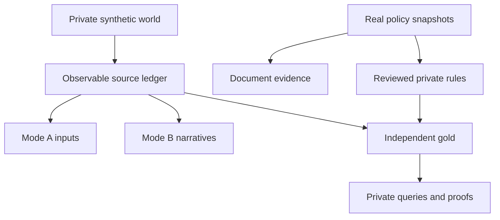
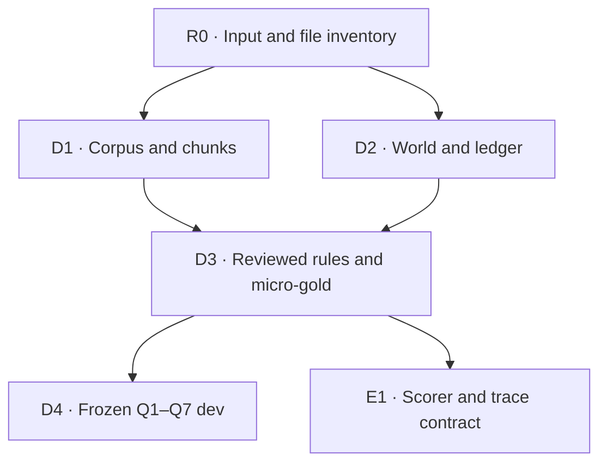
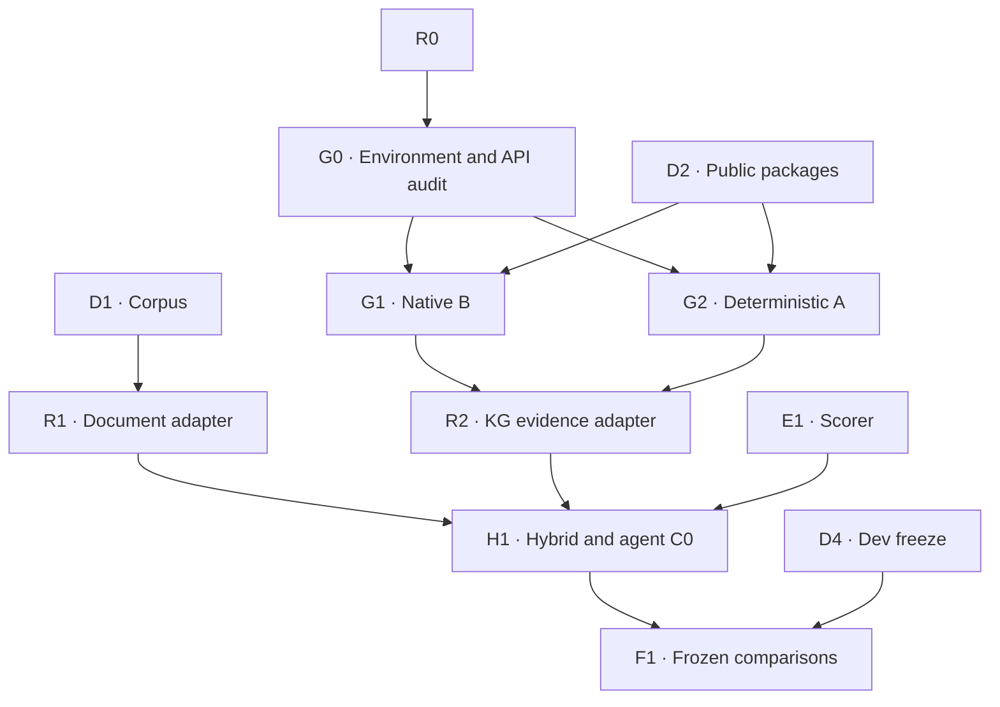

# GSM — Dataset and Graphiti Reference Baseline Plan

**Planning specification v0.1.1 · Cập nhật corpus protocol 2026-09-16 · Chưa triển khai hệ thống**

**Trạng thái:** đã đối chiếu bộ spec hiện tại và kiểm inventory ZIP được cung cấp; chưa kiểm implementation repository hoặc chạy baseline/conformance. ZIP có 224 bài riêng, 224 source URLs và raw hashes khác nhau, cùng một file tổng hợp bị loại khỏi index. Sáu audited hashes khớp 02/05; đây là inventory verification, không phải full semantic/OCR audit.

**Thứ tự áp dụng hiện tại:** 01 v0.1.1 → business schema 02 v1.1 (document revision v1.1.1) → release spec 05 v0.2.0; 04 v0.3 cung cấp rationale. Corpus mặc định `retrieval_full`=224, cấu hình conformance `debug_core`=6, primary-gold sources=4. Những đề xuất pre-audit trong kế hoạch gốc, bảng fingerprint lịch sử ở §3 và tên gate D0–D3 không ghi đè exact counts, T01–T07, DFG/BRG hoặc corpus protocol của 05. Repository/API/resource blockers còn phải xác minh tại R0/G0.

## 1. Purpose

**[PROPOSED]** Xây và đóng băng một dataset nhỏ, có gold kiểm toán được; tích hợp Graphiti reference baseline; chạy cùng dữ liệu qua construction, retrieval, context selection và agent evaluation. Kết quả phải đủ để xác định lỗi cần nghiên cứu tiếp trong dự án sáu tuần.

**[EXISTING]** Contract 01 xác định document retrieval, temporal KG retrieval và hybrid evidence là đối tượng tối ưu. Schema 02 đã định nghĩa identity, publication ledger, temporal reducer, support atoms và hai chế độ Graphiti. Kế hoạch triển khai các contract đó; không thiết kế memory framework mới.

Quy ước trạng thái áp dụng cho từng hàng bảng hoặc toàn bộ đoạn/danh sách ngay sau nhãn:

| Nhãn | Ý nghĩa |
| --- | --- |
| `[EXISTING]` | Đã xác nhận trong file đọc được hoặc tài liệu dự án; “có trong đặc tả” không có nghĩa “đã có implementation”. |
| `[PROPOSED]` | Quyết định hoặc artifact cần tạo. Tên symbol đề xuất chưa phải API tồn tại. |
| `[UNKNOWN]` | Chưa xác minh; ghi nơi cần kiểm tra và task giải quyết. |
| `[BLOCKED]` | Không được thực thi phần phụ thuộc trước khi giải quyết blocker. |

**[BLOCKED]** Repository grounding là gate R0. Các task phía sau có hành vi, đầu vào và acceptance criteria xác định, nhưng đường dẫn module và API chưa biết phải được chốt tại R0/G0 trước khi viết code. Không tự tạo một cây `src/` để lấp khoảng trống này.

## 2. Current verified project state

| Trạng thái | Điều xác nhận được | Giới hạn |
| --- | --- | --- |
| `[EXISTING]` | Bản contract 01, schema 02, research Markdown và paper matrix có trong workspace. | Chưa chứng minh đồng nhất với bản đang ở repository của người dùng. |
| `[EXISTING]` | Schema/generator-spec hiện áp dụng là 1.1 theo 02; Mode A là reference mặc định. | Document revision 1.1.1 và corpus metadata không chứng nhận generator/adapter đã tồn tại. |
| `[EXISTING]` | Kiểm kê workspace chỉ thấy tài liệu/input; kiểm tra Git tại workspace báo không phải repository. | Không kết luận repository trên máy người dùng không tồn tại. |
| `[EXISTING]` | Đầu vào mới của người dùng mô tả khoảng 100 Markdown policy đã crawl. | `[UNKNOWN]` Đường dẫn, số lượng thực, nội dung và metadata. |
| `[EXISTING]` | Người dùng báo T1 PASS representation; T2 `FAIL_CONSTRUCTION/I_TIME`; T3–T10 bị quota chặn. | `[UNKNOWN]` JSON, fixture, scorer và cấu hình thực tế của từng run. |

**[EXISTING] — báo cáo đầu vào:** T1 có JOINED `[2026-10-20, 2026-10-22)` và LEFT từ ngày 22; search trả cả historical candidates. T2 native ingestion không bảo toàn bản sửa hồi tố đã thử: một run tái dùng edge cũ, run khác tạo hai JOINED edges mở. Giữ nguyên finding được báo cáo; không suy rộng thành Graphiti không hỗ trợ temporal data.

**[UNKNOWN]** Cấu hình được báo là `graphiti-core 0.30.2`, `KuzuDriver(db=":memory:")`, `GeminiClient`, `GeminiEmbedder`, `GeminiRerankerClient`. Chưa có dependency lock hoặc mã test để xác nhận. Tên constructor và lời gọi này không phải hướng dẫn API đã được kiểm chứng tại đây.

## 3. Source-of-truth documents

**[EXISTING]** Các bản đã đọc và fingerprint SHA-256:

| File thực tế trong workspace | Phiên bản/vai trò | SHA-256 |
| --- | --- | --- |
| `/workspace/scratch/8d6061350457/docs/01_problem_and_evaluation.md` | Contract v0.1; mục 4, 7–8, 12–15 | `e756a9a793f50693e0ce750ebc6aa78c17efe01970d9f01af5f2fa9096ce74b8` |
| `/workspace/scratch/8d6061350457/docs/02_synthetic_schema_and_data_design.md` | Schema 1.0; mục 7–18, 24–28 | `ce941c78c877aa7f2fa0d8c58d25bbf72c790afa20c56e0775170aa60bdcba79` |
| `/workspace/scratch/8d6061350457/inputs/GSM-retrieval-research(1).md` | Framing, baseline và ưu tiên; mục 7–10, 13–14 | `26b87f0b5f8c0520d848f9876e52e33c797cbd9f96275dd62aef6137af0c37ff` |
| `/workspace/scratch/8d6061350457/inputs/GSM-paper-matrix(1).xlsx` | Cross-check công nghệ và bằng chứng nghiên cứu | `aeb34138a64b1d2b9553fbee0f4b81fe01762628f2353a42347a2c84d0724e10` |

**[PROPOSED]** R0 đối chiếu hash và nội dung với repository. Khác biệt có ảnh hưởng đến identity, temporal semantics, evidence hoặc metric phải được ghi trước khi chọn bản thực thi. Đầu vào mới về policy thật thay phần sinh toàn bộ policy giả; không thay các định nghĩa temporal hay gold của contract.

**[EXISTING]** Nghiên cứu ưu tiên Graphiti reference, lexical+dense+fusion+reranking, identity/time/provenance, bridge evidence và đánh giá scale riêng. Không cần nghiên cứu ngoài để định nghĩa lại baseline. API của package thực tế phải được xác minh bằng source/lock và capability probes tại G0, không lấy tài liệu phiên bản mới hơn làm bằng chứng cho bản đang dùng.

## 4. Existing repository inventory

| Trạng thái | Hạng mục | Kết quả kiểm tra hiện tại / hành động |
| --- | --- | --- |
| `[EXISTING]` | Các file ở mục 3 | Đọc được; là tài liệu, không phải source implementation. |
| `[EXISTING]` | Repository workspace | Root vật lý là `D:/vinai/memory`; chưa init Git ở root. Cấu trúc R&D được mô tả trong `README.md`. |
| `[EXISTING]` | `docs/` | Chứa contract 01–05; research ở `docs/research/`; draft và project notes được tách riêng. |
| `[EXISTING]` | `tests/conformance/graphiti/` | Có temporal correction fixture và suite T1–T10 cho native Mode B. |
| `[EXISTING]` | `tests/support/`, `runs/conformance/` | Có helper inspection và JSON kết quả chạy; run bị giới hạn Gemini quota phải giữ execution status riêng. |
| `[PROPOSED]` | `src/gsm_memory/`, `configs/`, `scripts/` | Đã bind physical placeholder; implementation, CLI và dependency manifest vẫn chưa hoàn thiện. |
| `[EXISTING]` | Corpus policy | 225 Markdown files trong checkout `external/policy_green_sm_corpus/`; archive nguồn ở `data/raw/archives/policy_green_sm_source.zip`. Crawl provenance/anomaly audit vẫn thuộc D1. |

**[EXISTING]** Inventory attachment đã xác nhận 224 bài riêng và file tổng hợp; có sáu nhóm trùng title, gồm nhóm P05/P06/P07 cùng ngày khác vùng. **[PENDING]** D1 vẫn phải materialize source catalog/hash/locator, kiểm parser/OCR provenance và review anomalies; số liệu inventory không thay semantic review. R0 xác minh checkout thực tế có cùng archive hash với 02/05.

## 5. Known unknowns

| ID / trạng thái | Đầu vào chưa biết | Cách giải quyết | Chỉ phần bị chặn |
| --- | --- | --- | --- |
| U01 `[UNKNOWN]` | Repository, conventions, symbols, locks | R0 đọc checkout, instructions, source, tests và manifests. | Chốt module paths, tái sử dụng code, commands. |
| U02 `[PARTIAL]` | Có ZIP/inventory; crawl timestamp và OCR quality còn chưa xác nhận | D1 pin archive/member hashes, normalization/locators và profile manifests; metadata thiếu giữ unknown. | Chỉ claims cần crawl history/OCR đã duyệt; không chặn fixed-edition tasks đã whitelist. |
| U03 `[UNKNOWN]` | Phiên bản Graphiti/backend/API thực | G0 đối chiếu lock, installed source, tests và run manifests. | Chốt native/CRUD/search/filter mappings. |
| U04 `[UNKNOWN]` | Kết quả T1–T10 hiện tại | G0 đọc JSON và scorer, nối từng result với fixture/config/hash. | Tuyên bố capability tương ứng, không chặn toàn bộ dataset. |
| U05 `[UNKNOWN]` | Policy version, hiệu lực, publication history | D1/D3 kiểm tra source span, crawl logs hoặc annotation có dẫn nguồn. | Historical policy applicability khi thiếu bằng chứng. |
| U06 `[UNKNOWN]` | Tài nguyên, quota, model access, thời gian còn lại | G0 đo pilot và chốt budget; ghi ngày bắt đầu thực tế. | Batch ingestion và lịch khả thi. |
| U07 `[SCOPED]` | T01–T07 đã audit; các decision tasks DEFER chưa được mở | D3 dùng bindings/formulas của 02; extension cần compatibility audit mới. | Chỉ tasks ngoài whitelist; không chặn core gold đã chốt. |
| U08 `[UNKNOWN]` | Production schema, cardinalities, QPS/SLA, access mapping | Nhận input mentor khi có. | Kết luận production; không chặn prototype synthetic. |

**[PROPOSED]** Unknown có owner là task ở bảng; khi giải quyết phải lưu bằng chứng, không chỉ đổi nhãn. Không chọn parser, graph writer hoặc framework thay thế để tránh kiểm tra U01–U03.

## 6. Dataset architecture

**[EXISTING]** Giữ thuật ngữ và records của schema 02:

| Lớp | Nội dung | Quyền truy cập |
| --- | --- | --- |
| A — Private oracle/world | Entities, `WorldFact`, `WorldEvent`, `ObservationPlan`, private `PolicyRule` và world metrics | Generator/evaluator; không mount vào agent hoặc retrievers. |
| B — Operational source data | `SourceRegistry`, immutable `SourceRecord`, `AssertionPayload`; `AssertionVersion` do reducer tạo | Runtime chỉ nhận publication prefix đúng scope/snapshot. |
| C — Graph projection inputs | Packages cho Mode A và Mode B; public source–projection links | Graphiti adapters; không chứa gold atoms/verdict. |
| D — Document memory | Public policy text, clause locators, metadata có căn cứ | Document retrieval; không chứa executable gold rules. |
| E — Queries | Public runtime requests và private family/tags/split records | Router chỉ nhận public request. |
| F — Gold | `GoldAnswer`, `SupportAtom`, `EvidenceProof`, `GoldSupportLink` | Evaluator độc lập với retrieval output. |

**[PROPOSED]** Với policy thật, chiều xây rule thay đổi một cách tường minh: raw text → annotation được kiểm tra → private rule interpretation. Không sinh lại hoặc sửa raw text để nó khớp một rule đã chọn trước.

**[EXISTING]** Oracle chấm đáp án chứng minh được từ thông tin được phép quan sát; `world_answer` chỉ là diagnostic riêng. Một nguồn bị che hoặc conflict không được hidden world truth âm thầm giải quyết.

## 7. Real GSM policy corpus plan

**[PROPOSED]** R0 lập inventory trước transformation: relative filename, byte count, hash, khả năng decode, lỗi/empty status, duplicate group và nguồn URL nếu thực sự có. Phân biệt exact byte duplicates với text gần giống; hai trang gần giống có thể khác ngoại lệ hoặc thời điểm. Không tự xóa near duplicates.

**[PROPOSED]** D1 dùng output layout và normalization CRLF→LF đã chốt trong 05; R0 bind module/parser vào repository thực tế. Giữ raw bytes bất biến, processed projection/hash/locators riêng; mọi parser transform bổ sung phải có version và mapping, không phá reviewed spans.

**[PROPOSED]** Manifest UTF-8 JSONL gồm trường có nguồn gốc rõ:

| Trường | Loại metadata | Quy tắc |
| --- | --- | --- |
| `document_id`, `source_filename`, `content_hash`, `size_bytes` | Derived/observed | ID dataset-local ổn định từ inventory đã freeze; hash raw bytes. ID không được gọi là GSM policy ID. |
| `source_url`, `crawl_timestamp`, `title` | Observed nếu có | Lưu raw value và locator/log source; thiếu thì unknown. Filesystem mtime không là crawl time. |
| `encoding`, `decode_status`, `duplicate_group` | Derived | Detector/decoder và thuật toán hash được pin; lỗi không bị thay ký tự âm thầm. |
| `document_type`, `language` | Observed hoặc manual | Chỉ điền khi có căn cứ; record method/reviewer; không mặc định toàn bộ là policy hoặc tiếng Việt. |
| `official_version`, `effective_from`, `effective_to`, `publication_time` | Observed/manual có dẫn nguồn | Unknown nếu không tìm thấy. Ngày trên trang chưa chắc là ngày hiệu lực. |
| `metadata_provenance`, `review_status`, `exclusion_reason` | Derived/manual | Phân biệt field observed, deterministic-derived, manually-reviewed và unknown. |

**[PROPOSED]** ID của bản chụp nội dung phục vụ reproducibility khác official policy version. Mỗi raw file phải thuộc included, exact-duplicate alias hoặc quarantined có reason; tổng các nhóm phải khớp inventory. Duplicate aliases giữ toàn bộ source locators. Missing URL không cản provenance nội bộ dựa raw file/hash/span nhưng giới hạn xác nhận nguồn công khai.

**[PROPOSED]** Sau inspection, D1 lập parser fixtures cho mọi construct thực sự xuất hiện: headings giữ hierarchy; list giữ thứ tự và nesting; table giữ header với hàng dữ liệu; link giữ label và target; HTML giữ nội dung có nghĩa và map về raw span. Boilerplate/navigation chỉ loại theo quy tắc cụ thể đã review. Empty section được ghi nhận. Trường hợp không parse chắc chắn phải bảo toàn raw segment hoặc quarantine, không silently drop.

**[EXISTING]** Schema 02 yêu cầu chunk có `chunk_id`, `document_revision_id`, `clause_ids`, `span_start/end`, `token_count`, metadata và hash; clause–chunk mapping là many-to-many.

**[PROPOSED]** Chunk là đơn vị text liên tục trong section hoặc một phần section quá dài, mang heading path và locators. ID từ document snapshot ID, source span và chunker-config hash; không chỉ hash text vì hai clauses giống nhau có thể khác provenance. Span convention và processed-to-raw mapping được pin sau parser audit. Không để một đoạn threshold mất table header hoặc exception mất clause anchor. `max_tokens`, `overlap`, `minimum_section_size`, tokenizer và các caps là dev configuration; chọn bằng inspection trên corpus đã biết, chưa gán số cuối trong kế hoạch.

**[EXISTING] — compatibility đã chốt trong 02 v1.1:** Real sources dùng `DocumentRevision.revision_kind=raw_snapshot`, source availability qua `ARTIFACT_PUBLICATION`; không fabricate normative `issued`, effective interval hoặc supersession. 05 pin availability của 224 snapshots và hai corpus profiles. D1 kiểm raw/source metadata; D3 chỉ giữ reviewed bindings đã whitelist.

**Corpus baseline đã chốt:** `retrieval_full` index 224 real articles; `debug_core` index sáu audited snapshots. Cùng synthetic documents/definitions, task semantics, operational graph và budget trong paired corpus comparison. Không dùng private corpus roles để filter. D1 kiểm đủ inventory/hash/availability; full relevance/OCR audit toàn corpus không là điều kiện DFG. R1 log visible/profile document và chunk counts trước/sau edition filtering; E1 giữ unjudged, source-bound proofs và N/A khi metric thiếu judgments. Exact profile manifests và source allowlists theo 05 §§2.3, 6.2, 6.6.

## 8. Synthetic operational dataset plan

**[PROPOSED]** Small dev recipe đầu tiên: 8 drivers, 2 fleets, 2 regions, 2 services, tối đa 4 incidents và 80 terminal trip identities. Đây là kích thước thực nghiệm đề xuất, không phải thống kê GSM. Bố trí ít nhất một cặp trùng display name, một driver có denominator 0 và một driver có observations không đầy đủ. Counts về source revisions/edges được báo theo thực tế, không ép bằng event count.

**[EXISTING]** Entity types, predicate vocabulary, cardinality và source authority giữ nguyên schema 02. Không thêm Vehicle hoặc Trip nodes. Stable driver ID là identity; name/alias có lịch sử. Hai trips khác `trip_id` vẫn là hai point events dù cùng subject/relation/object.

**[PROPOSED]** D2 sinh bằng config + seed + implementation version: private entities/events/temporal facts → observation plan → public immutable records → reducer → graph packages. IDs dùng quy tắc canonical và UUIDv5 namespace đã có trong schema; serialization/order ổn định. Physical ingestion timestamps chỉ được ghi khi chạy, không dựng trước như business time.

**[EXISTING]** `SourceRecord` có `record_id`, `source_id`, `scope_id`, `known_at`, `commit_seq`, `operation`, `target_assertion_ids`, `assertions`, `raw_payload`, `payload_hash`. `replace/retract` đóng known history của đúng targets; partial replacement giữ các đoạn không đổi; không overwrite record gốc.

**[PROPOSED]** Mandatory fixtures nhỏ, tách khỏi random sampling: forward transition; future-effective; late arrival; retroactive correction với hai đồng hồ khác nhau; retraction; equal-authority conflict; overlap; timezone và `[from,to)` boundary; duplicate name/trip; missing coverage; incident reopen; bridge sai quan hệ; correction làm metric/profile stale. Các policy-version fixtures giả lập, nếu cần, phải nằm trong control subset được ghi rõ là synthetic, không giả làm bản sửa của policy GSM thật.

**[EXISTING]** Giữ `cancel_rate_30d`: resolve trip revisions và precedence trước khi lọc `[t−30 days,t)`; tính numerator/denominator trên toàn bộ visible source set, có coverage; zero denominator → undefined; incomplete/conflict → exact values null. Summary dùng template có dependencies; hypothesis generation tắt mặc định.

**[EXISTING]** Definitions theo 02/05 gồm bốn reported measures, derived cancel_rate_30d và BC01–BC07. Summary lineage chỉ cần auxiliary fixtures đã chốt; không xây profile generation subsystem rộng. Không trình bày definition hoặc threshold tổng hợp thành công thức nội bộ GSM.

## 9. Oracle/gold construction plan

**[EXISTING]** D3 dùng T01–T07/B01–B07 của 02: primary gold từ reviewed TEXT spans của P154/P151/P05/P23; P172/P26 chỉ là audited distractors. Không chọn lại business rules hoặc formalize 218 bài thêm để lấp corpus. Alternative supports/qrels cần review theo 01/05 và ở phía evaluator.

**[PROPOSED]** Mỗi rule interpretation lưu source document hash, clause/span, từng predicate–clause mapping, phép so sánh, units, exception/definition dependencies, reviewer và review result. Một người kiểm tra lại trực tiếp text nguồn sau khi encoding; mọi ambiguity hoặc toán tử ngoài DSL được đánh dấu unsupported. LLM có thể gợi ý annotation, không ký duyệt gold.

**[EXISTING]** Evaluator dùng DSL `all/any/not/eq/in/lt/le`, bốn giá trị T/F/U/C và source precedence của schema. Giữ distinction answerable false, insufficient, conflict và ambiguous. Không suy phủ định từ việc search không thấy cạnh; cần negative derivation có coverage hoặc fact bác bỏ hợp lệ.

**[PROPOSED]** Xử lý policy thiếu thời gian theo hai phạm vi có ghi nhãn:

- Q1 hỏi nội dung của bản chụp đã chỉ rõ vẫn answerable nếu source text đủ; không phát biểu đó là bản đang hiệu lực.
- Hybrid có thể hỏi có điều kiện “xét riêng quy tắc trong bản chụp này” với applicability của edition là tiền đề công khai. Đây là probe áp dụng nội dung, không chứng minh historical policy-version correctness.
- Câu hỏi policy nào thực sự áp dụng tại T cần publication/valid-time evidence đã xác minh. Thiếu dữ kiện thì gold insufficient hoặc query chưa đủ điều kiện vào answerable subset; không chọn ngày giả để lấp chỗ trống.

**[EXISTING]** `SupportAtom`, `EvidenceProof`, `GoldAnswer`, `GoldSupportLink` giữ nguyên fields ở schema 02 mục 17. AND/OR proof chấp nhận alternative sufficient sets. `ProjectionLink` public nối source với chunk/graph output; private support links mới nối source với gold atoms. Extracted text không map chắc chắn được ghi unjudged và review, không gán đúng chỉ vì gần nghĩa.

**[PROPOSED]** Gold được tính độc lập từ visible ledger prefix và reviewed policy text/rules trước khi chạy retrievers. Kiểm tra bằng hand-worked fixtures và counterfactuals; không chỉ gọi lại cùng reducer để tự chứng minh reducer đúng. Mọi answerable proof phải đủ; bỏ atom thiết yếu làm proof không còn đủ.

## 10. Q1–Q7 dev dataset plan

**[EXISTING]** Catalog pilot hiện chốt 42 canonical queries trong 05 §5, toàn bộ là dev; allocations và expected results ở 05 thay recipe sơ bộ trong bảng kế hoạch này. Triển khai phải materialize/review/validate, chưa phải final benchmark.

| Family | Số query đề xuất | Yêu cầu evidence/gold |
| --- | ---: | --- |
| Q1 | 6 | Clause đúng, condition/exception/definition nếu có; snapshot identity; thời gian chỉ khi có căn cứ. |
| Q2 | 6 | Explicit ID và name ambiguity controls; state tại valid time và known snapshot. |
| Q3 | 6 | Event evidence, exact metric với source set/coverage, undefined/incomplete và summary lineage. |
| Q4 | 6 | Real clause + synthetic facts + operands/exception bridge; ghi rõ conditional hay verified temporal applicability. |
| Q5 | 4 | Typed/directed bridge bắt buộc; có path sai quan hệ làm distractor; có thể là KG-only nếu policy không dùng fleet bridge. |
| Q6 | 8 | Paired valid/known queries cho correction, future-effective, late event và retraction; các boundary khác có fixtures riêng. |
| Q7 | 6 | Insufficient, equal-authority conflict và ambiguous entity; partial evidence/missing roles có gold. |

**[EXISTING]** Private query record giữ `query_id`, family, secondary tags, query text, context và links tới `GoldAnswer`/proofs/support atoms. Public runtime dùng đúng request fields contract 01: `request_id`, `query_id`, `query`, `entity_refs`, `time_scope`, `known_as_of`, `access_scope`, `query_type_hint`, `context_token_budget`, `deadline`, `retrieval_config_id`. Không xuất gold family/tags/answer/proof vào router.

**[EXISTING]** Primary-family precedence: Q7 → Q6 → Q5 → Q4 → Q3 → Q2 → Q1 theo nhiệm vụ chính; giữ secondary tags để phản ánh overlap. Paraphrases và paired snapshots cùng scenario không được coi là mẫu độc lập.

**[PROPOSED]** Tạo micro-slice trước: một answerable state/policy path và một insufficient/conflict query, có source/gold/agent trace. Sau đó mở rộng đến dev-core. Nếu Q4 bị policy mapping chặn, công bố số query hoàn thành thực tế và blocker; không nhân paraphrase hoặc bịa rule để đạt 42. Native A/B cohort được chọn theo scenario và toàn bộ source dependencies, trước khi xem điểm.

## 11. Dataset versioning/freeze policy

**[EXISTING]** Giữ business schema/generator-spec 1.1 và bindings đã freeze trong 02; document revision 1.1.1 chỉ đồng bộ corpus protocol. Phiên bản generator implementation chưa tồn tại qua kiểm chứng; chỉ gán release sau validation. Đổi chunking/index/model làm đổi projection/experiment version, không tự đổi semantic gold.

**[PROPOSED]** Release hiện được thiết kế là `gsm-dev-core-0.2` theo 05 v0.2.0; chưa sinh hoặc freeze. Manifest pin corpus_profile_id/version/manifest hash, schema/generator/spec versions, implementation commit, seed, query/gold/qrels versions, document/graph-input hashes và split membership. Không overwrite release cũ; artifact paths/counts và profile visibility theo 05.

| Trạng thái đề xuất | Điều kiện |
| --- | --- |
| Working dev | Có thể sửa generator/annotations; mỗi run vẫn giữ input hashes và config riêng. |
| DEV-FROZEN | D0–D3 PASS cho phạm vi đã đăng ký; raw/processed inputs, queries, gold, proofs, source mappings, seeds và validation report đã lưu; không còn unknown quyết định đáp án trong answerable subset. |
| TEST-FROZEN | Có split riêng theo scenario/entity/template groups và policy lineage phù hợp; semantic gold được review; protocol/caps đã chốt trước final comparison; test không dùng tune. |

**[PROPOSED]** Conditional-policy queries và synthetic controls có cohort IDs riêng; freeze không biến chúng thành evidence về hiệu lực thật của policy GSM. Không đánh dấu full temporal-policy coverage nếu U05 chưa giải quyết.

**[EXISTING]** Không regenerate test vì phương pháp điểm thấp. Bug gold/generator có release sửa mới, impact list và rerun các baseline bị ảnh hưởng; giữ release cũ. API/LLM responses và narratives đã dùng phải được lưu để replay; gọi lại LLM không phải tái tạo bytes xác định.

## 12. Graphiti reference baseline definition

**[EXISTING]** Tên sử dụng là **Graphiti reference baseline**; không gọi là GSM production baseline hoặc bản tái lập cấu hình nội bộ.

**[PROPOSED]** Các run có mode/config IDs riêng:

| Run | Construction | Retrieval / purpose |
| --- | --- | --- |
| Native B | Native episode ingestion, không sửa output bằng oracle | Đo construction thực tế và retrieval trên graph đó. |
| Deterministic A | Public ledger → deterministic reducer → graph writer đã qua G0 | Reference construction phục vụ retrieval; không nhận private world truth. |
| Raw-candidate diagnostic | Cùng graph/config được chỉ rõ | Quan sát search trước external eligibility; chỉ dùng offline. |
| Eligible baseline | Scope/entity/time guards → candidates → evidence serialization | Đường runtime bắt buộc cho query đã hỗ trợ. |
| Bounded-expansion ablation | Cùng snapshot và seed retrieval, thêm 1–2 hop có caps | Đo bridge coverage; không phải advanced graph research. |

**[PROPOSED]** Pipeline chuẩn: public source package → construction → graph snapshot → candidate retrieval → explicit eligibility → normalization → selection → evaluator; thêm agent ở mốc C0/L4. Scope phải giới hạn ngay từ query backend khi API hỗ trợ và kiểm tra lại sau retrieval; không chỉ lọc scope sau khi evidence đã đến agent.

**[EXISTING]** Baseline v0 đầy đủ còn có document BM25 + multilingual dense + RRF + bounded reranker, source-event/computation access, rule/metadata routing và role-preserving context. Milestone KG retrieval có thể đến trước, nhưng chưa phải baseline v0 đầy đủ.

## 13. Mode B native baseline

**[PROPOSED]** G1 dùng entry point native được xác minh ở G0, từ cùng public records và scope/known cutoff với Mode A. Narratives đầu tiên render xác định; giữ IDs/time/source information thực sự có trong input. Variant bỏ ID hoặc dùng JSON phải có config riêng, không nhập vào A/B comparison chuẩn.

**[UNKNOWN]** Signature/import của `add_episode`, `reference_time`, custom entity/edge types, source linkage và supported search settings ở package đang dùng. G0 phải đọc source cùng tests để xác định; kế hoạch không cung cấp lời gọi suy đoán.

**[PROPOSED]** Ingest tuần tự theo publication order trong fixture sửa lịch sử; sau mỗi commit lưu receipt, graph inspection, node/edge counts, IDs mới/tái dùng/invalidated/expired, temporal fields và source links. Không dùng bulk path cho temporal fixture trước khi chứng minh semantics tương đương.

**[PROPOSED]** Chạy micro-slice 2–4 episodes trước; tiếp đó chọn cohort nhỏ theo scenario, tối đa khoảng 16 source commits cho pilot nếu budget cho phép. Cohort phải đủ source dependencies của queries đã chọn; nếu cắt records làm mất completeness thì sinh lại cohort gold/coverage trước freeze. A/B dùng cùng cohort; không so A toàn dataset với B partial cohort như cùng điều kiện.

**[EXISTING] — báo cáo chưa đối chiếu JSON:** T1/T2 là findings cần giữ. **[PROPOSED]** G0 kiểm tra scorer có tách valid time và known time, có source coverage cho kết luận phủ định và có phân biệt transition event với state. Hai open valid intervals chưa đủ tự chứng minh lỗi nếu chúng thuộc các known versions khác nhau. Nếu audit thay verdict được báo, phải giữ result cũ và giải thích nguyên nhân, không sửa lịch sử báo cáo.

**[PROPOSED]** T3–T10 chỉ rerun theo dependency: identity trước capability về alias/ID; correction/retraction trước các query tương ứng; metric invalidation trước stale-summary claim. Test IDs ngoài T1/T2 phải đọc từ suite thực tế. Quota failure giữ `BLOCKED_RATE_LIMIT`, không ghi như semantic failure. Retry phải có cap và receipt; nếu chưa chứng minh native ingest idempotent sau timeout, dùng fixture database mới thay vì blind retry làm nhân episodes.

## 14. Mode A deterministic baseline

**[EXISTING]** Schema 02 chọn native model CRUD với UUID xác định như hướng adapter; cũng cảnh báo `.save(driver)` riêng lẻ chưa làm graph search-ready, JSON episodes vẫn là extraction và `add_triplet` có thể deduplicate. Đây là yêu cầu/cảnh báo trong tài liệu, không phải API verification cho môi trường hiện tại.

| Candidate API / trạng thái hiện tại | G0 phải chứng minh | Quyết định được phép |
| --- | --- | --- |
| Native model CRUD `[UNKNOWN]` | Tạo/read lại nodes, parallel edges, episodes; UUID, attributes, provenance và indexes/embeddings; search tìm được records. | `[PROPOSED]` Ưu tiên nếu đáp ứng invariants và interface được hỗ trợ. |
| `add_triplet` `[UNKNOWN]` | Quyết định dedup có phá identity, event multiplicity hoặc correction history không; temporal fields nào được giữ. | Không mặc định deterministic. Chỉ chọn sau probe và ghi giới hạn. |
| JSON `add_episode` `[EXISTING]` — mô tả schema | G0 xác minh ingestion vẫn qua extraction trong bản pin. | Xếp Mode B; không dùng nhãn A chỉ vì JSON có cấu trúc. |
| Direct driver operations `[UNKNOWN]` | Interface thực tế, consistency với Graphiti schema/search và phần lifecycle phải tự đảm nhiệm. | Chỉ ghi như phương án cần quyết định có căn cứ; không tự bypass phần lớn Graphiti. |

**[PROPOSED]** G2 ghi `AssertionVersion` đã resolve từ public ledger bằng IDs xác định. Giữ node types, relation direction, interval/point distinction, source-event links, conflict versions và logical known history. Metadata có thể ở supported custom attributes hoặc public sidecar như schema cho phép; sidecar không chứa gold labels.

**[PROPOSED]** Probe tối thiểu phải round-trip một interval, hai point events cùng endpoints, correction ở known time muộn hơn, source provenance, scope/snapshot isolation, repeat-write semantics và indexed search. Đọc trực tiếp graph đủ để audit construction nhưng chưa đủ để PASS search readiness.

**[BLOCKED]** Nếu không có supported path bảo toàn contract, G2 không được PASS. Ghi capability gap và effort cần thiết; tiếp tục dataset, native audit và retrieval diagnostics độc lập. Không gọi một cấu trúc Python/SQL bên ngoài trả oracle facts là deterministic Graphiti baseline.

## 15. Temporal eligibility strategy

**[EXISTING]** Bốn đồng hồ giữ riêng: event time; valid interval/point; logical known interval; physical ingestion/indexing time. Current request phải resolve thành thời điểm và snapshot cụ thể.

**[PROPOSED]** R2 áp dụng đúng thứ tự có trace: scope → explicit entity constraints/resolution → query temporal intent → candidate search → kiểm tra valid/known eligibility trên từng evidence role → bundle/path compatibility. Push-down filters được dùng khi G0 chứng minh semantics; vẫn lưu cấu hình và kiểm tra output. Candidate caps áp dụng trước filter có thể làm thiếu recall; log số bị loại và giới hạn refill, không đọc gold để tìm thêm.

**[EXISTING]** State tại `(t,a)` cần `valid_from ≤ t < valid_to` và `known_from ≤ a < known_to`; open boundary chỉ dùng khi đã xác định unbounded. Unknown không là infinity. Point event xét event time/window; không mã hóa thành `[t,t)`. Same-state path phải tương thích đồng thời; historical sequence dùng order/window riêng. Comparison evidence được gắn role lịch sử, không bị loại chỉ vì không current.

**[PROPOSED]** Dùng snapshot replay từ public publication prefix làm chiến lược known-as-of nhỏ ban đầu. Prefix áp dụng đồng thời cho catalog/alias, docs có publication evidence, artifacts, embeddings và source lookup. Tính reducer trên prefix để không lộ future `known_to`. Snapshot replication và rebuild cost được ghi riêng.

**[UNKNOWN]** Mapping native `created_at/expired_at` sang logical known time chưa được chứng minh. Không blanket-filter mọi `expired_at != null`, vì có thể làm mất historical evidence. Ở Mode B, chỉ gắn source visibility/lineage khi mapping có căn cứ; không chép corrected valid interval từ oracle lên một edge sai. Nếu snapshot/filter API không hỗ trợ yêu cầu cụ thể, trả `unsupported` hoặc `unverified` evidence phù hợp contract, không tuyên bố đã giải quyết bitemporal retrieval.

**[PROPOSED]** Correction fixture phải tách ngày nhận bản đầu, ngày effective và ngày nhận correction; kiểm tra cả trước/sau known cutoff cho cùng valid date. Retraction rút assertion, không tự tạo assertion phủ định. Policy timestamp unknown không qua được guard cho claim về effective applicability, nhưng vẫn có thể được dẫn như nội dung của bản chụp cụ thể.

## 16. Evidence normalization mapping

**[EXISTING]** Tên fields dưới đây là contract 01 mục 4.2. Native candidate field names phải kiểm tra qua G0; không coi bảng là schema Graphiti đã được xác minh.

| Evidence field | Mode A / document mapping | Mode B mapping và phần chưa biết |
| --- | --- | --- |
| `evidence_id` | `[PROPOSED]` Stable source/version/representation identity; graph UUID là projection reference. | `[PROPOSED]` ID ổn định trong frozen run từ output thực và snapshot; cross-run matching qua source semantics, không giả UUID giống nhau. |
| `source_type`, `evidence_kind` | `[EXISTING]` document/KG/source event/computation; clause/fact/path/event/measure/summary/inference. | `[UNKNOWN]` Native fields phân biệt kinds; adapter phải dùng mapping đã kiểm chứng hoặc ghi unverified. |
| `source_id`, `source_version` | `[PROPOSED]` SourceRecord/assertion version, artifact version hoặc document content snapshot. | `[UNKNOWN]` Edge-to-episode/source-record links; UUID đơn độc không chứng minh source version. |
| `entity_ids` | `[EXISTING]` Canonical IDs từ public catalog và assertion. | `[UNKNOWN]` Native node IDs → canonical IDs; ambiguity/merge phải giữ trong diagnostics, không sửa bằng gold. |
| `content` | `[PROPOSED]` Clause nguyên văn hoặc typed assertion/derivation có nguồn. | `[UNKNOWN]` Native fact-text field thực tế; giữ raw extraction, không thay bằng expected text. |
| `graph_structure` | `[EXISTING]` Node/edge IDs, type, direction, ordered path. | `[UNKNOWN]` Native endpoint/type fields; đường suy từ output phải có đầy đủ cạnh thực. |
| `event_time`, `valid_time` | `[EXISTING]` Canonical point/interval; schema đề xuất interval → `valid_at/invalid_at`. | `[UNKNOWN]` Native values, null semantics và point mapping; kiểm tra bằng fixtures. |
| `known_time` | `[EXISTING]` Canonical known versions/prefix của public ledger. | `[UNKNOWN]` Native lifecycle equivalence; snapshot membership chỉ chứng minh visibility tương ứng, không tự khôi phục revision semantics. |
| `provenance` | `[EXISTING]` Source/version/locator; extraction/derivation/dependency links. | `[UNKNOWN]` Episode links và source spans có đủ hay không; thiếu thì gắn `I_LINEAGE/G_PROVENANCE` phù hợp stage. |
| `claims_supported`, `evidence_roles` | `[PROPOSED]` Claims/roles đề xuất từ evidence công khai. | Không lấy từ gold atoms; matcher ở evaluator xác nhận riêng. |
| `applicability_status` | `[PROPOSED]` Kết quả eligibility và query role, có reason. | Applicable/historical-comparison/conflicting/unverified; không mặc định applicable vì search trả về. |
| `scores` | `[EXISTING]` Method, stage, rank, raw score; nullable có reason. | `[UNKNOWN]` API có trả score không; không dựng score từ thứ tự rồi gọi là raw score. |
| `token_cost` | `[PROPOSED]` Đếm bằng serializer/tokenizer pin; tính cả bundle overhead. | Cùng cách tính với A/docs; không so ngân sách trên tokenizers khác nhau. |

**[PROPOSED]** Source event được fetch để giải thích một edge là evidence unit riêng có lineage; không làm biến mất construction error của edge đó. Một assertion và source episode sinh ra nó không thành hai nguồn độc lập. Unknown source/version/time phải hiện trong trace và eligibility result, không dùng default có vẻ đầy đủ.

## 17. Baseline evaluation protocol

**[EXISTING]** Dùng metric names/definitions của contract 01; không tạo scoreboard thay thế. Chấm raw candidates, eligible candidates và selected bundle riêng, với stage labels.

| Lớp / metric hiện có | Minimum baseline use |
| --- | --- |
| Construction / failure taxonomy | Đối chiếu graph inspection với expected observable assertions; counts và IDs cho missing/extra/merged/wrong-time/lost-lineage; denominator và unjudged rõ. Không tính lỗi graph thành retrieval-only failure. |
| L1 — Recall@K | Ranked document clauses/facts có qrels; giữ K, distinct-unit convention và stage. |
| L1 — Evidence-set recall; Minimal-evidence coverage | Metrics chính cho multi-evidence queries; dùng semantic atoms và alternative proofs. |
| L2 — Entity resolution accuracy; Temporal fact accuracy | Entity/time correctness trên tập có nhãn, kèm denominator; empty/unjudged không nhận điểm hoàn hảo. |
| L2 — Stale-evidence rate; Correct-version rate; Bridge/path coverage; Bundle temporal consistency | Chỉ chấm khi yêu cầu và gold tương ứng tồn tại; unknown policy dates không thành correct-version PASS. |
| L3 — Sufficiency@B; Selection loss; Required-role coverage | Tách missing retrieval khỏi mất evidence lúc packing. |
| L3 — Provenance coverage; Budget compliance | Integrity checks bắt buộc; ghi token cost và redundancy để chẩn đoán. |
| L4 — Correctness, groundedness, citation precision/coverage, abstention | Chạy trên agent subset và C0; dùng đúng expected statuses, không trộn với KG-only milestone. |

**[EXISTING]** Precision@K, MRR@K, nDCG@K có thể bổ sung khi đủ qrels; không áp MRR lên node list để tuyên bố một path đúng. No-answer/conflict dùng status scoring; không cho empty minimal set nhận sufficiency = 1.

**[PROPOSED]** Mỗi run pin input/snapshot/config; lưu per-query traces trước aggregate; báo per-family, cohort size, skipped/blocked/error counts và macro score phù hợp. Quota-blocked ingestion không được tính như query đã quan sát; lỗi runtime trong một query đã thực thi vẫn là failure. Dev 42 queries chỉ dùng diagnosis, không hỗ trợ kết luận thống kê mạnh về production.

**[EXISTING]** A/B và ablations dùng paired queries; uncertainty bootstrap theo scenario/driver khi đủ groups, không theo paraphrase. Agent giữ model/prompt/budget cố định giữa retrieved-context và gold-context controls; gold context chỉ đưa evidence nguồn, không kèm gold answer hoặc private AST. Báo gold-context không vừa budget thay vì tăng budget ngầm.

**[PROPOSED]** Performance pilot đo stage wall time, ingestion time-to-searchable, calls/tokens, storage và write amplification. Ghi cold/warm state; ít nhất 3 retrieval-only repeats trên frozen snapshots để xem biến động. Báo p50/p95 cùng sample count, coi tail estimate trên tập nhỏ là sơ bộ; không claim p99 hoặc scale envelope từ pilot. Chưa có production thresholds thì chỉ báo quan sát.

## 18. Construction-vs-retrieval decomposition

**[PROPOSED]** Đặt cùng public source cohort vào A và B, giữ queries/gold, snapshot cutoffs và document corpus. Source information phải tương đương dù định dạng structured/text khác nhau. A/B kiểm tra construction paths, không tự chứng minh thuật toán ranking nào tốt hơn.

| Quan sát | Quy lỗi theo contract |
| --- | --- |
| Required fact không có hoặc sai ngay trong graph inspection | `I_FACT`, `I_ENTITY_MERGE/SPLIT`, `I_TIME` hoặc `I_LINEAGE`; downstream recall loss ghi như symptom. |
| Graph có evidence đúng nhưng search/expansion không lấy ra | `G_ENTITY/G_RELATION/G_BRIDGE`, hoặc document retrieval tags theo stage. |
| Raw pool có evidence hợp lệ nhưng filter loại nhầm | Lỗi eligibility/mapping; audit `G_STALE/G_TIME_CONFLICT` hoặc contract/time configuration, không đổ cho extractor. |
| Eligible candidates đủ, selected context không đủ | `H_SELECTION/H_SOURCE_DOMINANCE/H_REDUNDANCY` và Selection loss. |
| Selected context đủ nhưng agent kết luận sai | `A_REASONING/A_UNSUPPORTED/A_CITATION` tương ứng. |
| Gold sai hoặc mapping chưa quyết định được | Ghi evaluation issue/unjudged, sửa release có impact list; không gán system failure chắc chắn. |

**[EXISTING]** Graphiti search không là oracle. **[PROPOSED]** Construction inspection phải có thể liệt kê graph ngoài top-k search và resolve actual stored facts về sources. Nếu API inspection chưa hỗ trợ, phần kết luận construction bị blocked; không suy “graph không có” chỉ từ search miss.

**[PROPOSED]** Mode B được giữ nguyên lỗi. Nếu A PASS invariants nhưng B FAIL, báo khoảng cách construction trên cohort; nếu cả hai cùng retrieval miss, kiểm tra search/eligibility/selection. Nếu A không thể dựng qua API hỗ trợ, vẫn báo native audit với oracle comparison, nhưng chưa có đầy đủ A/B attribution.

## 19. Experiment logging

**[EXISTING]** Dùng run artifacts của schema 02 và field groups contract 01 mục 15. Không overwrite JSON kết quả temporal suite; nhập dưới dạng reference tới file/hash/run gốc nếu cần.

| Artifact hiện có trong đặc tả | Nội dung bắt buộc khi triển khai |
| --- | --- |
| `runs/<run_id>/manifest.json` | Experiment/run IDs, contract/schema/generator/dataset/corpus/query/gold versions; commit/dirty hash; seed; hypothesis/changed component; mode/cohort/snapshot; configs và budgets. |
| `ingestion_receipts.jsonl` | Record ID, received/indexed times, attempts/status/errors, projection IDs; source known time giữ riêng. |
| `projection_links.jsonl` | Canonical source/version ↔ projection ID/locator; config hash, snapshot và mode. |
| `traces.jsonl` | Public resolved request; raw/eligible/selected/excluded evidence; scores/time fields/source links; stage timings, limits, conflicts; serialized context; agent output khi có. Gold-enriched version chỉ evaluator đọc. |
| `metrics.json` | L1–L4 áp dụng, denominator/unjudged/error/blocked counts; per-family/cohort; paired deltas/uncertainty; failure tags và audit notes. |

**[EXISTING]** Manifest pin Graphiti package/commit/config, backend/version, extraction LLM/prompts/decoding, embedding/tokenizer, reranker và agent; top-k/candidate/hop/fan-out caps, context/deadline/retry budgets; hardware/OS, cache/load/warmup/repeats; storage, RAM/GPU khi đo được, calls/tokens, cost basis/date và update lag.

**[PROPOSED]** Diagnostic graph inspections và original provider responses có filenames được chốt tại R0 theo logging conventions; manifest giữ locator/hash. Cost chưa có token accounting hoặc price basis được ghi unknown, không ghi 0. Secret/API key không vào reproducibility manifest.

## 20. Reproducibility requirements

**[PROPOSED]** G0 đóng băng environment bằng công cụ dependency hiện có sau khi đọc lock. Ghi actual installed versions và source hash khi patched; package version string đơn lẻ chưa đủ nếu code khác. Backend init/index options, locale/timezone, hardware và all model IDs phải có trong manifest.

**[EXISTING]** Dataset generation dùng seed/config/implementation pin; deterministic logical artifacts phải byte- hoặc canonical-content reproducible theo serialization đã chọn. Physical receipts và LLM output không bị yêu cầu giống bytes giữa live runs. Archive actual narratives/responses; tách replay mode khỏi live performance measurements.

**[PROPOSED]** Sau R0, mỗi task có verified command/working directory/config path và expected output từ CLI/tests thực tế. Lưu lệnh đã chạy trong run manifest cùng exit status; init phải dùng namespace/database riêng của run để không nhiễm lịch sử.

**[UNKNOWN]** Chưa có project run command nào được xác minh. Lệnh PowerShell resume trong báo cáo người dùng cần đối chiếu CLI source trước khi dùng. Kế hoạch không cung cấp package-manager commands, guessed CLI flags hoặc pseudo-API calls như hướng dẫn thực thi.

## 21. File-level implementation map

**[EXISTING]** File thực tế đã xác minh nằm trong mục 3. Deliverable này ở `docs/03_dataset_and_graphiti_baseline_plan.md`; repository workspace root được bind tại `D:/vinai/memory` và map cấu trúc được ghi trong `README.md`.

**[EXISTING] — layout trong schema, chưa xác nhận file đã tồn tại:** Ký hiệu `D` dưới đây là logical dataset root `data/<dataset_version>/` của schema 02 mục 24, không phải environment variable hoặc một thư mục repository đã tìm thấy. R0 phải bind thành đường dẫn thực trước implementation. Trong một hàng bảng, filename không có prefix là file cùng thư mục với đường dẫn đầy đủ đứng trước nó.

| Artifact key / trạng thái | Logical outputs đã được schema định nghĩa | Task tạo/hoàn thiện |
| --- | --- | --- |
| F-WORLD `[EXISTING]` | `D/private/oracle/entities.parquet`, `events.parquet`, `temporal_facts.parquet`, `observation_plan.jsonl`, `world_metrics.parquet` | D2 |
| F-SOURCES `[EXISTING]` | `D/public/operational/entity_catalog.jsonl`, `source_registry.jsonl`, `record_ledger.parquet`, `text_observations.jsonl`, `artifacts/` | D2 |
| F-RULES `[EXISTING]` | `D/private/oracle/policy_rules.jsonl` | D3 |
| F-GOLD `[EXISTING]` | `D/private/eval/queries.jsonl`, `gold_answers.jsonl`, `support_atoms.jsonl`, `proofs.jsonl`, `support_links.jsonl`, `entity_resolution.jsonl`, `manifest.json` | D4 |
| F-PUBLIC `[EXISTING]` | `D/public/runtime_queries/dev.jsonl`, `D/public/runtime_manifest.json`; graph-input packages dưới `D/public/graph_inputs/mode_a/` và `D/public/graph_inputs/mode_b/` | D2/D4 |
| F-RUN `[EXISTING]` | `D/runs/<run_id>/manifest.json`, `ingestion_receipts.jsonl`, `projection_links.jsonl`, `traces.jsonl`, `metrics.json` | G1/G2/R2/E1/F1 |
| F-CORPUS `[PROPOSED]` | Raw inventory, immutable raw files, corpus manifest, processed documents, chunks và raw-span mapping | D1; `[UNKNOWN]` exact locations, parser module và manifest/chunk filenames — chốt R0 sau corpus inspection. |
| F-REVIEWS `[PROPOSED]` | Policy rule review records, metadata provenance và compatibility decisions | D3; `[UNKNOWN]` exact file location — chốt R0. |
| F-CONFIG `[PROPOSED]` | Small-dev config; Graphiti modes; retrieval/packing budgets; environment/run commands | R0/G0; `[UNKNOWN]` format/path — tái dùng convention thực tế. |

**[UNKNOWN]** Không có function/class/module implementation nào đã được xác minh để ghi vào cột “existing symbols reused”. Các component/symbol names ở mục 22 chỉ là `[PROPOSED]`. R0 phải cập nhật bảng bind sau trước khi downstream coding:

| Component cần bind | Trạng thái đường dẫn implementation/test hiện tại | Nội dung phải ghi khi R0 hoàn thành |
| --- | --- | --- |
| Corpus/parser/chunker; ledger/reducer; policy oracle/query builder | `[UNKNOWN]` | Exact existing/new module paths, ownership, reused symbols, relevant tests. |
| Graphiti environment/native writer/deterministic writer | `[UNKNOWN]` | Exact test/helper paths, imports, supported API source locations và test entry points. |
| Document retriever; KG adapter; evidence serializer | `[UNKNOWN]` | Exact interfaces và output types đã có; chỉ đề xuất mới phần thiếu. |
| Evaluator/logging; hybrid/agent runner | `[UNKNOWN]` | Exact config/CLI/log/test paths; tương thích contract 01. |

**[BLOCKED]** R0 không PASS khi còn logical artifact chưa có physical path hoặc component chuẩn bị implement chưa được bind. Việc chốt file placement theo conventions là một task cụ thể, không phải quyền bịa module API hay thay schema.

## 22. Detailed implementation tasks

**[PROPOSED]** Thực thi theo dependencies; micro-slice được hoàn thành trước batch dev. Artifact keys trỏ tới mục 21. Không có proposed function signature nào được coi là đã chốt: chọn signature sau khi R0 xác định module/interface và G0 xác minh Graphiti API. Các task dưới đây là công việc tương lai, chưa được thực hiện bởi tài liệu này.

### R0 — Repository and input grounding

**Task ID:** R0  
**Title:** Xác minh repository, documents, corpus và bind file map.  
**Status:** [PARTIAL] — đã có corpus attachment/inventory; implementation repository và kết quả test gốc chưa được xác minh.  
**Goal:** Một inventory và implementation map có nguồn kiểm chứng.  
**Why needed:** Core requirement không bịa files/symbols; đầu vào của mọi dataset/API task.  
**Inputs:** [EXISTING] Bộ spec hiện tại và ZIP/hash theo 02/05; [UNKNOWN] implementation checkout, crawl logs và test results gốc.  
**Outputs:** [PROPOSED] Cập nhật mục 2–5/21 với exact paths, source fingerprints, dependency/CLI inventory, sample findings và component bindings; F-CONFIG locations.  
**Files affected:** [PROPOSED] Plan này; [UNKNOWN] repository documents nếu có khác biệt cần ghi nhận; chưa sửa code.  
**Existing symbols reused:** [UNKNOWN] Đọc từ actual source/tests, không từ snippets trong hội thoại.  
**Proposed symbols:** Không cần runtime symbol.  
**Method:** Đọc local instructions và Git state; liệt kê docs/tests/source/data/locks; đối chiếu contract hashes. Kiểm kê mọi policy file, đọc samples và anomaly groups. Đọc test/helper/JSON; bind mỗi component và artifact tới path thực, ghi điểm còn chưa xác minh.  
**Invariants:** Không đổi raw data; không xem reported result như reproduced result.  
**Failure handling:** Thiếu repository/corpus giữ blocker có phạm vi; không suy đoán filenames/imports.  
**Acceptance criteria:** Input roots, exact counts/hashes, sample report, contracts được chọn, module/test/config/output bindings đầy đủ; mọi `[EXISTING]` implementation item có file evidence.  
**Tests:** Read-only inventory reconciliation; kiểm tra hashes và đọc representative files, không cần test hệ thống mới.  
**Dependencies:** Cần implementation checkout/test artifacts để hoàn tất phần repository; corpus attachment đã có.  
**Non-goals:** Crawl lại website, cài framework, implement dataset hoặc đổi schema.

### D1 — Freeze real policy corpus

**Task ID:** D1  
**Title:** Tạo corpus manifest, processed projection và section-aware chunks.  
**Status:** [PROPOSED]; thực thi bị chặn bởi R0/U02.  
**Goal:** Corpus snapshot có lineage đầy đủ và nguyên bản bất biến.  
**Why needed:** Q1/Q4/Q5; document provenance, version correctness và retrieval qrels.  
**Inputs:** [EXISTING] Contract 01 mục 4/6/12, schema 02 mục 12/15, ZIP 224 bài và profile contract 05; [UNKNOWN] parser dependencies/code sau R0.  
**Outputs:** [PROPOSED] F-CORPUS, manifest counts/hashes, parser fixtures và normalization/chunking config.  
**Files affected:** [UNKNOWN] Parser/chunker/index-input module và tests do R0 bind; raw files chỉ đọc.  
**Existing symbols reused:** [UNKNOWN] Reuse parser/chunker có sẵn sau audit.  
**Proposed symbols:** [PROPOSED] `build_policy_manifest`, `normalize_policy_markdown`, `chunk_policy_sections` nếu chưa có tương đương.  
**Method:** Data phase: inventory → decode → normalization CRLF→LF → canonical source locators → profile manifests/visibility → validate/freeze theo DFG. Run phase sau đó mới tạo actual chunks/index IDs và ProjectionLink theo config đã pin. Exact/near duplicates xử lý theo mục 7; không dựng fake chunk IDs để pass DFG.  
**Invariants:** Không bịa dates/versions; thresholds, negations, exceptions, tables và source text không đổi nghĩa.  
**Failure handling:** Decode/parse/metadata ambiguity ghi reason; không silent drop hoặc invent defaults. Typed publication mapping thiếu là blocker riêng.  
**Acceptance criteria:** Mọi raw file được accounted; hashes nguyên vẹn; mọi chunk truy được raw span; build lại cùng input/config cho cùng logical hashes; metadata unknown hiện rõ.  
**Tests:** Golden parser fixtures từ corpus thật; clause/exception/table-header preservation; deterministic IDs; processed-to-raw locator checks.  
**Dependencies:** R0.  
**Non-goals:** LLM contextual prefixes, corpus paraphrase, advanced chunking hoặc policy extraction làm gold tự động.

### D2 — Deterministic operational world

**Task ID:** D2  
**Title:** Sinh world, immutable public ledger, reducer và minimal derived artifacts.  
**Status:** [PROPOSED].  
**Goal:** Một dataset nhỏ tái tạo được với observable history đúng schema.  
**Why needed:** Q2/Q3/Q5/Q6/Q7; oracle independence và construction audit.  
**Inputs:** [EXISTING] Schema 02 mục 5–11/23–25; [PROPOSED] small-dev F-CONFIG mục 8.  
**Outputs:** [PROPOSED] F-WORLD, F-SOURCES, scoped/prefix graph-input packages, generator validation report và implementation version/hash.  
**Files affected:** [UNKNOWN] Generator/reducer/artifact modules và tests bound ở R0; output paths theo F-WORLD/F-SOURCES.  
**Existing symbols reused:** [UNKNOWN] Existing schema/types/helpers phải đọc trước khi thêm.  
**Proposed symbols:** [PROPOSED] `generate_operational_world`, `reduce_publication_ledger`, `compute_cancel_rate_30d`.  
**Method:** Sinh stable entities/events; publish records theo observation plan; reducer xử lý assert/replace/retract/precedence trên prefix. Tính metric với complete source set và coverage; render narratives từ đúng public records; tạo một template-summary revision fixture.  
**Invariants:** Schema I01–I11, I15/I18; giữ point identity, bốn đồng hồ, private/public separation và false ≠ unknown.  
**Failure handling:** Từ chối invalid FK/interval/revision permission/cycle; source conflict hợp lệ được giữ; incomplete aggregate không xuất exact value.  
**Acceptance criteria:** Fixed seed/config/code tái tạo logical hashes; hand-worked temporal/metric fixtures đúng; thêm future record không đổi historical prefix; mọi narrative giữ thông tin nguồn của record.  
**Tests:** Boundary/known-time truth tables, partial replacement, retraction/coverage, duplicate trip/name, zero denominator, stale dependencies và metamorphic replay tests.  
**Dependencies:** R0; không phụ thuộc corpus normalization hoặc live LLM.  
**Non-goals:** Production realism, simulator lớn, hypothesis generation hoặc dùng Graphiti làm nguồn truth.

### D3 — Reviewed policy oracle

**Task ID:** D3  
**Title:** Encode tập rule thật giới hạn và gold evaluator độc lập.  
**Status:** [PROPOSED]; historical applicability bị chặn khi U05 chưa giải quyết.  
**Goal:** Mỗi executable rule có interpretation và clause proof đã review.  
**Why needed:** Q1/Q4 và exceptions; bảo đảm hybrid gold không do LLM tự quyết định.  
**Inputs:** [PROPOSED] F-CORPUS từ D1, F-SOURCES từ D2; [EXISTING] DSL và proof semantics schema 02 mục 13/17.  
**Outputs:** [PROPOSED] F-RULES, F-REVIEWS, policy compatibility decisions và micro-slice gold.  
**Files affected:** [UNKNOWN] Oracle/rule type/test modules và review artifact path bound ở R0.  
**Existing symbols reused:** [UNKNOWN] Reuse actual rule/evidence types nếu có.  
**Proposed symbols:** [PROPOSED] `validate_policy_rule_mapping`, `evaluate_policy_rule`.  
**Method:** Chọn clauses biểu diễn được; annotate predicate/exception/definition và units; kiểm tra lại với nguyên văn; resolve edition/time scope; evaluate T/F/U/C trên observable facts. Giữ conditional-edition probes riêng với real historical applicability.  
**Invariants:** Không thêm predicate nghiệp vụ hoặc threshold không có nguồn; private AST không ra runtime; I12/I13/I15.  
**Failure handling:** Ambiguous/out-of-DSL rule bị loại khỏi executable subset với reason; missing publication evidence không thành not-effective.  
**Acceptance criteria:** Mọi retained rule có reviewer, hash/span và complete operand mapping; T/F/U/C hand cases đúng; không còn unknown làm thay answerable verdict.  
**Tests:** Hand-derived rule tables, exception flips, missing operand/conflict, irrelevant distractor stability và clause-to-AST audit.  
**Dependencies:** D1 và D2 micro-slices; không cần tất cả generated events.  
**Non-goals:** Tự động diễn giải mọi policy, mở rộng DSL hoặc claim business/legal validation của GSM.

### D4 — Auditable Q1–Q7 dev set

**Task ID:** D4  
**Title:** Sinh queries, semantic gold và freeze dev release.  
**Status:** [PROPOSED].  
**Goal:** Dev set nhỏ có đủ source evidence và expected outcomes kiểm tra được.  
**Why needed:** Same-query comparisons, Q1–Q7 và L1–L4.  
**Inputs:** [PROPOSED] F-CORPUS, F-SOURCES, F-RULES/F-REVIEWS; [EXISTING] query/proof schema và taxonomy.  
**Outputs:** [PROPOSED] F-GOLD, F-PUBLIC query files, dev freeze manifest; audited A/B cohort IDs.  
**Files affected:** [UNKNOWN] Query builder/matcher fixture modules và tests bound ở R0; files theo F-GOLD/F-PUBLIC.  
**Existing symbols reused:** [UNKNOWN] Existing request/evidence types sau R0.  
**Proposed symbols:** [PROPOSED] `build_dev_queries`, `derive_gold_proofs`, `validate_public_private_exports`.  
**Method:** Chọn scenario và query intent trước; derive answer/proof từ observable sources; viết wording; review toàn bộ dev; xuất public request và private labels riêng; kiểm tra source/projection mappings. Không dựa retrieval results để chọn gold.  
**Invariants:** I13/I15–I18; không dùng UUID/chunk ID làm semantic atom; alternatives được nhận; no-answer không có empty-proof perfect score.  
**Failure handling:** Unsupported policy query giữ cohort blocker hoặc expected insufficient có lý do; không lấp quota bằng duplicate paraphrases.  
**Acceptance criteria:** Mọi retained query có expected status và auditable sources; mọi answerable query có sufficient proof; private fields không xuất public; counts/splits/hashes được freeze.  
**Tests:** Proof deletion/alternative-proof tests, negative/conflict/ambiguity cases, source hash checks, leakage scan và full manual review của small dev.  
**Dependencies:** D1, D2, D3.  
**Non-goals:** Hàng trăm final-test queries, tune theo baseline score hoặc coi 42 queries là production distribution.

### G0 — Environment and API conformance audit

**Task ID:** G0  
**Title:** Pin môi trường, đối chiếu test findings và xác minh Graphiti interfaces.  
**Status:** [PROPOSED]; hiện blocked bởi U01/U03/U04.  
**Goal:** Một capability record đủ chọn native/Mode A/search paths có căn cứ.  
**Why needed:** Không invent APIs; identity/time/provenance và reproducibility.  
**Inputs:** [UNKNOWN] Actual dependency lock, installed package source, test/helpers/results sau R0; [EXISTING] mapping requirements schema 02 mục 14.  
**Outputs:** [PROPOSED] F-CONFIG pins, verified command records, capability/probe report, T1–T10 status table có file/hash provenance và API decision cho G2.  
**Files affected:** [UNKNOWN] Existing Graphiti helper/test modules; chỉ đề xuất probe mới ở path bound R0. Results cũ giữ nguyên.  
**Existing symbols reused:** [UNKNOWN] Chỉ điền actual classes/functions/imports sau source inspection.  
**Proposed symbols:** [PROPOSED] `audit_graphiti_capabilities` nếu không có helper tương đương.  
**Method:** So lock với installed code; đọc init/ingest/search/CRUD/filter implementations; inspect JSON/scorer; chạy isolated micro probes mục 14 trong implementation phase. Đo call/token/latency pilot; chọn limits theo tài nguyên thực.  
**Invariants:** Version/backend/mode không bị trộn; native lifecycle không mặc định là simulator known time; quota block khác semantic fail.  
**Failure handling:** Thiếu quota/API giữ per-capability BLOCKED/UNSUPPORTED; không đổi backend/model để giấu failure. Thay cấu hình có run riêng.  
**Acceptance criteria:** Init và indexed round-trip có trace trên supported path; pins/commands đầy đủ; T1/T2 reported-vs-verified được phân biệt; Mode A capabilities có PASS/FAIL/BLOCKED cùng evidence.  
**Tests:** Existing temporal tests được audit/rerun theo nhu cầu; micro probes về fields/indexing/provenance và snapshot isolation, không bắt buộc live-pass toàn T1–T10.  
**Dependencies:** R0; D2 chỉ cần cho integration fixtures, API inspection có thể chạy song song D1/D2.  
**Non-goals:** Upgrade framework để chữa lỗi, đổi provider mặc định hoặc benchmark quota lớn.

### G1 — Native construction baseline

**Task ID:** G1  
**Title:** Ingest Mode B với đầy đủ receipts và construction observations.  
**Status:** [PROPOSED].  
**Goal:** Native graph snapshot tái kiểm tra được trên frozen public cohort.  
**Why needed:** Đo natural-language construction và tái kiểm tra giới hạn T1/T2.  
**Inputs:** [PROPOSED] D2 Mode B package, G0 verified native path/pins, frozen cohort/cutoff.  
**Outputs:** [PROPOSED] Native graph snapshots, F-RUN receipts/projection links/manifest và per-commit inspections.  
**Files affected:** [UNKNOWN] Native ingestion runner/helpers/tests bound R0/G0.  
**Existing symbols reused:** [UNKNOWN] Verified native episode method và test utilities từ G0; không assume signature.  
**Proposed symbols:** [PROPOSED] `ingest_native_episodes` nếu runner hiện có thiếu capability này.  
**Method:** Fresh namespace; sequential native ingest; capture inputs/outputs/errors; inspect graph sau commit; freeze actual snapshot và links. Retry theo receipt/idempotency policy mục 13.  
**Invariants:** A/B source information tương đương; không sửa extracted entity/time bằng oracle; scope/prefix không rò.  
**Failure handling:** Save partial run/resume boundary; unknown commit outcome cần inspect/rebuild isolated fixture; quota giữ blocker.  
**Acceptance criteria:** Tất cả commits trong completed cohort có status/receipt; graph đọc/search được; construction differences có IDs/sources; semantic failures có thể tồn tại nhưng phải được ghi chính xác.  
**Tests:** Native ingestion smoke, source-link checks, cohort/snapshot isolation và existing fixture regression thích hợp.  
**Dependencies:** G0 native capability, D2 public micro-slice; full cohort freeze trước measured comparisons.  
**Non-goals:** Tự sửa T2, LLM prompt optimization hoặc ingest toàn world bất kể quota.

### G2 — Deterministic Graphiti adapter

**Task ID:** G2  
**Title:** Materialize canonical public assertions qua supported Graphiti path.  
**Status:** [PROPOSED]; execution bị chặn cho đến khi G0 xác minh writer phù hợp.  
**Goal:** Graphiti snapshot có representation đúng contract và search-ready.  
**Why needed:** Mode A reference và decomposition construction/retrieval.  
**Inputs:** [PROPOSED] D2 prefix/reducer outputs; G0 API decision; [EXISTING] schema mapping/UUID rules.  
**Outputs:** [PROPOSED] Mode A snapshots, F-RUN receipts/projection links và fidelity report.  
**Files affected:** [UNKNOWN] Adapter, sidecar nếu cần, conformance tests bound R0/G0.  
**Existing symbols reused:** [UNKNOWN] Chỉ supported CRUD/index/embedding methods đã xác minh tại G0.  
**Proposed symbols:** [PROPOSED] `write_deterministic_graph`; signature chọn từ verified backend interface.  
**Method:** Resolve public prefix; write explicit nodes/edges/episodes/lineage; build required search artifacts; round-trip và đối chiếu graph với expected assertions; repeat write kiểm tra IDs/cardinality.  
**Invariants:** I14, correct entity/type/direction/time/provenance; parallel trip events không dedup mất; không dùng private truth hoặc source còn ở tương lai.  
**Failure handling:** Unsupported metadata/API làm capability blocked; write failure có receipt và snapshot chưa ready; không publish half-built snapshot.  
**Acceptance criteria:** Required conformance fixtures không có fidelity violation; source lineage đầy đủ; repeated deterministic writes không nhân logical records; real search tìm được indexed probe evidence.  
**Tests:** Schema-to-graph round-trip, parallel events, correction/retraction/known cutoff, source links, idempotency và indexed retrieval smoke.  
**Dependencies:** D2, G0 writer capability.  
**Non-goals:** New graph database, private driver hacks không được audit, hoặc graph ngoài Graphiti trả oracle answers.

### R1 — Document baseline

**Task ID:** R1  
**Title:** Tích hợp lexical, dense, fusion và bounded reranking.  
**Status:** [PROPOSED].  
**Goal:** Document adapter theo contract, có candidates/scores/source lineage từng stage.  
**Why needed:** Baseline v0 document và Q1/Q4; không dùng Graphiti thay policy retrieval.  
**Inputs:** [PROPOSED] D1 chunks/manifest, G0 resource/model constraints, D3 micro qrels; [EXISTING] contract 01 mục 12–13.  
**Outputs:** [PROPOSED] Document indexes/config snapshots, normalized evidence và F-RUN stage traces.  
**Files affected:** [UNKNOWN] Document retrieval/config/test modules bound R0.  
**Existing symbols reused:** [UNKNOWN] Existing retriever libraries/wrappers sau dependency audit.  
**Proposed symbols:** [PROPOSED] `retrieve_documents`, `normalize_document_evidence` nếu cần.  
**Method:** Index source-aware chunks; expose BM25/dense/fusion/fusion+reranker configs; pin multilingual model và caps trên dev; enforce scope và supported temporal constraints; giữ candidate lineage. Có thể làm BM25 micro-path trước cho C0, hoàn thiện các thành phần trước v0 freeze.  
**Invariants:** Raw corpus/gold cố định giữa ablations; no fabricated metadata; RRF chỉ hợp nhất rankings của cùng document units.  
**Failure handling:** Missing model/API/cost support ghi blocker; không gọi dense-only là full baseline; không loại unknown-date content khỏi mọi Q1 query.  
**Acceptance criteria:** Bốn configs chạy cùng `retrieval_full` corpus/snapshot; clauses truy nguồn được; stage scores/caps/model pins rõ; small Q1 smoke có evidence đúng. `debug_core` dùng conformance/micro-path; pass trên sáu bài chưa chứng nhận full-corpus baseline. Traces có counts trước/sau edition filtering và judgment coverage; pooled qrels pin trước comparison.  
**Tests:** Source locator/metadata guards, fixed-corpus retrieval smoke, wrong-edition/exception distractors và rerank-stage trace checks.  
**Dependencies:** D1; resource pins từ G0 khi dùng model; D3 micro-gold để đánh giá.  
**Non-goals:** Reranker training, learned sparse/late interaction research hoặc LLM query router.

### R2 — KG retrieval and evidence adapter

**Task ID:** R2  
**Title:** Resolve request, retrieve, filter, expand có giới hạn và normalize graph evidence.  
**Status:** [PROPOSED].  
**Goal:** Một request path auditable trên cả hai graph modes đã hỗ trợ.  
**Why needed:** Contract 01 mục 4; Q2/Q3/Q5/Q6 và L1–L3.  
**Inputs:** [PROPOSED] G0 verified search/inspection interface; G1 hoặc G2 ready snapshot; public requests/catalog/source mappings.  
**Outputs:** [PROPOSED] Contract response, normalized evidence, source-event/computation outputs và F-RUN traces.  
**Files affected:** [UNKNOWN] KG adapter/serializer/source lookup modules và tests bound R0.  
**Existing symbols reused:** [UNKNOWN] Verified search/driver helpers từ G0 và existing evidence types.  
**Proposed symbols:** [PROPOSED] `retrieve_graph_evidence`, `filter_temporal_evidence`, `normalize_graph_evidence`.  
**Method:** Resolve entity/time/scope công khai; search candidates; eligibility theo mục 15; optional 1–2 hop theo typed whitelist/caps; fetch source evidence; normalize theo mục 16; serialize trong budget. Exact aggregate đọc đầy đủ visible source set qua computation adapter.  
**Invariants:** Không resolve bằng gold; wrong-time evidence không được gắn applicable; source lookup giữ cùng prefix/scope; không aggregate trên top-k.  
**Failure handling:** Unsupported temporal mapping trả trạng thái rõ; empty due backend failure không thành insufficient; truncation/cap có flag.  
**Acceptance criteria:** Cả raw/eligible pools và excluded reasons có trace; request/time/scope checks PASS; valid point/path semantics; every supported evidence field có mapping hoặc explicit unknown.  
**Tests:** Valid/known boundaries, wrong driver, temporal path incompatibility, source-prefix leak, score-null handling và budget serialization.  
**Dependencies:** G0 và ít nhất một G1/G2 snapshot; chạy cả modes sau khi sẵn sàng.  
**Non-goals:** Advanced expansion, semantic repair Mode B hoặc oracle-backed retrieval.

### E1 — Evaluator and experiment trace

**Task ID:** E1  
**Title:** Chấm construction, candidates, selected evidence và agent output độc lập.  
**Status:** [PROPOSED].  
**Goal:** Metrics/failure tags có thể truy về input và source evidence của từng query.  
**Why needed:** L1–L4, experiment logging và causal diagnosis của contract.  
**Inputs:** [EXISTING] Metric definitions contract 01; [PROPOSED] D3 micro-gold/D4 full gold, actual graph observations và R1/R2 outputs.  
**Outputs:** [PROPOSED] F-RUN manifest/traces/metrics, construction diff và error cases với source locators.  
**Files affected:** [UNKNOWN] Existing evaluator/logging modules và tests bound R0; giữ format schema 02.  
**Existing symbols reused:** [UNKNOWN] Actual scoring/logging helpers sau R0.  
**Proposed symbols:** [PROPOSED] `match_support_atoms`, `score_evidence_bundle`, `summarize_baseline_run`.  
**Method:** Match source-constrained atoms; evaluate alternative proofs tại từng stage; compute metrics/denominators; inspect graph để gán earliest failure; enrich private traces với gold; export aggregates cùng per-query records.  
**Invariants:** Graphiti search không là gold; unjudged ≠ incorrect; no-answer/empty bundle không nhận perfect coverage; runtime không đọc gold.  
**Failure handling:** Missing mappings giữ unjudged và audit queue; invalid run/config không bị gộp vào comparison; schema errors hiện rõ.  
**Acceptance criteria:** Hand-worked examples cho từng metric được dùng khớp kết quả; failure injection ở construction/retrieval/selection/reasoning được phân biệt; all required log fields/denominators có mặt hoặc N/A có reason.  
**Tests:** Independent fixed-answer scoring fixtures, alternative proof, wrong-entity/time, empty/unjudged, provenance duplication và stage-loss tests.  
**Dependencies:** R0 và D3 micro-gold; mock-shaped fixtures được dùng để xây scorer, nhưng G4 cần actual R1/R2 outputs.  
**Non-goals:** LLM-only judge, new metric suite hoặc score repair để baseline đẹp hơn.

### H1 — Hybrid and agent C0 path

**Task ID:** H1  
**Title:** Nối document/KG evidence với một agent cố định.  
**Status:** [PROPOSED].  
**Goal:** Một end-to-end path thật và hybrid context có complementary evidence.  
**Why needed:** Contract C0 và L4; retrieval-only không hoàn thành project objective.  
**Inputs:** [PROPOSED] R1/R2 adapters, D3 micro-gold, E1 logging/scorer, fixed agent model/prompt config.  
**Outputs:** [PROPOSED] C0 positive/negative traces, hybrid selected bundle, citations/statuses và retrieved-vs-gold-context runs.  
**Files affected:** [UNKNOWN] Agent/router/packing/config tests bound R0.  
**Existing symbols reused:** [UNKNOWN] Agent framework và context interfaces hiện có sau audit.  
**Proposed symbols:** [PROPOSED] `select_baseline_evidence`, `run_baseline_agent` nếu thiếu equivalents.  
**Method:** Route bằng public request/rules/metadata; retrieve sources; join theo actual facts/clauses; pack evidence giữ role/bridge/exception trong budget; agent trả answer/citations/status; E1 chấm riêng từng tầng. Không cho router đọc private required-role gold.  
**Invariants:** Policy normative clause không bị precomputed KG verdict thay thế; citations truy nguồn; private oracle chỉ dùng trong evaluator/control run.  
**Failure handling:** Missing role/conflict thể hiện trong context/status; agent error/timeout là runtime failure; không thay output bằng gold.  
**Acceptance criteria:** C0 có live document và Graphiti adapters; answerable fixture đúng và grounded; negative fixture không đưa factual conclusion vô căn cứ; complete trace/pins/cost pilot.  
**Tests:** Real integration smoke cho positive/insufficient hoặc conflict; same-reader gold-context control; source/bridge/budget omission diagnostics.  
**Dependencies:** R1/R2/E1 micro-paths và D3 micro-gold; không đợi toàn dev-core hoặc T1–T10.  
**Non-goals:** Agent autonomy framework mới, complex planning, action execution vào hệ thống thật.

### F1 — Frozen comparison and error-analysis release

**Task ID:** F1  
**Title:** Chạy baseline đã pin, minimum ablations và đóng gói kết quả.  
**Status:** [PROPOSED].  
**Goal:** Một baseline report có thể tái chạy và chỉ ra failure class ưu tiên.  
**Why needed:** Quyết định kỹ thuật tiếp theo phải dựa trên evidence, không dựa framework preference.  
**Inputs:** [PROPOSED] D4 DEV-FROZEN inputs; G1/G2 snapshots khả dụng; R1/R2/H1 configs; E1 metrics; budget/protocol đã đăng ký.  
**Outputs:** [PROPOSED] F-RUN traces/metrics/manifests, paired comparisons, capability/blocker table và quyết định mục 30.  
**Files affected:** [UNKNOWN] Experiment runner/report paths bound R0; không sửa frozen source/gold.  
**Existing symbols reused:** [UNKNOWN] Actual run orchestration/metrics helpers sau R0.  
**Proposed symbols:** [PROPOSED] `run_baseline_experiment` nếu chưa có runner.  
**Method:** Chạy document component ablations; A/B cùng cohort; eligibility/expansion diagnostics; source-only/hybrid và gold-context controls trên subset. Lưu immutable runs, audit cases và paired deltas; không tạo Cartesian benchmark matrix.  
**Invariants:** Same inputs/budgets khi attribution yêu cầu; one changed component mỗi comparison; missing mode không thành zero score hoặc PASS.  
**Failure handling:** Quota/missing API ghi partial/blocked coverage; không tuyên bố full baseline khi Mode A hoặc C0 bắt buộc chưa đạt; gold bug tạo release mới.  
**Acceptance criteria:** Mọi reported number có run/config/input/source trace; baseline completion checklist mục 29 có verdict; observed errors và limitations đủ để chọn một next hypothesis.  
**Tests:** Re-run frozen retrieval inputs, manifest/hash validation và audit all small-cohort construction discrepancies; không thêm optional stress suite.  
**Dependencies:** D4, E1, R1/R2 và H1; đầy đủ A/B cần cả G1/G2. Partial reports được xuất với missing capabilities rõ.  
**Non-goals:** Thử thuật toán mới, thay framework hoặc scale trước khi chốt baseline diagnosis.

## 23. Dependency DAG

**[PROPOSED]** Nhánh dữ liệu; arrows biểu diễn dependency, không yêu cầu đợi full batch nếu task cho phép micro-slice:

**[PROPOSED]** Nhánh baseline; R2 có thể bắt đầu với **một** snapshot đã ready từ G1 hoặc G2. Full A/B comparison mới cần cả hai.

**[PROPOSED]** Dependencies bổ sung không vẽ để tránh rối: model/resource pins G0 trước measured R1/H1 runs; E1 chấm actual R1/R2 output trước G4; F1 đầy đủ cần G1 và G2 cùng frozen cohort. Temporal audit chạy song song; một test chưa chạy chỉ chặn capability phụ thuộc nó.

## 24. Parallelizable workstreams

| Workstream đề xuất | Có thể chạy sau | Deliverable để bàn giao | Ràng buộc phối hợp |
| --- | --- | --- | --- |
| Corpus/document — D1/R1 | R0; model pins khi cần | F-CORPUS, chunks/locators, document adapter | Không đổi IDs/chunk serialization sau index freeze mà không bump projection. |
| Synthetic/oracle — D2/D3/D4 | D2 sau R0; D3 đợi real clauses | Public ledger, reviewed rules, gold/proofs | Private/runtime boundary và canonical IDs thống nhất trước integration. |
| Graphiti — G0/G1/G2/R2 | R0; public micro-fixtures cho ingest | Verified interfaces, snapshots, evidence mapping | Modes/namespaces riêng; không sửa helper dùng chung mà thiếu rerun affected tests. |
| Evaluation/integration — E1/H1/F1 | Contract + micro-gold; sau adapters cho live runs | Scorer, logs, C0, paired results | Một evidence/logging contract; không tạo hai format riêng cho A/B. |

**[PROPOSED]** Parallelizable là mô tả dependencies, không giả định có nhiều engineers hoặc agents. Với một người, ưu tiên luân phiên corpus/oracle trong khi chờ quota, giữ micro end-to-end path trước khi mở rộng. Các phần source/API còn blocked không được “giải quyết” bằng stub rồi ghi như live baseline.

## 25. Phase gates and acceptance criteria

**[PROPOSED]** Mỗi gate có PASS/FAIL/BLOCKED, evidence locator và phạm vi. PASS về khả năng đo không đồng nghĩa tất cả semantic queries đúng.

| Gate | Điều kiện PASS chính xác | Không được dùng thay thế |
| --- | --- | --- |
| D0 — Input inventory | R0 hoàn thành; repository/docs/corpus/test artifacts có exact paths/hashes; toàn raw files accounted; sample/anomaly report; implementation/output paths được bind. Metadata còn thiếu được ghi unknown. | Chỉ có lời mô tả “khoảng 100 files” hoặc candidate filenames. |
| D1 — Frozen corpus | 224 source hashes/locators và hai profiles 6/224 khớp inventory; source metadata/availability đúng 05. Actual chunks/ProjectionLinks thuộc run phase, không là DFG input. | Bịa effective time hoặc chunk IDs để làm manifest/gate đầy đủ. |
| D2 — Synthetic world | Generator/reducer invariants áp dụng PASS; hand-worked mandatory temporal/identity/metric fixtures đúng; cùng config/seed/code tái tạo hashes; public prefix không lộ future/private data. | Graphiti tự sinh “truth” hoặc generator tự chấm bằng cùng một lời gọi. |
| D3 — Gold dev | Query IDs/counts khớp manifest đăng ký; cả Q1–Q7 có coverage; mọi query có reviewed expected status; answerable proofs hợp lệ và alternatives/source links đầy đủ; public export không chứa gold. | Lấp thiếu real policy bằng policy giả không gắn nhãn; tuyên bố temporal-policy PASS từ conditional-content query. |
| G0 — Environment | Package/backend/model/config pins và working command records đủ; isolated init/index/search probe thực chạy; capability report có evidence cho native và quyết định Mode A. | Chỉ compile/import code hoặc dẫn README của version khác. |
| G1 — Native observations | Completed cohort có receipt mỗi commit, graph inspection/source links hoặc explicit lineage failure, search snapshot truy cập được; construction differences được log. | Yêu cầu Mode B phải sửa đúng T2 rồi mới được gọi là baseline; hoặc coi quota-blocked là observed FAIL. |
| G2 — Deterministic construction | Supported writer được xác minh; mandatory Mode A fidelity fixtures PASS; IDs/time/provenance/parallel events giữ đúng; repeat-write và indexed-search probes PASS. | Đọc facts từ oracle bên ngoài để trả thay Graphiti. |
| G3 — Retrieval path | Các requests trong declared supported slice có terminal response và raw/eligible/selected traces; required mappings/guards kiểm tra được; scope/budget/prefix tests PASS; errors/unsupported không bị silent skip. | Search raw history được coi như evidence applicable; normalized output được “sửa” bằng gold. |
| C0 — Live agent path | Đủ điều kiện contract 01 mục 14: cả document/Graphiti adapters thực, positive answer đúng/grounded, negative behavior đúng, exact context/citations/pins/latency-cost pilot có log. | KG-only retrieval hoặc mocked agent output. |
| G4 — Evaluation baseline | DEV-FROZEN slice chạy qua actual adapters và E1; all required metrics có values/denominators hoặc justified N/A; construction/retrieval/selection/reasoning phân biệt; artifact hashes và rerun command đủ. Full label còn cần G2/C0 và các baseline components ở mục 29. | Có một bảng final-answer accuracy, hoặc thiếu mode nhưng vẫn báo đủ A/B. |

**[PROPOSED]** Nếu một family/cohort chưa có dữ liệu hợp lệ, chỉ freeze và báo **partial dev slice** với danh sách thiếu; D3 full vẫn BLOCKED. Unknown không quyết định đáp án, như missing official version trong câu hỏi chỉ hỏi nội dung snapshot, được giữ với scope hạn chế. Unknown làm đổi expected answer thì không được vào answerable gold.

**[EXISTING]** Integrity violations về scope, provenance bắt buộc và context budget không được bù bằng accuracy trung bình. **[PROPOSED]** Mode B construction failures là measured findings ở G1/F1; việc dataset/evaluator hoạt động đúng không biến các failures đó thành temporal capability PASS.

## 26. Risks and blockers

| Trạng thái / risk | Hệ quả | Xử lý trong phạm vi |
| --- | --- | --- |
| `[PARTIAL]` Corpus đã kiểm inventory; repository chưa xác minh | Chưa xác minh implementation APIs/tests; inventory không chứng nhận semantic/OCR audit toàn corpus. | R0 xác minh checkout/locks/results; D1 materialize source/profile metadata từ ZIP đã pin. |
| `[UNKNOWN]` Real policy không đủ dates hoặc DSL operands | Q1 có thể chạy nhưng historical Q4 chưa có gold đủ căn cứ. | Reviewed subset/conditional probes có nhãn; block claims mạnh hơn; giữ synthetic temporal controls riêng. |
| `[UNKNOWN]` Mode A supported writer không đủ fidelity | Không có deterministic Graphiti comparator hợp lệ. | Capability report, bounded adapter investigation; tiếp tục native/data/evaluation; không lách sang database mới. |
| `[EXISTING]` — reported native correction failure/variation | Historical truth có thể sai ngay khi construction. | Preserve original observations, audit scorer/source versions, same-input repeats khi budget cho phép; không ước lượng failure rate từ hai runs khác config chưa xác minh. |
| `[EXISTING]` — reported provider quota block | Native coverage và calendar delay không dự báo chỉ bằng episode count. | Call/token pilot, sequential small cohort, capped retry/resume, làm phần deterministic trong thời gian chờ. |
| `[PROPOSED]` — risk: oracle hoặc future data leakage | Điểm retrieval cao giả tạo. | Public-prefix packaging, private mount isolation, source lookup/alias/artifact checks. |
| `[PROPOSED]` — risk: quá nhiều schema plumbing | Hết sáu tuần trước khi có agent path. | Micro-slice trước, một metric/summary fixture, 42-query dev target, giới hạn Mode B cohort. |
| `[EXISTING]` External validity hạn chế | Không chứng minh đúng với driver data/query distribution production. | Báo real-text/synthetic-operations composition, reviewed-rule scope và missing production inputs. |

**[PROPOSED]** Giữ raw observations/results bất biến trong project evaluation, đồng thời chỉ tạo synthetic operational records. Không mở rộng tác vụ sang production access/security rollout hoặc thu thập thêm dữ liệu cá nhân.

## 27. Six-week feasibility check

**[UNKNOWN]** Đã trôi qua bao nhiêu thời gian, số giờ làm việc còn lại và quota thực tế. Lịch dưới đây là mốc tương đối, cần đối chiếu tiến độ hiện tại; không tự khởi động lại đồng hồ sáu tuần.

| Khoảng thời gian đề xuất | Ưu tiên | Bằng chứng cần đạt |
| --- | --- | --- |
| Tuần 1 / phần đầu còn lại | R0, G0; D1/D2 micro-slice; D3 micro-gold; R1/R2/E1/H1 path tối thiểu | C0 nếu inputs/API sẵn sàng; nếu chưa đạt, ghi gate blocked và nguyên nhân cụ thể. |
| Tuần 2 | Hoàn thiện ledger/revisions, corpus freeze, reviewed policy subset, Mode A probes/writer | D1/D2, G1; G2 PASS hoặc capability gap xác định. |
| Tuần 3 | D4 dev freeze; full document baseline, KG eligibility/bounded expansion, hybrid/scorers | D3/G3/G4 cho supported slice; logs và minimum comparisons chạy được. |
| Tuần 4 | A/B cohort, fixed-config ablations, source/evidence error audit | F1 và decision gate mục 30; không mở nhiều nhánh kỹ thuật. |
| Tuần 5–6 | Dự phòng reruns/report và phase tiếp theo đã được justify | Không thêm implementation task mới vào kế hoạch baseline này; scale/improvement cần quyết định sau F1. |

**[PROPOSED]** Timebox API feasibility investigation ban đầu khoảng hai ngày làm việc; không có supported Mode A path thì báo blocker/effort, không tự dành nhiều tuần viết lại framework. Tổng generator/oracle cần được kiểm tra với planning target 48–72 giờ của schema 02, không xem đó là effort đã đo.

**[PROPOSED]** Khi thiếu thời gian, giảm paraphrases, số sampled drivers/events, số live Mode B repetitions và quy mô cohort. Giữ minimal semantic fixtures, real document lineage, independent gold, C0 và logging. Nếu sáu tuần không đủ cho baseline đầy đủ, báo phạm vi hoàn thành; không bỏ guard hoặc đổi metric để tuyên bố PASS.

## 28. Explicit non-goals

**[EXISTING] — giới hạn giữ từ contract và yêu cầu tác vụ:** Không triển khai trong phase này:

- A-MEM, HippoRAG, KG²RAG hoặc advanced graph expansion.
- Mem0 replacement, MemGPT/Letta integration hoặc một memory architecture mới.
- New reranker research, retriever training hoặc foundation-model training.
- LLM policy extraction làm gold; mở rộng schema/DSL để bao phủ mọi chính sách.
- Production HA/security/DevOps completion, deployment hoặc operational actions thật.
- Large-scale stress tests; pilot telemetry không phải scale validation.
- Reproduction toàn bộ paper matrix hoặc benchmark leaderboard.

**[EXISTING]** Bounded reranking và typed 1–2 hop traversal thuộc baseline v0 đã được yêu cầu; chúng không phải nhánh nghiên cứu nâng cao mới.

## 29. Baseline completion definition

**[PROPOSED]** Chỉ gọi **baseline đầy đủ cho declared experimental scope** khi tất cả điều kiện sau có evidence:

1. R0/D0 đã hoàn thành; source-of-truth versions, actual paths, environment và APIs được xác minh.
2. Corpus raw/processed và small synthetic dataset được freeze; composition real/synthetic, missing metadata và publication limitations được công khai.
3. Q1–Q7 dev set có independent gold/proofs/source links; unsupported families không bị che bằng aggregate score.
4. Mode B có observed native runs trên registered cohort; Mode A qua supported Graphiti path PASS fidelity/search readiness. Hai modes có same-cohort comparison; Mode B failures được giữ nguyên.
5. Document BM25/dense/fusion/bounded-rerank baseline, KG entity/time/source/bounded-expansion adapter và explainable hybrid selection chạy được.
6. C0 live path PASS; L1–L3 và L4 được đo riêng; retrieved-vs-gold-context control giữ reader/budget cố định.
7. Minimum ablations đủ attribution: document component chain; KG raw/eligible/+bounded expansion; A/B construction; document-only/KG-only/hybrid trên Q4 subset. Không chạy tích Descartes.
8. Every score có immutable run/input/config manifest, stage trace, source audit, cost/latency measurement method và reproduction command; error report đủ cho mục 30.

**[PROPOSED]** Mode A bị blocked hoặc C0 chưa đạt → báo **partial baseline**, nêu rõ phần đã chạy. Semantic errors ở native graph vẫn có thể là kết quả của một baseline experiment hoàn chỉnh, nhưng không chứng nhận retriever đáp ứng mọi use case. Conditional policy probes không chứng minh real historical policy applicability.

**[EXISTING]** Production quality thresholds, SLA/cost/freshness ceilings và scale targets chưa được xác nhận. Baseline completion không tương đương production acceptance hoặc scalability success.

## 30. Next-step decision gate after baseline results

**[PROPOSED]** F1 kết thúc bằng một decision record: observed failure class, affected query/source examples, frequency/denominator, earliest failing stage, existing component implicated, một hypothesis, target metric, controls/budget và stop condition. Chỉ chọn một nhánh nghiên cứu chính tiếp theo.

| Bằng chứng từ frozen baseline | Nhánh có thể xem xét sau gate |
| --- | --- |
| Graph representation đúng, relevant clauses vẫn không vào candidates | Document retrieval improvement. |
| Gold graph có bridge/path nhưng search hoặc bounded expansion bỏ sót | Graph retrieval improvement. |
| Native graph sai identity/time/lineage; deterministic adapter sửa được trên cùng observable sources | Temporal construction improvement với chi phí/update latency đo riêng. |
| Candidates đủ, context mất exceptions/bridge hoặc một nguồn chiếm hết budget | Hybrid evidence selection. |
| Context dài do repeated event detail, summary có thể kiểm chứng và giữ lineage | Profile-memory compression; cần counterfactual/correction tests. |
| Supported Graphiti path không đáp ứng contract hoặc integration cost vượt budget có bằng chứng | Đánh giá một alternative framework/backend bằng cùng frozen contract; không mặc định Mem0/Letta giải quyết temporal semantics. |

**[PROPOSED]** Nếu chưa có observed baseline results hoặc representation/gold vẫn sai chưa phân định, decision là tiếp tục sửa đúng tầng và thu evidence; chưa chọn kỹ thuật mới. Một improvement chỉ được đề xuất khi có failure mechanism cụ thể và phép đo có thể bác bỏ hypothesis đó.

**[UNKNOWN] — đầu vào cần tiếp theo:** Docs, temporal conformance tests/results và policy Markdown/archive đã được bind vào layout ở root `README.md`. Phần còn thiếu là dependency manifest/lock cấp project, implementation thật dưới `src/gsm_memory/`, crawl metadata và audit corpus, quota/hardware cùng thời gian còn lại. Đây là các đầu vào cần để R0/G0 chuyển các placeholder hiện tại thành implementation specification và baseline có thể tái lập đầy đủ.
