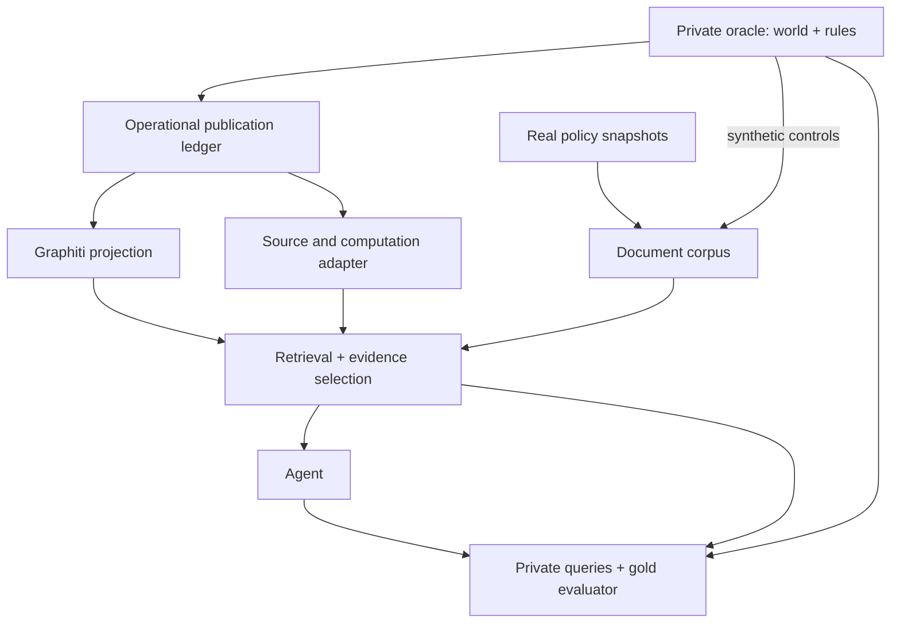
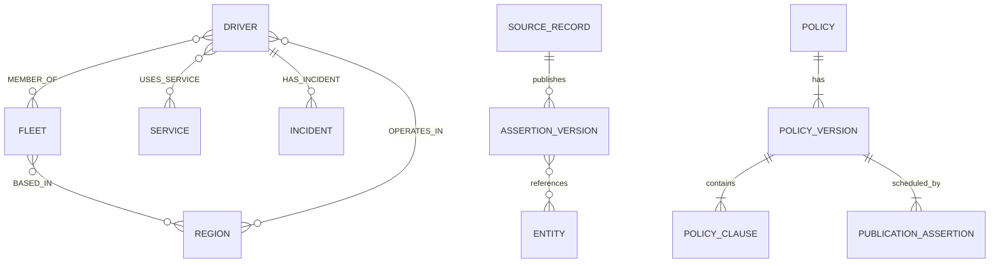
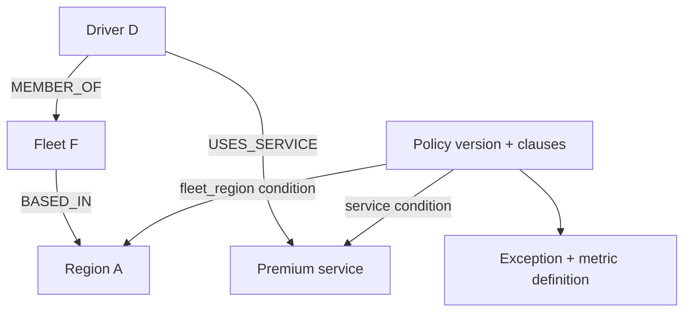

# GSM — Synthetic Schema and Data Design

**Schema v1.1 · Amendments theo corpus policy Green SM · 16/09/2026**

**Mục tiêu:** tạo dataset có policy công khai và dữ liệu vận hành tổng hợp để đánh giá construction, document retrieval, temporal-KG retrieval, hybrid evidence, reasoning và scalability. Đây là hợp đồng thực nghiệm cho dự án sáu tuần; không phải schema production, hệ thống tính lương hay công cụ ra quyết định đối với tài xế thật.

Bản này hợp nhất các amendments vào Schema v1.0. Giữ Q1–Q7, L1–L4, failure taxonomy, baseline Graphiti và C0 trong `docs/01_problem_and_evaluation.md`; giữ kết luận của `docs/research/gsm_retrieval_research.md` và `docs/research/gsm_paper_matrix.xlsx`. Nguồn nghiệp vụ bổ sung là corpus dưới `external/policy_green_sm_corpus/`, với archive gốc tại `data/raw/archives/policy_green_sm_source.zip`, được dẫn bằng mã Pxx và URL tại mục 12. Không thay kết luận dự án bằng một memory framework mới.

`MUST` là ràng buộc dữ liệu; `SHOULD` là mặc định có thể đổi bằng config. Các tên field là **schema tổng hợp đã chọn**, chưa phải mapping được GSM xác nhận. Tài liệu xác định công thức và điều kiện sử dụng; không tuyên bố generator, adapter hay các kiểm thử mới đã được triển khai.

| Nhãn căn cứ | Ý nghĩa | Có được dùng làm gold? |
| --- | --- | --- |
| `SOURCE_TEXT` | Điều khoản đọc được trong phần văn bản của bản crawl, có locator | Có cho phát biểu được văn bản hỗ trợ; vẫn cần đúng scope, version và thời gian |
| `OCR_PENDING` | Thông tin hiện chỉ đọc từ phần OCR, chưa đối chiếu ảnh gốc | Chưa dùng làm gold nghiệp vụ đã xác minh; giữ nguyên để review |
| `BENCHMARK_CONVENTION` | Định nghĩa tính toán/chọn cửa sổ do benchmark công bố | Có trong track có điều kiện hoặc synthetic control; không gọi là công thức nội bộ GSM |
| `UNRESOLVED` | Thiếu định nghĩa, lịch sử, scope hoặc cách diễn giải | Không sinh đáp án số chắc chắn; bổ sung evidence hoặc giữ nhãn thiếu thông tin |

### Bảng amendments

| ID | Thay đổi đã hợp nhất | Ý nghĩa nghiệp vụ và tác động đánh giá | Mục |
| --- | --- | --- | --- |
| A01 | Tách raw document snapshot, nội dung policy, lịch hiệu lực và lịch quan sát | Ngày đăng không chứng minh lịch sử nội dung; tránh tự tạo version/effective time | 9, 12, 15 |
| A02 | Thêm offer, quyết định nhận, assignment và thời gian khách đặt chuyến | Tỷ lệ nhận chuyến có denominator riêng; giờ thưởng không bị lấy nhầm theo lúc hoàn thành | 7, 10 |
| A03 | Thêm service-unit outcomes cho điểm giao | Một chuyến nhiều điểm giao không bị tính như một chuyến đơn; correction đúng đơn vị | 7, 10 |
| A04 | Thêm online session, revenue entry, rating, workday record | Tính giờ online, doanh số, sao và ngày công có dữ liệu gốc và coverage | 7, 10, 11 |
| A05 | Thêm thuộc tính/cohort và mốc gia nhập/chuyển dịch vụ có nguồn | Không dùng `standard/specialist` thay nhóm tái tuyển, tập nghề hoặc sinh viên | 7, 13 |
| A06 | Bổ sung calendar, metric definitions có đơn vị, công thức và cutoff | Tránh lẫn ngày lịch/30×24 giờ, mean-of-ratios/ratio-of-sums và VND/doanh thu ròng | 5, 9, 10 |
| A07 | Thêm binding giữa điều khoản và công thức; lịch tạm dừng theo scope | Không rút policy cho toàn bộ Depot khi thông báo chỉ nêu một số Depot | 12, 13 |
| A08 | Thêm bảng công thức đầy đủ và ví dụ biên | Numeric gold tái tính được; unknown/conflict không bị biến thành 0 hoặc false | 10, 13, 25 |
| A09 | Tách track source-grounded, conditional và synthetic control | Policy thật và policy biến đổi để thử temporal không bị đánh đồng; công bằng giữa baseline/proposed | 17–18, 27 |
| A10 | Pilot nhỏ, manifest và migration v1.0 → v1.1 | Giữ semantics cũ; không backfill dữ liệu chưa có; release cũ vẫn tái lập được | 22–26 |

## 1. Design principles

Thiết kế đi từ năng lực truy vấn đến bằng chứng cần thiết, rồi mới chọn đối tượng dữ liệu. Một thành phần chỉ được giữ nếu tạo ra một phép thử có ích mà thành phần đơn giản hơn không đáp ứng được.

1. **Truth độc lập với ngôn ngữ:** structured ledger và rule evaluator xác định đáp án; LLM chỉ diễn đạt hoặc trích xuất.
2. **Identity, time và provenance là dữ liệu bắt buộc:** tên giống nhau hoặc text tương tự không đủ chứng minh hai facts tương đương.
3. **Bằng chứng theo vai trò:** policy clause, state fact, bridge, event và aggregate không phải các ranking items có thể tùy ý thay thế nhau.
4. **History bất biến:** correction thêm phiên bản và lineage; không ghi đè nguồn cũ.
5. **Đo từng tầng:** construction, retrieval, selection và reasoning có đầu vào/đầu ra riêng để quy lỗi.
6. **Độ khó có kiểm soát:** dữ liệu thường, hard negatives và fault scenarios đều có mẫu số và seed; không cố tình làm lexical retrieval thất bại.
7. **Tái sử dụng công nghệ:** Graphiti vẫn là graph baseline. Schema không yêu cầu viết database, memory framework hoặc thuật toán graph mới.

## 2. Assumptions, limitations and contract clarifications

**Đã biết về dự án:** thời gian khoảng sáu tuần; mục tiêu là agent tích hợp document memory và temporal KG; Graphiti là reference hiện có; chưa có dữ liệu vận hành hoặc schema nội bộ GSM. Đã có corpus policy công khai được crawl; nội dung và chất lượng trích xuất phải được kiểm tra trước khi formalize.

**Chốt cho thực nghiệm:** dữ liệu chủ yếu tiếng Việt; thời gian chuẩn UTC, có timezone nguồn; tenant tổng hợp gọi là `scope_id`; identity và enum do generator quản lý. Chưa có cơ sở coi phân bố tài xế, sự kiện, truy vấn hoặc latency target là đại diện GSM.

Ba điểm của contract trước được làm rõ, không đổi mục tiêu đánh giá:

- Các trường `PENDING schema` được chốt bằng schema tổng hợp này. Mapping sang production tiếp tục chưa biết; không chờ schema GSM để triển khai.
- “Gold KG” trong ablation được hiểu là **KG dựng đúng từ dữ liệu operational đã được phép biết**, không phải graph chứa toàn bộ hidden truth. Nếu hai KG được cấp lượng thông tin khác nhau, không thể quy chênh lệch điểm cho extraction.
- Không có record không đồng nghĩa với không có sự kiện. Phủ định và aggregate đầy đủ cần bằng chứng về phạm vi dữ liệu đã được bao phủ.

Thông tin về một hệ thống simulation tài xế có sẵn chỉ xác lập một nguồn đầu vào tiềm năng. Chưa có schema/sample hoặc mô tả khả năng của hệ thống đó, nên không giả định nó cung cấp temporal revisions, policy rules hay gold evidence. Có thể tái sử dụng sau khi map và kiểm tra theo contract này.

## 3. Final schema and component review

Chọn **một entity registry nhỏ + immutable publication ledger + temporal assertion view + policy documents + derived artifacts**. Đây là schema dữ liệu, không phải một framework memory mới.

| Thành phần đề xuất | Quyết định v1.1 | Evidence/query được phục vụ | Lý do và giới hạn |
| --- | --- | --- | --- |
| Driver | Giữ entity | Identity, state, behavior; Q2–Q7 | Stable ID; trạng thái thay đổi nằm ở assertions |
| Fleet | Giữ entity | Disambiguation; bridge Driver → Fleet → Region; Q2/Q5 | Tạo multi-hop có ý nghĩa mà không cần vehicle simulator |
| Region, Service | Giữ catalog entities | Applicability, distractors, joins; Q1/Q4/Q5 | Tên có thể thay đổi; join bằng ID |
| Vehicle, `DRIVES` | Tiếp tục không mô phỏng | Chưa có yêu cầu riêng không thể kiểm tra qua Fleet/Service | Không sinh lịch phân xe, GPS hoặc vehicle lifecycle |
| DriverEvent | Giữ record, không thêm business node mặc định | Quan sát và lịch sử; Q3/Q6 | Episode/source record lưu nguồn; event facts có ID riêng |
| Trip / offer / điểm giao | Giữ business IDs trong ledger và typed views, không bắt buộc graph nodes riêng | Cohort, tỷ lệ, thời điểm đặt và điểm thưởng; Q3/Q4/Q6 | Một trip có thể có nhiều offers và service units; không dùng số offers thay số trips |
| Incident | Giữ entity nhẹ | Ngoại lệ, mở/đóng/mở lại; Q3/Q4/Q6/Q7 | Có identity để phân biệt hai vụ việc và sửa đúng vụ |
| DriverState | Temporal view, không mutable truth table | Historical state; Q2/Q4/Q6 | Tránh current-state overwrite phá lịch sử |
| Policy, PolicyVersion, PolicyClause | Giữ logical records và documents | Rule, version, exception; Q1/Q4/Q6 | Clause text là evidence; rule AST chỉ evaluator được đọc |
| BehaviorMetric | Giữ artifact có lineage | Aggregate/window; Q3/Q4 | Không coi số tổng hợp là raw observation |
| ProfileSummary | Giữ typed artifact | Profile retrieval và stale summary; Q3/Q6 | Dẫn tới metrics/events; không thay thế nguồn |
| Inference/Hypothesis | Một loại profile artifact, mặc định tắt | Unsupported-inference tests; Q3/Q7 | Không được trở thành oracle fact |
| Source registry, coverage certificate | Bổ sung metadata/records | Provenance, conflict, phủ định; Q3/Q7 | Cần để phân biệt thiếu dữ liệu với kết luận âm |

Bổ sung observations về online, doanh số, rating, ngày công và điều kiện tham gia chương trình ở mục 7. Không xây payroll, payment settlement, GPS, khách hàng hoặc fraud simulator. Giá trị thưởng/phạt là đáp án của bài kiểm thử có điều kiện, không phải giao dịch được thực thi.

## 4. Four schemas and diagrams

| Lớp | Nội dung | Ai được truy cập? |
| --- | --- | --- |
| A — Oracle world | Synthetic entities/events/facts, reviewed rule bindings, observation plan, expected proofs | Generator và evaluator; retrieval/agent MUST NOT truy cập |
| B — Operational input | Catalog đã công bố, source records, revisions, coverage, text observations | Ingestion và structured computation adapters trong scope/snapshot |
| C — KG projection | Nodes, temporal edges, episodes, source links, projection metadata | Graphiti adapter; chỉ từ B đã được công bố |
| D — Document projection | Policy versions/clauses, metadata, source locators | Document index/reader; không kèm private executable rules |



Các mũi tên từ oracle là bước sinh dữ liệu offline, không phải tool mà agent được gọi. Policy thật đi từ raw snapshot đến reviewed clause bindings; không được viết lại cho khớp AST. Document release chịu publication cutoff và access scope như B. Rule bindings và gold được xây offline; runtime chỉ nhận nguồn đã công bố và định nghĩa tính metric công khai.



Sơ đồ biểu diễn quan hệ qua toàn lịch sử. Cardinality tại một thời điểm được quy định ở mục 7; quan hệ nhiều-nhiều trong lịch sử không cho phép một driver thuộc hai fleet đồng thời trong world sạch.

## 5. Common types, units and keys

| Type / field | Định nghĩa và ý nghĩa nghiệp vụ | Validation |
| --- | --- | --- |
| `ID` | String opaque, duy nhất trong `world_id`, bất biến | Không mã hóa đáp án, split, lỗi hoặc thứ tự query |
| `Timestamp` | ISO 8601 có offset; canonical UTC, microsecond | Không nhận local timestamp không có timezone |
| `LocalDate` | `YYYY-MM-DD` trong một `calendar_id` | Không tự coi ngày local là ngày UTC |
| `Boundary` | Tagged `finite(at)`, `unbounded`, `unknown` | Unknown khác vô hạn; không dùng null thay cả hai |
| `ValidExtent` | `point(at)` hoặc `interval(from,to)`; `unknown/not_applicable` khai báo riêng | Interval `[from,to)`; finite from < to; point không là interval rỗng |
| `KnownExtent` | `known_from: Timestamp`, `known_to: Boundary` | Ledger suy ra finite start và finite/unbounded end; không đọc từ wall-clock Graphiti |
| `TypedValue` | `entity_ref/enum/boolean/integer/rational/string` | Type tường minh; extension tiếp tục dùng các tag này |
| `Rational` | `{n: integer, d: positive integer}`, rút gọn; `value=n/d` | So sánh exact bằng cross multiplication; phần trăm 90% lưu 9/10 |
| `Money` | `amount_minor: signed integer`, `currency`, `scale`; pilot `VND`, scale 0 | Không cộng khác currency/basis; kết quả công thức có thể là rational VND trước rounding |
| `Duration` | Integer microseconds, hoặc rational hours ở artifact | Không cộng timestamp; không làm tròn trước so sánh >8 giờ |
| `Locator` | Source/version + record/assertion hoặc document/clause/span + hash | OCR thêm image locator và extracted span; URL đơn lẻ chưa đủ tái lập |
| `CalendarDefinition` | `calendar_id/version`, `timezone`, `day_start_local`, `week_start`, `cycle_kind`, `cycle_bounds`, `origin`, `source_locator`; pilot ngày lịch bắt đầu 00:00 local | Phân biệt ngày lịch, tuần và kỳ lương; thiếu kỳ lương không tự dùng tháng dương lịch |
| `RegionDefinition` | `region_id`, `boundary_version`, `label`, `valid`, `source_locator` | “TP.HCM (cũ)” không tự map sang phạm vi mới; không đòi dựng GIS |

Mọi record có `schema_version`, `world_id`; khóa chính `(world_id,id)`. Driver/Fleet/Incident thuộc một `scope_id`; foreign keys phải đúng loại và scope. Region/Service có thể dùng catalog chung. `access_scope` là quyền đọc do app cấp; `business_scope` là phạm vi áp dụng policy: hai khái niệm khác nhau.

ID, tên và content hash có vai trò riêng. Hai nguồn cùng phát biểu không bị hợp nhất identity vì cùng text hash. Graphiti UUIDv5 có namespace `(world_id,scope_id,mode,snapshot_id)` và canonical object/version ID; database UUID không phải semantic gold.

## 6. Oracle schema and entity definitions

Oracle lưu chân lý cuối cùng của world riêng với những gì hệ thống được quan sát tại từng thời điểm. `WorldFact` không bị làm sai khi tạo noise; noise nằm trong observation/publication plan.

| Record | Trường ngoài common fields | Constraints |
| --- | --- | --- |
| `Entity` | `entity_id: ID`; `entity_type: DRIVER/FLEET/REGION/SERVICE/INCIDENT`; `scope_id: ID`; `existence: ValidExtent` | Không chứa mutable state làm ground truth thứ hai |
| `NameVersion` | `name_id: ID`; `entity_id: ID`; `text: string`; `kind: display/alias`; `locale: string`; `valid: ValidExtent`; publication lineage | Tên không unique; historical name phải giữ lịch sử |
| `WorldFact` | `world_fact_id: ID`; `subject_id: ID`; `predicate: enum`; `object: TypedValue`; `qualifiers: object`; `valid: ValidExtent` | True state tuân thủ ontology/cardinality; không chứa extraction confidence |
| `WorldEvent` | `world_event_id: ID`; `driver_id: ID`; `event_type: enum`; `event_time: Timestamp`; `attributes: object` | Sự kiện thật có identity độc lập với record quan sát nó |
| `ObservationPlan` | `observation_id: ID`; `world_refs: ID[]`; `source_id: ID`; `release_at: Timestamp`; `transform: enum`; `revision_targets: ID[]` | Private; ghi missing/late/correction/conflict injection và nguyên nhân |
| `PolicyRule` | `rule_id: ID`; `policy_version_id: ID`; `dsl_version: string`; `requires: AST`; `exceptions: AST[]`; `predicate_clause_map: object` | Private deterministic rule; không mount vào retrieval process |
| `WorldMetric` | Driver/window/definition; true numerator/denominator và source world-event set | Private diagnostic, không thay metric từ observable records |

Catalog public chỉ chứa các entities/names đã công bố. Không xuất private existence end, future alias hoặc future assignment để hỗ trợ resolver. Public `NameVersion` là view của `ENTITY_NAME` assertions cùng publication lineage, không phải bảng mutable độc lập. Attributes như `status`, `category`, `fleet`, `region` được biểu diễn bằng assertions trong mục 7.

## 7. Relations, predicates and operational records

### 7.1. Closed predicate vocabulary

| Predicate | Subject → object / qualifiers | Cardinality và semantics | Query |
| --- | --- | --- | --- |
| `MEMBER_OF` | Driver → Fleet | Một fleet tại một instant trong world sạch; có thể unknown trong observations | Q2/Q5/Q6 |
| `BASED_IN` | Fleet → Region | Một base region tại một instant | Q5/Q6 |
| `OPERATES_IN` | Driver → Region | Một primary operating region; quy ước tổng hợp, không mô tả toàn bộ hoạt động thực tế | Q2/Q4/Q6 |
| `USES_SERVICE` | Driver → Service | Set-valued, có thể nhiều dịch vụ đồng thời | Q2/Q4/Q5 |
| `DRIVER_STATUS` | Driver → enum `active/suspended/inactive` | Single-valued tại instant | Q2/Q4/Q6 |
| `DRIVER_CATEGORY` | Driver → enum `standard/specialist` | Single-valued; chỉ là loại tổng hợp | Q2/Q4 |
| `HAS_INCIDENT` | Driver → Incident | Một owner bất biến cho mỗi incident trong world; assertion sai có thể bị correction | Q3/Q4/Q7 |
| `INCIDENT_STATUS` | Incident → enum `open/resolved` | Single-valued; reopen tạo interval mới | Q3/Q4/Q6 |
| `TRIP_OUTCOME` | Driver → Service; `trip_id`, `outcome: completed/cancelled`, `region_id`, `reason_code` | Point fact; một terminal outcome được chấp nhận cho mỗi trip | Q3/Q6 |
| `ENTITY_NAME` | Entity → string; `kind`, `locale` | Display/alias versions, có valid time | Q2/Q7 |
| `POLICY_PUBLICATION` | PolicyVersion → enum `issued/withdrawn`; source locator | Valid interval là lịch hiệu lực công bố; known interval là lịch biết phiên bản lịch đó | Q1/Q4/Q6 |
| `ARTIFACT_PUBLICATION` | Metric/Profile/Coverage hoặc v1.1 Definition artifact → enum `available/retracted`; content locator | Công bố hoặc rút một artifact bất biến; logical known time theo ledger | Q3/Q6/Q7 |

`BASED_IN` và `OPERATES_IN` không đồng nghĩa: rule phải chỉ rõ dùng `fleet_region` hay `operating_region`. Không tự thêm `Driver ELIGIBLE_FOR Policy`, vì cạnh đó sẽ mã hóa sẵn kết luận hybrid.

Subject/object foreign keys được kiểm tra theo từng predicate: `POLICY_PUBLICATION` tham chiếu bảng PolicyVersion; `ARTIFACT_PUBLICATION` tham chiếu artifact tương ứng; các quan hệ nghiệp vụ tham chiếu Entity. Không ép mọi logical record thành business entity.

Fact keys được chốt theo semantics: state scalar và fleet/region assignment dùng `(subject_id, predicate)`; service membership thêm `service_id`; incident ownership dùng `incident_id`; trip outcome dùng `trip_id`; display name dùng `(entity_id, locale)`, alias thêm alias identity; policy/artifact publication dùng ID đối tượng được công bố. `logical_fact_id` ổn định cho key này; nhiều assertion versions hoặc sources có thể cùng key. Conflicts xét key và temporal overlap, không chỉ text. `reason_code` v1 là `driver_request/system_cancel/unspecified`, chỉ để thử evidence retrieval.

### 7.2. Source registry

| Trường | Type / quy định |
| --- | --- |
| `source_id`, `scope_id` | `ID`; nguồn tổng hợp như operational log, registry hoặc policy publisher |
| `source_kind` | Enum `registry/event_log/incident_log/policy_publisher/derived` |
| `authority_rank` | Integer; số nhỏ có ưu tiên cao hơn, cố định theo dataset |
| `allowed_predicates` | Enum list; không cho nguồn tùy ý phát biểu mọi domain |
| `can_correct_source_ids` | ID list; mặc định chỉ chính nguồn đó |
| `timezone` | IANA timezone dùng diễn giải input local times |

Precedence là quy ước công khai của benchmark, không dựa vào confidence LLM. Các nguồn có cùng rank cao nhất và giá trị xung đột tạo `unresolved_conflict`; không tự chọn record đến muộn nhất. Các source assertions thấp hơn vẫn giữ để audit.

### 7.3. Immutable publication ledger

| Record | Trường bắt buộc | Semantics |
| --- | --- | --- |
| `SourceRecord` | `record_id: ID`; `source_id: ID`; `scope_id: ID`; `known_at: Timestamp`; `commit_seq: int`; `operation: assert/replace/retract`; `target_assertion_ids: ID[]`; `assertions: AssertionPayload[]`; `raw_payload: object/string`; `payload_hash: string` | Một atomic commit; source record bất biến |
| `AssertionPayload` | `assertion_id: ID`; `logical_fact_id: ID`; `subject_id: ID`; `predicate: enum`; `object: TypedValue`; `qualifiers: object`; `valid: ValidExtent`; `event_time: Timestamp/null`; `source_refs: Locator[]` | Có ID trước projection; không dùng subject–predicate–object làm unique key |
| `AssertionVersion` | Payload + `record_id`, `source_id`, `scope_id`, `known_from`, `known_to`, `supersedes: ID[]` | Materialized view do reducer tạo từ ledger; không phải nguồn để ghi tay |
| `IngestionReceipt` | `run_id`; `record_id`; `received_at`; `indexed_at/null`; `status`; `attempts`; `error`; `projection_ids` | Đồng hồ thực của pipeline; không thay `known_at` tổng hợp |

`assert` không có targets; `replace` có targets và payload thay thế; `retract` có targets, không thêm payload. Một correction chỉ đóng các assertion IDs được chỉ định và được phép sửa. `known_at` của target phải sớm hơn thời điểm commit sửa; cùng timestamp chỉ cho các commits độc lập. Replacement một phần interval MUST công bố lại các đoạn không thay đổi cần giữ; không được làm mất lịch sử ngoài phần sửa.

Sự kiện v1.0 tiếp tục hợp lệ. Extensions v1.1 dưới đây cũng đi qua cùng ledger/reducer; không tạo một mutable operational table làm nguồn chân lý thứ hai. `event_type` trong raw payload phục vụ rendering; typed assertions mới là contract chung.


### 7.4. Operational extensions và ý nghĩa từng trường

Các record dưới đây là typed views của `AssertionPayload/AssertionVersion`, cùng identity, revision và provenance contract. Field bắt buộc cho record mới được ghi trong bảng; trường nullable phải mang reason `not_observed/not_applicable/unknown`. Chỉ bật domain mà rule được chọn cần đến; không bắt pilot sinh mọi extension.

| Record / predicate | Trường và type ngoài common ledger fields | Ý nghĩa nghiệp vụ | Identity / temporal semantics |
| --- | --- | --- | --- |
| `OfferIssued` / `OFFER_ISSUED` | `offer_id: ID`, `trip_id: ID/null`, `driver_id`, `service_id`, `region_id`, `issued_at: Timestamp` | Một lần hệ thống đề nghị một tài xế nhận một chuyến; nhiều tài xế có thể nhận các offer khác nhau cho cùng trip | Key `offer_id`; Driver → Service; point tại issued_at. Notification retry giữ nguyên offer_id |
| `OfferDecision` / `OFFER_DECISION` | `offer_id`, `driver_id`, `decision: accepted/declined/timed_out/system_cancelled`, `decided_at`, `reason_code` | Phản hồi/kết quả của offer; chưa có quyết định là pending, không tự là declined | Key `offer_id`; Driver → enum; point tại decided_at. Một accepted decision sau resolution; correction qua replace |
| `TripAssignment` / `TRIP_ASSIGNMENT` | `trip_id`, `offer_id/null`, `driver_id`, `service_id`, `region_id`, `accepted_at`, `customer_requested_at: Timestamp/null`, `request_source_ref` | Gắn một chuyến đã nhận với tài xế; giữ riêng thời gian khách đặt để tính điểm theo policy P05 | Key `trip_id`; Driver → Service; point tại accepted_at. `customer_requested_at` là timestamp bổ sung, không thay event_time của assignment |
| `TripOutcome` / `TRIP_OUTCOME` | Giữ `trip_id`, `driver_id`, `service_id`, `outcome: completed/cancelled`, `region_id`, `reason_code`; point terminal time | Một kết quả cuối của chuyến; không phải một offer hay một điểm giao | Key trip_id như v1.0; thiếu assignment không cản metric cancellation cũ, nhưng không đủ cho completion-rate mới |
| `ServiceUnitOutcome` / `SERVICE_UNIT_OUTCOME` | `unit_id`, `trip_id`, `driver_id`, `service_id`, `unit_kind: single_trip/delivery_stop`, `outcome: completed/cancelled`, `event_time` | Đơn vị hoàn thành được dùng cho điểm thưởng: chuyến đơn hoặc từng điểm giao | Key unit_id, FK trip_id; Driver → Service. Chuyến đơn đúng một unit; chuyến đa điểm dùng stop IDs khác nhau, không cộng thêm parent trip |
| `OnlineSession` / `ONLINE_SESSION` | `session_id`, `driver_id`, `device_ref/null`, `valid` interval | Khoảng tài xế online; session khác thiết bị có thể chồng nhau | Key session_id; Driver → boolean true; interval, không dùng point event làm số giờ |
| `RevenueEntry` / `REVENUE_ENTRY` | `entry_id`, `driver_id`, `trip_id/null`, `service_id/null`, `amount_minor`, `currency`, `component_code`, `recognized_at`, `related_entry_id/null` | Khoản doanh số/điều chỉnh có dấu, được tính theo một revenue basis được định nghĩa | Key entry_id; Driver → integer amount; point recognized_at. Refund thực là entry âm mới; sửa dữ liệu sai dùng replace entry cũ |
| `RatingObservation` / `RATING_OBSERVATION` | `rating_id`, `trip_id`, `driver_id`, `score: Rational`, `scale_max`, `rated_at` | Đánh giá khách hàng thực sự phát sinh; không đánh giá không phải 0 sao | Key rating_id; Driver → rational score. Pilot một rating khách hàng hiện hành mỗi trip; sửa rating giữ lineage |
| `WorkdayRecord` / `WORKDAY_STATUS` | `workday_id`, `driver_id`, `local_date`, `calendar_id`, `definition_id/version`, `status: true/false`, `reason_code`, `source_refs` | Xác nhận ngày vận doanh hoặc ngày đủ điều kiện chấm công theo **một định nghĩa cụ thể** | Key `(driver_id,local_date,definition_id/version)`; Driver → boolean; valid là ngày local. Thiếu record không phải false |
| `DriverAttribute` / `DRIVER_ATTRIBUTE` | `driver_id`, `attribute_id`, `value: TypedValue`, `valid` | Thuộc tính có nguồn để kiểm tra cohort; không chứa kết luận eligible | Key `(driver_id,attribute_id)` cho scalar; cardinality/type từ registry đóng bên dưới |
| `EngagementEvent` / `ENGAGEMENT_EVENT` | `engagement_event_id`, `driver_id`, `event_kind: joined/rejoined/service_converted`, `from_service_id/null`, `to_service_id/null`, `event_time` | Mốc gia nhập/tái tuyển/chuyển dịch vụ để xét cửa sổ áp dụng | Key engagement_event_id; Driver → enum; nhiều lần chuyển phải là nhiều IDs |

`SourceRegistry.allowed_predicates` được mở rộng tường minh cho các predicate trên. `source_kind` thêm `dispatch_log/online_log/revenue_log/rating_log/attendance_log`; rank/permissions tiếp tục do benchmark công bố, chưa phải authority thực tế của GSM. Không cấp quyền một log sửa mọi nguồn.

| `attribute_id` được phép trong v1.1 | Type / ý nghĩa | Giới hạn |
| --- | --- | --- |
| `engagement_program` | Enum theo catalog, ví dụ `bike_partner/taxi_driver` | Code tổng hợp, không suy từ tên dịch vụ; một program chính trong pilot |
| `recruitment_kind` | `first_join/rejoin` | Không suy rejoin từ việc có một đoạn thiếu dữ liệu |
| `prior_traditional_taxi_experience` | Boolean | Cần nguồn tuyển dụng; không suy từ số trips |
| `training_active` | Boolean theo valid interval | Đúng tại thời điểm xét; unknown end không là đã kết thúc |
| `student_status` | Boolean theo interval | Phục vụ ngoại lệ Học sinh/Sinh viên ở P05; không suy từ tuổi/tên |
| `assignment_compliance` | Boolean, kèm `definition_id`, khoảng xét và source attestation | P26 yêu cầu tuân thủ phân công/phân ca; chưa có log chi tiết thì chỉ thử điều kiện trên attestation tổng hợp có nguồn |

`DRIVER_CATEGORY=standard/specialist` được giữ cho synthetic controls cũ; không map sang các nhóm ở P26. Nhóm 1 và nhóm 2 trong P26 có thể chồng mô tả; thiếu quy tắc ưu tiên thì không ép một cohort duy nhất.

Đối với object có identity sự kiện như trip/offer/unit/rating/revenue entry/session, candidate versions được resolve theo business key trước time filtering; thời điểm/interval và các qualifiers là một phần nội dung cần phân xử. Hai nguồn nói cùng trip kết thúc ở hai ngày khác nhau có thể conflict dù hai point timestamps không trùng nhau. State facts vẫn dùng key + interval overlap. Không dùng điều kiện point-overlap để bỏ sót event-time correction/conflict.

**Giới hạn có chủ đích:** v1.1 chưa mô phỏng chuyển một trip giữa nhiều tài xế sau khi đã accepted, shared ride hoặc đổi currency. Loader gặp các trường hợp đó phải báo unsupported; không âm thầm giữ bản cuối. Một trip có thể có nhiều offers nhưng chỉ một assignment được chấp nhận trong world sạch của pilot. Coverage về từng domain vẫn cần riêng.

## 8. Entity resolution and name disambiguation

Thứ tự xử lý: lấy stable ID từ application context nếu có; kiểm tra scope/existence tại query time; nếu chỉ có mention thì sinh candidate bằng name/alias và lọc theo các điều kiện thực sự được cung cấp như fleet, region, service, time. Không lấy hidden gold entity để bổ sung context.

Chuẩn hóa Unicode NFC và casefold cho matching. Bỏ dấu hoặc typo matching chỉ mở rộng candidates; không tạo identity mới và không được dùng để chọn tùy tiện giữa các candidates còn hợp lệ. Query có ID/context mâu thuẫn với mention cần trả `ambiguous_request` với reason `context_conflict`.

| Record | Trường |
| --- | --- |
| Public mention input | `mention: string`; `supplied_entity_id: ID/null`; `context_constraints: object`; `valid_at`; `known_as_of`; `access_scope` |
| Resolution trace | `candidate_ids`; `matched_names`; `constraints_used`; `rejected_candidates/reasons`; `resolved_ids`; `status`; latency |
| Private resolution gold | `query_id`; `expected_candidate_ids`; `expected_resolved_ids`; `expected_status`; support atoms cho điều kiện phân biệt |

Ba lớp query mặc định dev: 80% có explicit ID/context, 15% mention phân giải duy nhất, 5% không thể phân giải. Đây là tỷ lệ thử nghiệm ban đầu; chưa có dữ liệu để gọi là tỷ lệ thực tế.

Collision rate 10% nghĩa là 10% **drivers tham gia nhóm trùng tên**, không phải xác suất một cặp tên trùng. Trong nhóm này, 50% được bố trí thêm collision cùng region; cần fleet/service/time để phân biệt hoặc cố ý giữ ambiguous. Alias 10% entities, đổi alias lịch sử 3% entities đủ điều kiện, typo 5% mention-only queries. `display_name` trùng cùng region không tự tạo conflict giữa facts của hai IDs.

Historical resolver chỉ dùng names và attributes hợp lệ theo cả `valid_at` và `known_as_of`. Bài missing evidence và bài ambiguous identity được gắn nhãn riêng dù cùng nằm trong Q7.

## 9. Temporal model and required scenarios

### 9.1. Four clocks

| Clock | Quy định |
| --- | --- |
| `event_time` | Khi sự kiện xảy ra; point event được chọn bằng `window_start ≤ event_time < window_end` |
| Valid time | Khi fact/quy định đúng trong nghiệp vụ; state interval là `[valid_from, valid_to)` |
| Known/transaction time | Khi một assertion version thuộc trạng thái thông tin đã công bố; `[known_from, known_to)` theo logical publication ledger |
| `ingestion_time` | Wall-clock khi run nhận input; `indexed_at` là khi kiểm tra quan sát được kết quả đúng |

Với interval fact, applicable tại `(t,a)` khi `valid_from ≤ t < valid_to` và `known_from ≤ a < known_to`, sau kiểm tra source precedence và scope. Unknown boundary không được diễn giải thành vô hạn. Query có thể vẫn trả uncertainty; generator không chấm fact có thời gian chưa xác định là chắc chắn applicable.

`valid_at` thiếu trong current query dùng `evaluation_now` đã pin. `known_as_of` thiếu dùng publication snapshot của run. “Ngày 2” được chuyển thành window theo timezone được cung cấp, không mặc định một instant UTC. Các facts dùng cho cùng trạng thái phải đồng thời hợp lệ; chuỗi sự kiện chỉ cần đúng thứ tự/window tương ứng.

### 9.2. Correction example

Ví dụ UTC, A/B là Region IDs. Ngày 3/8 nhận báo cáo driver chuyển A → B từ ngày 1/8; ngày 5/8 nhận correction rằng chuyển từ ngày 2/8. True world cuối cùng là B từ ngày 2/8.

| Assertion version | Valid interval | Known interval | Nguồn/revision |
| --- | --- | --- | --- |
| A₀ | `[01/07, ∞)` | `[01/07, 03/08)` | Báo cáo ban đầu |
| A₁ | `[01/07, 01/08)` | `[03/08, 05/08)` | Thay A₀, giữ phần trước chuyển |
| B₁ | `[01/08, ∞)` | `[03/08, 05/08)` | Báo cáo đến muộn |
| A₂ | `[01/07, 02/08)` | `[05/08, ∞)` | Correction thay A₁/B₁ |
| B₂ | `[02/08, ∞)` | `[05/08, ∞)` | Correction thay A₁/B₁ |

Tại valid time `01/08 12:00`, known-as-of `04/08` cho trạng thái **B**; known-as-of `06/08` cho **A**. Câu hỏi lịch sử “theo thông tin đã biết ngày 4” phải được chấm theo B dù world truth cuối cùng là A. Gold giữ riêng `world_answer` để phân tích, không phạt hệ thống vì thông tin chưa thể biết.

### 9.3. Scenario representation

| Scenario | Oracle và publication model | Expected check |
| --- | --- | --- |
| Future-effective | World transition tại t₂; assertion công bố tại t₁ < t₂ | Không dùng state mới tại t < t₂; vẫn có thể trả lời lịch đã công bố |
| Late arrival | World event tại t; record công bố tại a > t | Không xuất hiện trong prefix trước a; xuất hiện đúng event window sau a |
| Historical correction | World truth giữ nguyên; replace source assertion sai bằng các đoạn đúng | Valid-at cố định có thể đổi đáp án khi known-as-of đổi |
| State replacement | World transition thật; source kết thúc đoạn cũ và mở đoạn mới | Boundary chính xác, không chồng state sạch |
| Policy version change | Nội dung version mới và publication interval riêng | Đúng clause/version tại t và a |
| Overlap | Set-valued overlap hợp lệ; single-valued world overlap bị reject; source overlap có thể conflict | Không đồng nhất mọi overlap với lỗi |
| Retraction | Đóng known interval của assertion bị rút; không thêm fact ngược lại | Có thể từ answerable thành insufficient |
| Conflicting sources | Hai source claims trái nhau về cùng key/time; true world chỉ có một giá trị | Theo precedence hoặc unresolved conflict; không dùng hidden truth phân xử |
| Timezone/boundary | Canonical UTC + source timezone/offset; fixture sát nửa đêm, interval end và DST khi phù hợp | Không double-count ngày hoặc dùng closed upper bound |

### 9.4. Snapshot isolation and freshness

Historical benchmark dựng snapshot từ **publication prefix** `known_at ≤ known_as_of`, xử lý cùng timestamp theo atomic `commit_seq`. Snapshot trước correction không được chứa future `known_to`, future summaries hoặc embeddings sinh từ dữ liệu tương lai. Áp dụng cả với catalog, alias, policy metadata và cache, không chỉ graph edges.

v1.1 dùng một số checkpoint cố định trên quality suite; không tạo graph riêng cho từng query. Large stress ưu tiên current snapshot, báo riêng chi phí nhân bản snapshots. Live-update test phát records theo lịch load và đo `indexed_at − received_at`; không trừ timestamp nghiệp vụ tổng hợp khỏi wall-clock để tính update lag.


### 9.5. Business calendar và thời gian tài liệu

| Tình huống | Quy tắc canonical | Không được làm |
| --- | --- | --- |
| Ngày local d | `W_d=[local_midnight(d),local_midnight(d+1))`, chuyển từng boundary sang UTC bằng calendar | Group trực tiếp theo ngày UTC |
| Tuần P05 | Thứ Hai 00:00 đến Thứ Hai kế tiếp, timezone `Asia/Ho_Chi_Minh` trong benchmark | Cộng dồn rating tuần trước; coi cả Thứ Bảy **và** Chủ Nhật là bắt buộc khi nguồn nói một trong hai |
| Policy chỉ ghi ngày bắt đầu | Lưu nguyên date precision; mapping sang 00:00 local phải ghi `BENCHMARK_CONVENTION` nếu giờ không được nêu | Bịa timestamp chính thức từ ngày đăng |
| “Kỳ lương tháng 6/2026” P23 | `cycle_id` và bounds từ CalendarDefinition đã được xác nhận hoặc một convention được công bố | Mặc định kỳ lương là `[01/06,01/07)` khi nguồn chưa định nghĩa |
| “02 tháng từ ngày chuyển dịch vụ” P26 | Calendar-month arithmetic với `month_end_rule` được pin nếu bật; mặc định chưa tính khi binding thiếu | Thay bằng 60 ngày; tự chọn inclusivity hoặc reset khi tái tuyển |
| `posted_date` | Metadata ngày đăng của trang, giữ precision/source | Đồng nhất với valid_from, known_from hoặc lần crawl |
| `captured_at` | Lần thu nhận snapshot có bằng chứng; không có thì unknown | Lấy mtime ZIP hoặc ngày trong tên file làm timestamp crawl đã xác minh |
| `dataset_release_at` | Logical known time mà benchmark cấp snapshot cho hệ thống | Diễn giải thành ngày GSM thật sự biết/ban hành nội dung |

Trang hiện tại có thể đã thay ảnh/nội dung sau ngày đăng. P172 có ngày đăng 18/04/2025 nhưng OCR ảnh ghi hiệu lực 26/08/2025: đây là lý do phải lưu snapshot; không đủ để tái dựng nội dung từng có trong tháng 4. Known-time replay của policy thật chỉ dùng các observations đã có. Các lịch sử được dựng thêm để thử correction phải nằm trong track `synthetic_control`, có nhãn và provenance riêng.

## 10. Metrics, business meanings and complete formulas

### 10.1. Phân tầng và schema artifact

| Level | Representation | Ý nghĩa / giới hạn |
| --- | --- | --- |
| Raw observation | Immutable SourceRecord | Nguồn S báo cáo X; chưa phân xử conflict |
| Validated fact | Temporal assertion sau scope/revision/precedence | Thông tin chứng minh được tại snapshot; không dùng hidden world truth |
| Derived metric | MetricArtifact + definition + đầy đủ nguồn | Con số có population, window và lineage; không phải raw observation |
| Profile | ProfileArtifact kind=summary | Tóm tắt metrics/events; không tạo fact mới |
| Inference | ProfileArtifact kind=hypothesis | Gắn nhãn suy luận, mặc định tắt; không thay bằng chứng về policy |

| Record | Fields và ý nghĩa |
| --- | --- |
| `MetricDefinition` | Giữ `definition_id/version`, `name`, `event_filter`, `dedup_key`, `numerator_rule`, `denominator_rule`, `window_rule`, `zero_denominator_policy`, `definition_document_locator`. Extension thêm `unit`, `formula_id/version`, `population_rule`, `time_anchor`, `outcome_cutoff_rule`, `required_coverage_domains`, `calendar_id`, `revenue_basis_id/null`, `origin`, `rounding_rule/null`. Definition là tài liệu công khai về phép tính, không phải gold verdict |
| `MetricArtifact` | Giữ `metric_id`, `driver_id`, `definition_id/version`, `window_start/end`, `known_as_of`, `numerator: int/null`, `denominator: int/null`, `value: rational/null`, `status`, `source_set_id`, `coverage_ids`, `computed_at`, `published_known_at/null`. Extension thêm `unit`, `business_cutoff`, `calendar_id`, `basis_id/null`, `supersedes_artifact_ids`, `diagnostics_locator/null`. Scalar integer biểu diễn value=n/1 |
| `ProfileArtifact` | `profile_id`, `driver_id`, `kind`, `text`, `window`, `known_as_of`, `dependency_ids`, `derivation_version`, `generated_at`, `published_known_at`, `status: current/stale/retracted`, `claim_locators`, `supersedes_artifact_ids` |
| `RevenueBasisDefinition` | `basis_id/version`, `currency`, `included_component_codes`, `excluded_component_codes`, `recognition_rule`, `adjustment_rule`, `trip_allocation_rule`, `origin`, `source_locators`. Xác định “doanh số” nào đang được cộng; thiếu basis không đủ để tính khoản thực tế |
| `WorkdayNormDefinition` | `norm_id/version`, `calendar_id`, `period_id`, `scope_selector`, `standard_day_count: nonnegative integer`, `attendance_definition_id`, `origin`, `source_locators`, `publication_ref`. Xác định K và điều kiện chấm công theo đúng kỳ/program; không mặc định 26. Được phát hành như public definition artifact, có known history |
| `PointScheduleDefinition` | `schedule_id/version`, `policy_version_id`, `service_id`, `region_scope`, `valid`, `time_anchor`, `local_time_buckets`, `points_per_unit`, `unit_rule`, `source_locators`, `review_status`. Bảng điểm nằm trong document evidence; bản machine-readable phục vụ evaluator hoặc computation ablation có khai báo |

`status` của metric giữ `complete/incomplete/conflict/undefined`. Trước hết resolve versions/source conflicts, rồi xét coverage, rồi tính. Conflict ảnh hưởng kết quả → `conflict`; thiếu population/nguồn/định nghĩa hoặc có cohort chưa đóng → `incomplete`; population đầy đủ nhưng denominator bằng 0 → `undefined`. Ba trạng thái này trả exact n/d/value=null; partial counts chỉ nằm trong diagnostics. Definition không tồn tại/unsupported input là lỗi contract, không trả số giả.

### 10.2. Ký hiệu và quy tắc tính chung

| Ký hiệu | Định nghĩa |
| --- | --- |
| `d, W=[b,e), a, t*` | Driver, business window, known_as_of, business cutoff cho outcome. Hai đồng hồ `a` và `t*` độc lập |
| `S(a)` | Public assertions active ở known snapshot a, sau corrections và source precedence; không có future releases |
| `card(X)` | Số phần tử có business ID khác nhau; không phải số rows/sources |
| `I(P)` | 1 nếu mệnh đề P chứng minh đúng, 0 nếu chứng minh sai; unknown/conflict không được đưa vào tổng như 0 |
| `eligible(X)` | Population theo MetricDefinition công khai, không theo top-k retrieval |
| `μ(U)` | Độ dài hợp của các khoảng U; lưu exact microseconds |
| `rev_B(X,a)` | Tổng signed entries theo revenue basis B liên kết đúng population X, ở snapshot a |

Luôn resolve toàn bộ revisions của một business object **trước** lọc time window; correction có thể chuyển event ra khỏi window. Mỗi công thức dưới đây yêu cầu coverage đầy đủ đúng các domains, window và cutoff của nó. Các phép so sánh dùng rational chính xác; làm tròn chỉ ở display hoặc theo rounding rule đã công bố.

### 10.3. Formula catalog cho metrics

| ID / metric | Đầu vào và công thức đầy đủ | Ý nghĩa nghiệp vụ | Điều kiện / căn cứ |
| --- | --- | --- | --- |
| M01 `cancel_rate_30d` | `W=[t−30×24h,t)`; C = distinct trips có terminal cancelled trong W; F = distinct trips có terminal completed trong W; `rate=card(C)/(card(C)+card(F))` | Tỷ lệ hủy trong các chuyến có kết quả cuối thuộc cửa sổ | Giữ nguyên v1.0. Denominator 0 → undefined. Không phải mặc định tỷ lệ hủy trên app GSM |
| M02 `acceptance_rate` | O = eligible offers với issued_at∈W; A = các o∈O có decision accepted tại/before t*; `AR=card(A)/card(O)` | Tỷ lệ chấp nhận lời mời, đúng offer cohort | Convention pilot: O gồm mọi offer đã phát; declined/timed_out/system_cancelled đã đóng vẫn ở denominator. Pending tại t* → incomplete. GSM chưa xác nhận cách loại system-cancelled; mapping policy là conditional |
| M03 `completion_rate_accepted_cohort` | T = distinct assigned trips với accepted_at∈W; F = các trip∈T có terminal completed tại/before t*; `CR=card(F)/card(T)` | Tỷ lệ hoàn thành trong cùng cohort chuyến đã nhận | Convention; mọi trip trong T phải có terminal outcome ≤t*, hoặc incomplete. Không lấy completed theo một window chia accepted theo window khác; không suy CR=1−M01 |
| M04 `completed_trips` | F_W = distinct trips với terminal completed time∈W; `N_completed=card(F_W)` | Số chuyến hoàn thành trong ngày/tuần | Khác cohort M03; zero là hợp lệ nếu coverage complete và F_W rỗng |
| M05 `online_hours` | `U=union(valid intervals của online sessions) intersect W`; `H=μ(U)/3,600,000,000` | Tổng thời gian online, không đếm đôi sessions chồng nhau | Mẫu số là microseconds/giờ. Open end chỉ clip đến cutoff đã được nguồn chứng nhận; end unknown không tự clip thành complete |
| M06 `revenue` | E_B = eligible entries có recognized_at∈W, đúng driver/currency/basis B; `R_B=Σ(entry.amount_minor)` | Doanh số theo một định nghĩa cụ thể, có signed adjustments | “Doanh số”, thu nhập chia sẻ, thưởng, tiền ví và tiền sau thuế không đồng nghĩa; thiếu policy→basis binding → incomplete |
| M07 `mean_trip_revenue` | F_W như M04; `R_trip=rev_B(F_W,a)` với cutoff/recognition đã pin; `AvgTrip=R_trip/card(F_W)` | Doanh số trung bình của chính các chuyến hoàn thành được xét | Revenue entries phải gắn đúng trip population, đã phân bổ đủ; không lấy tổng tiền ví chia trips. F_W rỗng → undefined |
| M08 `operating_days` | D_W = mọi ngày local cần xét; `N_op=Σ_{x∈D_W} I(WorkdayStatus(d,x,op_definition)=true)` | Số ngày vận doanh theo definition gắn với policy | Coverage phải cho cả ngày không hoạt động; không suy từ số ngày có rows. P154 định nghĩa “hoạt động có phát sinh doanh số”; thành phần doanh số vẫn cần binding |
| M09 `average_orders_per_operating_day` | `N_order=Σ_{x∈D_W, op(x)=true} order_count_definition(d,x)`; `AvgOrders=N_order/N_op` | Số đơn bình quân trên ngày vận doanh, phục vụ P151 | Convention pilot order_count=M04; nguồn chưa nêu đủ loại đơn/outcome. N_op=0 → undefined, không coi trung bình thấp |
| M10 `weekly_rating` | R = current customer ratings với rated_at∈W, score theo cùng thang 5; `Rating=Σ score_i/card(R)` | Trung bình các đánh giá thực sự phát sinh trong tuần | P05 FAQ loại chuyến không đánh giá khỏi denominator. Convention anchor=rating event time; review trường hợp rating muộn. Không rating → undefined, không phải 0 |
| M11 `completed_reward_units` | U_W = distinct completed service units có completion time∈W; `N_units=card(U_W)` | Số đơn vị được thưởng, phân biệt chuyến đơn và điểm giao | Convention weekly membership theo completion time; P05 xác định giờ quy đổi theo khách đặt, chưa đủ làm rõ cross-week membership |
| M12 `reward_points` | Với u∈U_W: lấy trip, `h=local_time(customer_requested_at)`; `p_u=lookup(schedule, service, region, h, applicable_edition)`; `P_W=Σ p_u` | Điểm theo dịch vụ/giờ khách đặt cho từng điểm giao hoàn thành | Mỗi unit chỉ tính một lần. Lookup phải ra đúng một row; thiếu requested_at, stop coverage hoặc version → incomplete/conflict. Không lấy accepted_at/completed_at thay giờ quy đổi |
| M13 `weekly_rate` | `AR_W=Σ accepted_offers_x / Σ eligible_offers_x`; tương tự CR trên union các accepted-trip cohorts không trùng | Rate của population tuần | **Không** tự lấy trung bình các daily percentages. Nếu policy yêu cầu arithmetic daily mean thì dùng definition riêng `Σ r_x/N_days` và đầy đủ rates; chưa có căn cứ coi hai cách tương đương |
| M14 `consecutive_weeks` | Với predicate tuần B_w: `L_w=0` nếu B_w=F; `L_w=L_(w−1)+1` nếu B_w=T và predecessor đã xác định | Số tuần lịch liên tiếp thỏa một điều kiện | W−1 là tuần kế trước theo calendar, không phải record kế trước. Thiếu/conflict predecessor cần thiết → unknown/conflict; cần lịch sử đến một reset hoặc mốc bắt đầu chương trình |

M14 trả exact streak khi đủ lịch sử. Nếu tác vụ chỉ hỏi `streak≥k`, k tuần liền kề đều T đã đủ chứng minh; không bắt retrieval lấy cả lịch sử trước đó. Ví dụ F05 có thể dùng trực tiếp `B_w AND B_(w−1) AND B_(w−2)` thay vì yêu cầu exact L_w.

Online, offers, accepted trips, completed trips, reward units và ratings có populations khác nhau. Không ép tất cả dùng một `event_time`, một denominator hoặc một coverage certificate.

### 10.4. Worked examples và biên bắt buộc

| Ví dụ đã đóng population | Phép tính | Kết quả đúng / lỗi cần bắt |
| --- | --- | --- |
| 100 offers, 90 accepted; 81 trong 90 assigned trips completed, 9 cancelled | AR=90/100; CR=81/90 | Cả hai 90%; không dùng 81/100 làm CR |
| Terminal window có 81 completed, 9 cancelled | M01=9/90 | 10%; chỉ tình cờ bằng 1−CR nếu populations trùng, không phải identity tổng quát |
| Online 08:00–12:00 và 11:00–17:00 cùng ngày | Union 08:00–17:00 | 9 giờ, không phải 10 |
| R=200.000 VND trên ngày vận doanh của P154 | `(280000−200000)×1/5` | 16.000 VND; đúng 280.000 → 0; chưa biết ngày vận doanh → chưa đủ điều kiện áp công thức |
| Rating tổng 97 từ 20 đánh giá, 10 trips khác không rating | `97/20=4,85` | Không đạt điều kiện **>4,85**; không chia cho 30 |
| Bike khách đặt 08:59:59, hoàn thành 09:05 | Lookup giờ đặt thuộc `[06:00,09:00)` | Theo bảng P05 đang chờ review: 10 điểm, không phải 5; đúng 09:00 dùng bucket tiếp |
| Express 2h, khách đặt 11:30, 3 stops hoàn thành | `3×15` theo bảng P05 | 45 điểm; không cộng thêm 15 cho parent trip |
| Ngày 1: 9/10 offers accepted; ngày 2: 1/2 | `AR_W=10/12=5/6` | 83⅓%, khác arithmetic daily mean 70% |

Các ví dụ sử dụng ngưỡng OCR chỉ kiểm tra arithmetic với bảng giả định đã pin; không chứng nhận độ chính xác OCR hoặc quyền lợi thực tế. Với rational VND chưa nguyên, giữ exact amount và rounding status. Không tự chọn làm tròn xuống/lên; pilot P154 dùng doanh số bội số 5 VND để kết quả nguyên, ghi đây là fixture constraint.

### 10.5. Derived artifact lifecycle

Metric/profile content bất biến. Recompute tạo ID mới, `supersedes_artifact_ids` và publication mới; `ARTIFACT_PUBLICATION` quản lý known history. `current/stale/retracted` là trạng thái tại snapshot, không ghi đè nội dung cũ. Correction/retraction vào dependency hoặc coverage làm artifact stale; unknown freshness không được báo current.

Summary mặc định dùng template có citations. So sánh “tỷ lệ tăng” cần hai windows complete cùng definition. On-demand computation ghi input snapshot và receipt; không tự trở thành artifact đã tồn tại trong quá khứ. Public tool chỉ tính metrics từ public definitions/records, không gọi private policy evaluator để trả sẵn Q4.

## 11. Coverage, negative evidence and source-set lineage

Thêm coverage certificate để hỗ trợ phủ định và aggregate mà không trao hidden oracle cho agent.

| Record | Fields |
| --- | --- |
| `CoverageCertificate` | `coverage_id`, `scope_id`, `entity_ids`, `domain`, `predicates/event_types`, `window`, `source_ids`, `known_as_of`, `complete_through`, `status: complete/partial`, `source_set_id`, `publisher_source_id`, `publication_record_id` |
| `SourceSetManifest` | `source_set_id`, `member_count`, `member_hash`, `members_locator`, `selection_rule/version`, `snapshot_id` |

Certificate là record operational sinh bởi một nguồn có quyền chứng nhận phạm vi cụ thể; không chứng nhận toàn bộ thế giới doanh nghiệp. Với “không có incident open tại T”, cần complete incident-register coverage tại T và các trạng thái liên quan, hoặc một validated negative assertion có coverage lineage tương đương. Không tìm thấy incident qua semantic search không đủ.

Tương tự, thiếu cạnh `USES_SERVICE` không chứng minh driver không dùng dịch vụ đó nếu chưa có complete service-roster coverage. Scalar state có một giá trị khác đã được xác lập có thể bác bỏ phép `eq`; set-valued membership cần đầy đủ phạm vi hoặc bằng chứng âm có lineage. Negative assertion ở đây là kết quả derivation kèm certificate, không bổ sung một predicate nghiệp vụ ngầm.

Khi masking một record làm mất tính đầy đủ, generator MUST hạ coverage thành partial hoặc không công bố certificate. Không giữ certificate complete để vô tình cấp bằng chứng sai. Retraction/correction làm thay đổi tập nguồn phải tạo certificate/version mới.

Source-set members lưu đầy đủ ở artifact truy vết; evidence context dùng count/hash/locator và các events cần giải thích. Không nhét hàng triệu IDs vào prompt. Nếu query yêu cầu exact aggregate, computation adapter dùng toàn bộ visible set; nếu query chỉ hỏi ví dụ sự kiện, gold có thể chấp nhận tập nhỏ đủ chứng minh nhận định được hỏi.

### 11.1. Coverage cho các amendments

| Domain | Phạm vi phải được chứng nhận | Vì sao cần riêng |
| --- | --- | --- |
| Offers/decisions | Toàn bộ offers của driver trong issued window và decisions đến business cutoff | Có đủ trips không chứng minh đủ offers bị từ chối |
| Assignments/outcomes | Cohort accepted trips và terminal states đến cutoff | Trip chưa kết thúc không phải trip bị hủy |
| Service units | Toàn bộ expected unit IDs và outcomes của trips liên quan | Parent trip complete không chứng minh số điểm giao hoàn thành |
| Online | Sessions giao window và source watermark cho open sessions | Log login đủ không đồng nghĩa log logout đủ |
| Revenue | Components/basis, recognition window hoặc trip cohort, adjustments đến snapshot | Có fare entries nhưng thiếu adjustments chưa đủ exact revenue |
| Ratings | Ratings phát sinh trong window, revisions và scale | Complete rating register vẫn có thể không có rating; đó là undefined average |
| Workdays/calendar | Mọi ngày/kỳ trong window, đúng definition và scope | Ngày thiếu record không phải ngày nghỉ hoặc vi phạm |
| Policy schedules | Các publications/overrides được cấp trong benchmark scope/snapshot | Một corpus crawl không tự chứng nhận toàn bộ lịch sử chính sách GSM |

Coverage xác nhận tính đầy đủ của **nguồn đã chỉ định**, không xác nhận nguồn không thể sai. Với post-period outcome cutoff, certificate phải bao phủ cả cohort và tail interval cần theo dõi. Không đánh dấu aggregate complete vì mọi item được retrieval trả về đã có provenance.

## 12. Policy corpus, schema and review status

### 12.1. Intake và nguồn đã đối chiếu

ZIP có **224 bài riêng + 1 file tổng hợp**; nội dung các bài riêng được lặp lại trong file tổng hợp. Exclude `00_Tong_hop_Tat_ca_Chinh_sach_Tin_tuc.md` khỏi corpus độc lập để không đếm đôi. Không coi cả 224 bài là 224 policy chuẩn tắc: có tin tức, tuyển dụng, chương trình và FAQ. 202 bài có marker nội dung OCR; marker không chứng minh OCR đúng. Các mã Pxx dưới đây là mã tham chiếu theo prefix filename, không phải số hiệu policy GSM.

| Mã / nguồn | Dữ kiện ảnh hưởng schema | Readiness / giới hạn |
| --- | --- | --- |
| P154 — [Doanh số tối thiểu Hà Nội](https://www.greensm.com/vn-vi/news/cap-nhat-quy-dinh-doanh-so-toi-thieu-tai-ha-noi) | Ngày đăng 19/06/2025; hiệu lực ghi 23/06/2025; Bike Hà Nội; 280.000 VND/ngày vận doanh, truy thu 20% phần thiếu | `SOURCE_TEXT` cho ngưỡng/công thức và ví dụ 16.000. Revenue basis nội bộ và lịch supersession chưa biết; không gọi là policy đang hiệu lực năm 2026 |
| P151 — [Quy định vận doanh](https://www.greensm.com/vn-vi/news/cap-nhat-quy-dinh-van-doanh) | 15/07/2025; auto-accept khi AR<50%; body nêu CR và/hoặc AR<70%, phạt theo trung bình đơn và số ngày vi phạm | Body và OCR có phạm vi diễn đạt khác nhau: OCR chỉ nêu AR. Cần review; chưa tự tạo business conflict từ chỗ OCR bỏ sót. Denominators và “03 ngày” còn cần binding |
| P05 — [Thu nhập/vận doanh Hà Nội, TP.HCM](https://www.greensm.com/vn-vi/news/cap-nhat-chinh-sach-thu-nhap-van-doanh-ha-noi-ho-chi-minh-dong-nai) | Ngày đăng 15/08/2026; hiệu lực ghi 17/08/2026; điểm thưởng theo **giờ khách đặt**, đa điểm theo điểm giao hoàn thành; rating không tính chuyến không đánh giá | FAQ là `SOURCE_TEXT`; bảng điểm/tier/điều kiện phần ảnh là `OCR_PENDING`. Ngưỡng AR/CR theo khu vực; không dùng mọi điều kiện TP.HCM cho Hà Nội |
| P26 — [Điều kiện đảm bảo thu nhập](https://www.greensm.com/vn-vi/news/bac-tai-xanh-taxi-cap-nhat-dieu-kien-chinh-sach-dam-bao-thu-nhap-thang6-2026) | Ngày đăng 09/06/2026; OCR ghi hiệu lực 06/06/2026; nhóm mới/tái tuyển/kinh nghiệm taxi/chuyển GF VIP; online, tỷ lệ, số chuyến, tuân thủ phân ca | Chi tiết điều kiện phần ảnh là `OCR_PENDING`; nhận diện cohort và cách tính khoản bù/thuế chưa đầy đủ |
| P172 — [Thưởng vượt ngày công](https://www.greensm.com/vn-vi/news/thuong-khi-vuot-ngay-cong-tai-tphcm) | Ngày đăng 18/04/2025; OCR ghi 26/08/2025; Depot HCM 1/2/6/7; 200.000/ngày vượt, cap 800.000/tháng | Có dấu hiệu nội dung snapshot khác thời điểm ngày đăng; điều kiện chấm công và norm từng tháng chưa có. Cap/scope/date từ ảnh cần review |
| P23 — [Tạm dừng thưởng vượt ngày công](https://www.greensm.com/vn-vi/news/cap-nhat-chinh-sach-thu-nhap-tam-dung-chinh-sach-thuong-vuot-ngay-cong) | Ngày đăng 12/06/2026; nêu Depot HCM **1/6/7**, từ kỳ lương tháng 6/2026 | `SOURCE_TEXT` cho thông báo; không tự rút quyền lợi của Depot 2. Bounds kỳ lương và explicit mapping program/schedule cần xác nhận |

Các URL là provenance của bản đã cung cấp, không phải tuyên bố đã xác minh trạng thái mới nhất của website. Bài cùng title/ngày nhưng phạm vi khác vẫn là nguồn khác. Giữ raw text kể cả artefacts OCR, nhưng index normalized text phải ghi transformations; không coi lời dẫn của công cụ OCR là lời của GSM.

### 12.2. Document records

| Record | Fields / business meaning | Quy định |
| --- | --- | --- |
| `SourceDocumentSnapshot` — mới | `snapshot_id`, `source_url`, `archive_member_path`, `raw_hash`, `raw_locator`, `posted_date/null`, `posted_date_precision`, `captured_at: Boundary`, `dataset_release_at`, `language`, `content_kind`, `asset_refs[]`, `extraction_method`, `extraction_version/null` | Bản quan sát bất biến; thiếu capture timestamp lưu unknown. Tin không phải policy vẫn có record này |
| `DocumentAsset` — mới | `asset_id`, `snapshot_id`, `source_url`, `local_locator/null`, `content_hash/null`, `media_type`, `ocr_text_locator/null`, `review_status` | Link ảnh chưa tải khác ảnh đã pin hash; không tuyên bố đã kiểm tra ảnh nếu chỉ có OCR |
| `SourceReview` — mới | `review_id`, `snapshot_id`, `clause/span`, `reviewer_ref`, `reviewed_at`, `method`, `status`, `issues`, `evidence_locators` | Review theo từng clause/table; approve một dòng không tự approve toàn bài. `method` phân biệt text, image/manual và automated-only |
| `Policy` | `policy_id`, `title`, `document_type`, `scope_ids` | Family/program identity; title không unique; chưa biết nối family thì giữ provisional mapping |
| `PolicyVersion` | Giữ `policy_version_id`, `policy_id`, `version_label`, `content_hash`, `language`, `clause_ids`; thêm `source_mode`, `source_snapshot_id/null`, `official_version_label/null` | `source_mode=real_snapshot/synthetic_control`. Với real snapshot, `version_label=snapshot:<hash-prefix>` là label thực nghiệm, không giả số hiệu chính thức |
| `PolicyClause` | Giữ `clause_id`, `policy_version_id`, `section_id`, `order`, `kind`, `text`, `cross_references`, `content_hash`; thêm `source_span`, `asset_id/null`, `basis_label`, `review_id/null` | Clause giữ source text; bảng có row/column locators; không tự sửa ngưỡng để phù hợp generator |
| `PolicyPublication` | View `POLICY_PUBLICATION`: `publication_assertion_id`, `policy_version_id`, `status: issued/withdrawn`, `valid`, `known`, `source_locator` | Giữ semantics v1.0 cho global/default lịch của một version. Unknown valid time vẫn unknown; không lấy posted_date điền |
| `DocumentRevision` | Variant cũ `revision_kind=policy_projection`: giữ các fields v1.0, gồm publication_assertion_id. Variant mới `revision_kind=raw_snapshot`: `document_revision_id`, `snapshot_id`, `policy_version_id/null`, `renderer_version`, `text_locator/hash`, `metadata`, `observation_release_id` | Raw snapshot có thể chưa có confirmed PolicyPublication; không tạo publication giả để qua validator. V1.0 thiếu tag được hiểu policy_projection |
| `DocumentObservationRelease` — mới | `release_id`, `snapshot_id`, `known_at`, `scope_ids`, `source_record_id`, `status: available/retracted` | Public availability của tài liệu trong benchmark; không khẳng định hiệu lực pháp lý/nghiệp vụ của policy |

`DOCUMENT_SNAPSHOT_PUBLICATION` là predicate extension: subject snapshot_id → `available/retracted`, fact key snapshot_id; known history theo ledger, valid=not_applicable và event_time=null. SourceRegistry phải cho phép source công bố predicate này; tương tự với POLICY_SCOPE_OVERRIDE. Nó xác lập source visibility, không thay `POLICY_PUBLICATION`. Các real raw snapshots có thể phục vụ Q1 “bài này nói gì” mà chưa đủ trả lời “policy nào áp dụng tại T”.

### 12.3. Rule bindings và lịch tạm dừng theo scope

| Record | Fields / business meaning | Runtime visibility |
| --- | --- | --- |
| `PolicyRuleBinding` | `binding_id/version`, `policy_version_id`, `rule_group_id`, `clause_ids`, `metric_definition_refs`, `formula_refs`, `parameter_locators`, `assumptions`, `status: reviewed/conditional/pending_review/unsupported`, `review_refs`, `evaluation_track` | Private mapping dùng sinh/chấm gold; public docs giữ thresholds/clauses và public metric definitions tương ứng |
| `PolicyScopeOverride` | `override_id`, `target_publication_assertion_ids`, `policy_version_id`, `rule_group_ids`, `scope_selector`, `status: issued/withdrawn`, `valid`, `known`, `reason_clause_ids`, `source_locator` | Source-backed schedule metadata cho một phần scope; cần retrieve thông báo/điều khoản để chứng minh kết luận |
| `PolicyComputationDefinition` | `computation_id/version`, `formula_id`, `typed_inputs`, `parameters`, `output_unit`, `rounding_rule/null`, `parameter_clause_map`, `required_bindings` | Private closed formula registry; không mount như tool trả verdict/tiền thưởng sẵn cho agent |

`POLICY_SCOPE_OVERRIDE` là predicate mới, key override_id, subject PolicyVersion → issued/withdrawn. Selector chỉ dùng IDs nguồn chứng minh được như fleet/region/service/program và rule-group; không mã hóa ngưỡng doanh số/rating. Override chỉ tác động phần giao giữa valid interval và scope của target. Ngoài phần giao, lịch cũ vẫn giữ. Target/link/authority phải được review; không suy “bản mới thắng”, “scope hẹp luôn thắng” hoặc “hai bài cùng title là supersession”. Nếu nhiều overrides active mâu thuẫn mà không có precedence/explicit replacement, giữ conflict.

P172→P23 là fixture ứng viên cho partial suspension: sau khi review mapping và calendar, HCM 1/6/7 có thể bị dừng theo thông báo; không suy HCM 2 vẫn chắc chắn được hưởng nếu coverage lịch policy của Depot 2 chưa đầy đủ. Không withdraw toàn bộ PolicyVersion của P172 để biểu diễn việc này.

### 12.4. Metadata boundary

| Thông tin | Public metadata / evidence | Private oracle |
| --- | --- | --- |
| IDs, URL, hashes, source observations, approved valid/known time | Có; unknown/review status giữ nguyên | Có |
| Region/service/fleet scope hints | Có, chỉ route/filter; có source locators | Có |
| Thresholds, exceptions, điểm/tier, điều kiện cohort | Trong **document clauses**; không phát tán thành ready-made eligibility graph | AST, reviewed parameter tables và bindings |
| Metric definitions | Public definition docs có version; tool tính trên visible records | Independent implementation/fixtures để kiểm tra số học |
| Applicability, financial decision, proof labels, query family | Không xuất vào retrieval index | Gold/evaluator |

Với synthetic controls, render policy từ AST và kiểm tra text preservation. Với real policies, hướng đi ngược lại: immutable snapshot → review clauses → binding có căn cứ. Nếu thử một biến thể ngưỡng/hiệu lực, tạo document `synthetic_control` với tên/ID và provenance riêng; không sửa bài thật rồi vẫn gắn nguồn GSM.

## 13. Policy applicability and financial formula bindings

### 13.1. Boolean contract giữ nguyên

Rule DSL v1.0 giữ `all/any/not` và typed `eq/in/lt/le`; với path numeric x và constant c, `x>c` normalize thành `not(x le c)`, `x≥c` thành `not(x lt c)`, bảo toàn U/C. Không cần đổi grammar legacy để thêm gt/ge. Operand registry v1.1 thêm typed attributes, calendar/workday predicates, engagement events và metrics mục 10. Không thực thi Python/SQL tùy ý trong rule. `fleet_region` phải resolve `MEMBER_OF → BASED_IN`; không thay bằng `OPERATES_IN`.

| Phép toán | Định nghĩa đầy đủ |
| --- | --- |
| Leaf | `T/F/U/C`: chứng minh đúng/sai, thiếu hoặc không xác định, xung đột chưa phân xử |
| `not(x)` | Đổi T↔F; giữ U và C |
| `all(xs)` | Có F → F; toàn T → T; còn lại có C → C; nếu không → U. Empty all=T |
| `any(xs)` | Có T → T; toàn F → F; còn lại có C → C; nếu không → U. Empty any=F |
| `applies` | `requires AND NOT(any(exceptions))`, sau resolution entity, policy edition/schedule và scope |
| T/F result | Có proof cho verdict; F không đồng nghĩa dữ liệu vắng mặt |
| U/C result | U → insufficient_evidence; C → unresolved_conflict; không trả amount chắc chắn |

Default synthetic rule depth 3, 6 leaves và 2 exceptions là generator knobs, không phải giới hạn nghĩa của policy thật. Bài nhiều điều kiện được chia thành rule groups có AND-proof, không cắt bớt điều kiện để qua cap. Scalar `in` là thuộc list; set-valued service `in` là giao không rỗng. Phủ định membership cần coverage.

Policy resolver không chọn version label lớn nhất. Explicit edition query phải nói rõ đang áp dụng edition giả định hay hỏi hiệu lực thực tế. Nếu cần biết version đang áp dụng mà lịch sử không đầy đủ, trả thiếu thông tin. Với source-backed withdrawal, có thể chứng minh `not_effective`; chưa có publication không có nghĩa policy không tồn tại.

### 13.2. Công thức theo các policy đã chọn

`ScopeOK` bao gồm entity/cohort, region boundary version, service/program, schedule và period đúng nguồn. `E` là toàn bộ điều kiện áp dụng, không chỉ một ngưỡng metric. Các công thức tiền chỉ được tính khi E=T và required bindings đã được phê duyệt cho track. E=F trả verdict không áp dụng/không đủ điều kiện; không tự biến mọi trường hợp thành một khoản 0 VND. U/C giữ status tương ứng.

| ID / rule | Công thức và ý nghĩa nghiệp vụ | Điều kiện và trạng thái hiện tại |
| --- | --- | --- |
| F01 — P154 truy thu ngày | Với ngày vận doanh đủ điều kiện: `charge = max(280000 − R_day, 0) × 1/5` VND | Ngưỡng/công thức `SOURCE_TEXT`. E cần Bike, Hà Nội, edition/schedule và operating day. R_day theo revenue basis gắn với “Doanh số” app; mapping chưa biết thì conditional. Ngày không hoạt động không tự chịu 56.000 |
| F02 — P151 auto-accept | `trigger = ScopeOK AND (AR_day < 1/2)`; output là đề xuất bật tính năng đến mốc “23h59” ghi trong nguồn | Không thực thi hành động. Denominator và độ chính xác giây của mốc kết thúc chưa xác nhận; giữ source literal nếu chưa có binding |
| F03 — P151 ngày vi phạm | Theo body: `bad_x = (AR_x < 7/10) OR (CR_x < 7/10)`; `V_week=Σ I(bad_x)` trên các ngày thuộc definition được pin | Không tự dùng OCR để bỏ nhánh CR. Population ngày và rates là conditional cho đến review |
| F04 — P151 phạt tuần | Convention `violates_week = (V_week ≥ 3)`; nếu false: không phát sinh mức phạt này; nếu true và AvgOrders≥5: 100.000; nếu true và AvgOrders<5: 200.000 VND | “Vi phạm 03 ngày” được benchmark diễn giải ≥3, **chưa khẳng định GSM đã định nghĩa như vậy**. AvgOrders=M09. Unknown ngày/rate/avg cần thiết → chưa tính exact amount |
| F05 — P151 tái phạm | `B_w = violates_week_w AND (AvgOrders_w<5)`; `L_w=M14(B)`; `lock_candidate = ScopeOK AND (L_w≥3)` | Cửa sổ các tuần liên tiếp của đúng chương trình/edition. Thay policy không tự reset/giữ streak nếu chưa có transition binding; không gọi API khóa tài khoản |
| F06 — P05 chia sẻ doanh số | `share_gross=Σ_s α_s × R_share,s`; α Bike/Express Siêu tốc=7/10, Express 2h/4h=18/25, Food=3/4 | Các rates từ `OCR_PENDING`. Revenue basis có special-request fees theo nguồn; FAQ nêu doanh số trước khuyến mại/chiết khấu. Đây chưa là tiền sau PIT/VAT; không tự tính tax/net income |
| F07 — P05 thưởng tuần | `P=M12`; khi E=T, `reward=tier(P)` theo bảng 13.4; E dùng conditions theo region và definition đã review | Rating >97/20, không ≥. Hà Nội AR/CR≥17/20; TP.HCM≥9/10 theo nguồn. Điều kiện ngày và rating phải đối chiếu bảng+FAQ; không copy nguyên HCM sang HN. Numeric gold hiện conditional/pending review |
| F08 — P05 truy thu thiếu doanh số tuần | `target(HN)=1600000`, `target(HCM_old)=1500000`; `shortfall=max(target−R_week,0)`; B_w=(shortfall>0); L_w=M14(B); `charge=0` nếu shortfall=0; nếu shortfall>0: `charge=shortfall×r(L_w,student_status)` | Bảng OCR ghi regular r(1)=1/4, r(2)=3/10, r(3)=7/20, r(4)=2/5. **Regular L≥5 chưa được tự suy 40%**. Student từ tuần 3 có r=3/10 theo chú thích. Cần review scope/student status, revenue basis và reset semantics |
| F09 — P05 phí ngày không vận doanh | Candidate nếu definition và exceptions đã đủ: `fee_month=50000×max(N_nonoperating_days−4,0)` | OCR ghi từ ngày không vận doanh thứ 5 trong tháng. Chưa đủ dữ liệu về ngày đủ điều kiện tính phí/lý do hợp lệ; **disabled mặc định**. Cảnh báo 2 ngày và thu hồi 5 ngày liên tiếp là rule khác, không lấy monthly count thay streak |
| F10 — P172 thưởng ngày vượt công | Gọi x₁…xₙ là các ngày vận doanh trong tháng đã sắp theo local date; K=ngày công chuẩn của kỳ; `N_extra=Σ_{j>K} I(attendance_qualified(x_j))`; `bonus=min(800000,200000×N_extra)` | Convention xác định thứ tự ngày vượt phải được pin. Không mặc định K=26 mỗi tháng. Norm, attendance definition, OCR cap/scope/effective time và lịch dừng P23 cần binding; chưa đủ thì conditional/unsupported |
| F11 — P26 nhóm 1 | `E1=Scope1 AND Window1 AND Compliance AND H_day>8 AND AR_day≥9/10 AND CR_day≥9/10 AND N_completed≥6` | OCR nêu floor 600.000/ngày. Scope/window gồm tuyển mới chưa kinh nghiệm GSM hoặc tái tuyển, dịch vụ/khu vực và thời gian tập nghề/chuyển Limo phù hợp. Không suy đã thực trả 600.000 |
| F12 — P26 nhóm 2 | `E2=Scope2 AND Window2 AND Compliance AND H_day>8 AND AR_day≥9/10 AND CR_day≥9/10 AND N_completed≥10` | OCR nêu net 18 triệu/tháng, trước thuế 18,6 triệu và mức tham chiếu 715.000/ngày hoặc thu nhập cũ cao hơn. Không suy 18,6 triệu/26=715.000 exact, không tự quy đổi ngày/tháng hoặc tính PIT |
| F13 — P26 nhóm 3 | `E3=Scope3 AND Window3 AND Compliance AND N_completed≥5 AND AvgTrip≥100000 AND AR_day≥9/10 AND CR_day≥9/10` | OCR nêu floor 700.000/ngày; Taxi chuyển GF VIP, khu vực và 2 tháng từ chuyển đổi. Không thêm online>8 vào nhóm 3 khi bảng không nêu |
| F14 — Khoản chi thực tế của đảm bảo thu nhập | **Chưa có công thức đủ căn cứ**; cần base earnings được bù, prorating, eligible days, prior-income proof, khoản loại trừ và rounding | Không tự đặt `payment=max(floor−revenue,0)`. Dataset hiện chỉ chấm điều kiện/floor đã review; câu hỏi số tiền bù thực tế phải insufficient hoặc chưa đưa vào numeric evaluation |

P26 Scope1/Scope2: Car/Premium tại các địa bàn cũ Hà Nội, TP.HCM, Bình Dương, Đồng Nai; Limo toàn quốc theo OCR. Window Car/Premium là thời gian tập nghề; Limo là tập nghề hoặc hai tháng từ chuyển dịch vụ. Scope3 là Taxi chuyển GF VIP tại Hà Nội/TP.HCM cũ, Window3 hai tháng từ chuyển. `Compliance` cần nguồn về phân công/phân ca, không tự mặc định true. Mô tả nhóm có thể chồng nhau; không dùng thứ tự group number làm precedence.

### 13.3. P05 — Bảng điểm candidate phải review ảnh trước khi dùng gold thật

Mỗi cell dưới đây là **điểm/đơn vị hoàn thành**, lấy từ OCR bản đã cung cấp. Timezone benchmark là Asia/Ho_Chi_Minh; giờ tra bảng là `customer_requested_at`. Bucket cuối là hợp ba khoảng, không phải một interval liên tục.

| Service | [06:00,09:00) | [09:00,11:00) | [11:00,14:00) | [14:00,15:00) | [16:00,19:00) | [00:00,06:00) ∪ [15:00,16:00) ∪ [19:00,24:00) |
| --- | ---: | ---: | ---: | ---: | ---: | ---: |
| Bike | 10 | 5 | 5 | 5 | 10 | 5 |
| Express Siêu tốc | 5 | 5 | 10 | 5 | 5 | 5 |
| Express 2h | 10 | 10 | 15 | 15 | 10 | 10 |
| Express 4h | 15 | 15 | 15 | 15 | 10 | 10 |
| Food | 15 | 15 | 25 | 15 | 25 | 15 |

Đổi các mốc “08h59/10h59/…” sang half-open hour boundary là normalization ở độ chính xác phút, được ghi trong binding. Bảng phải cover 24 giờ đúng một lần cho từng service/edition. Chưa biết rule chọn edition cho trip băng qua mốc đổi policy thì fixture đó chưa được numeric gold cho đến khi binding được công bố.

### 13.4. P05 — Tier thưởng và conditions không được gộp sai

| P_W | Candidate tier reward từ OCR |
| --- | ---: |
| P_W < 800 | 0 theo convention “chưa đạt mốc tối thiểu”; ghi assumption trong binding |
| 800 ≤ P_W < 900 | 350.000 VND |
| 900 ≤ P_W < 1.200 | 500.000 VND |
| 1.200 ≤ P_W < 1.500 | 800.000 VND |
| 1.500 ≤ P_W < 1.650 | 1.200.000 VND |
| 1.650 ≤ P_W < 1.850 | 1.350.000 VND |
| P_W ≥ 1.850 | 1.750.000 VND |

| Clause / region | Dữ kiện nguồn | Trạng thái diễn giải |
| --- | --- | --- |
| Hà Nội, bảng điều kiện | AR và CR ≥85% | Threshold có nguồn; OCR cần review |
| TP.HCM, bảng điều kiện | ≥5 ngày vận doanh/tuần, có ít nhất một ngày Thứ Bảy **hoặc** Chủ Nhật; AR/CR≥90%; rating>4,85 | Không đổi OR thành AND; đủ ngày cần workday coverage |
| FAQ rating | >4,85; trung bình ratings phát sinh trong tuần; không rating không tính 0; FAQ cũng nhắc AR/CR theo hai khu vực | Rating được nêu chung trong FAQ trong khi row Hà Nội không lặp lại. Review composition các clauses; sự thiếu lặp lại không tự là conflict |

### 13.5. Formula registry và audit

PolicyComputationDefinition chỉ cho phép registered formulas M01–M14/F01–F14, typed inputs và operations hữu hạn `sum/count/min/max/exact_divide/lookup/piecewise`. F14 không executable. Lookup không khớp hoặc khớp nhiều rows không được mặc định 0. Mọi parameter có clause locator hoặc nhãn benchmark convention; sửa parameter tạo binding version mới.

Public computation được cấp raw records, MetricDefinitions và source sets để trả metric. Bảng thresholds và quyết định cuối vẫn cần document evidence. Nếu thử structured policy-table tool, ghi thành ablation riêng, tính chi phí retrieval/validation của table và không so như thể cả hai hệ thống được cấp thông tin giống nhau. Không cho tool truy cập private F-rule evaluator.

## 14. Graphiti projection and ingestion modes

### 14.1. Canonical mapping

| Canonical input | Episode | Entity node / edge | Time và provenance |
| --- | --- | --- | --- |
| Driver/Fleet/Region/Service/Incident được công bố | Catalog/source episode khi có source record | `EntityNode` với canonical ID và type | Neutral label; không ghi mutable current profile vào node làm nguồn duy nhất |
| Interval entity relation | Episode của SourceRecord | `EntityEdge` typed `MEMBER_OF`, `OPERATES_IN`… | Valid interval, canonical known interval, assertion/record IDs |
| Scalar status/category | Episode nguồn | Edge tới shared typed enum-value node | Enum nodes là chi tiết projection; giữ state history trên edge |
| Trip outcome | Episode nguồn | Driver → Service edge `TRIP_OUTCOME`, qualifiers trip/outcome/region | Point event time; parallel edges khác event/assertion IDs không được dedup mất |
| Incident | Episode open/update | Incident node, owner edge và status edges | Source-event links và intervals cho reopen/correction |
| PolicyVersion | Policy publication episode | Thin version node và `SCOPE_REGION/SCOPE_SERVICE` hints nếu có | Link tới document version/publication; không copy toàn bộ normative rule vào KG |
| Metric/profile | Artifact source episode | Có thể thêm artifact node + `HAS_METRIC/HAS_PROFILE` | Dependency IDs, window, known snapshot, evidence kind; source adapter vẫn truy vết được |
| Operational extensions | SourceRecord episode | Typed edges với offer/trip/unit/session/entry/rating IDs hoặc public sidecar | Giữ known/valid/event anchors và parallel identities; không bắt mọi log trở thành business node |
| Source link | `EpisodicNode` | Episode–entity `MENTIONS` và edge provenance mappings | Nguồn là record/artifact thực; không dùng gold atom IDs làm runtime labels |

`SCOPE_REGION/SCOPE_SERVICE` là routing hints, không đặt tên `APPLIES_TO` như một verdict. Unsupported relations từ extractor phải được ghi construction error; không mặc định generic edge tương đương typed relation.

Canonical valid intervals ánh xạ sang `valid_at/invalid_at` của edge khi phù hợp API đã pin. Point event giữ `exp_event_time` và `exp_valid_kind=point`; không biến thành interval `[t,t)`. `exp_assertion_id`, `exp_record_id`, `exp_known_from/to`, source locators và explicit boundary kinds nằm trong supported custom attributes hoặc public sidecar theo UUID. Native `created_at/expired_at` không tự động được coi là logical known clock của simulator.

### 14.2. Mode A — structured deterministic construction

Đây là reference mặc định. Reducer đọc public ledger theo snapshot, tạo đúng nodes/edges/episodes bằng ID, giữ parallel facts và source revisions. Chọn adapter dùng native model CRUD với UUID xác định, không semantic entity dedup. API CRUD/model-save cụ thể phải được kiểm tra trên package/backend đã pin. Adapter phải xây embeddings, indexes và source links cần cho search; gọi save đơn lẻ chưa chứng minh search đã sẵn sàng. [Graphiti CRUD documentation](https://help.getzep.com/graphiti/working-with-data/crud-operations)

Không gắn nhãn `add_triplet` là deterministic chỉ vì input có ba thành phần: API này có bước tìm/deduplicate nodes và edge. Chỉ dùng nếu conformance audit chứng minh giữ được các invariant cần thiết và ghi rõ chi phí; không phải đường chuẩn v1. JSON đưa vào `add_episode` vẫn là episode ingestion có extraction, không phải table loader xác định. [Adding fact triples](https://help.getzep.com/graphiti/working-with-data/adding-fact-triples), [Adding episodes](https://help.getzep.com/graphiti/core-concepts/adding-episodes)

Đây là adapter vào Graphiti, không phải graph database mới. Source precedence và logical known-time eligibility là explicit contract logic; không tuyên bố Graphiti tự bảo đảm toàn bộ bitemporal semantics.

### 14.3. Mode B — unstructured extraction

Render các operational records tương ứng thành event narrative/free-text observation rồi ingest qua `add_episode`; giữ explicit IDs khi nguồn thực nghiệm thực sự có chúng. Có thể dùng custom entity/edge types để ràng buộc extraction. JSON-episode extraction là một variant của B, không gộp vào A. [Custom entity and edge types](https://help.getzep.com/graphiti/core-concepts/custom-entity-and-edge-types)

A và B MUST nhận cùng scope, publication cutoff, source assertions và document corpus. Text B phải bảo toàn thông tin của record A; nếu một variant cố ý bỏ ID hoặc timestamp thì đó là thí nghiệm input-information riêng. Không dùng oracle để âm thầm sửa entity merges của B. Evaluator được map extracted outputs về source truth để chấm, nhưng mapping gold không được sửa graph runtime.

Historical snapshots của cả hai modes chỉ ingest prefix tương ứng. `reference_time` episode không thay được cả valid time và known time. Không dùng bulk episode path cho correction/retraction test trước khi kiểm tra hành vi invalidation trên version/backend thực tế; đây là capability gate, không phải giả định mọi phiên bản Graphiti giống nhau. [Episode ingestion and bulk behavior](https://help.getzep.com/graphiti/core-concepts/adding-episodes)

### 14.4. Adapter conformance before data loading

Pin Graphiti package/commit, backend, models và index configuration. Chạy fixture kiểm tra: hai driver trùng tên vẫn là hai IDs; hai trips cùng subject/relation/object vẫn là hai events; point/interval không nhập nhằng; corrections/retractions giữ history; source links truy vết được; scope và known snapshot không rò dữ liệu; indexed queries thấy đúng records.

Nếu API không đáp ứng, sửa adapter hoặc ghi unsupported capability và failed gate. Không đổi canonical schema để che lỗi mapping. `group_id` dùng namespace theo scope/mode/snapshot, không tự được coi là ACL hoặc physical sharding; không mặc định chia một namespace cho mỗi driver.


Kết quả T1/T2 người dùng đã báo cáo trên `graphiti-core 0.30.2` chỉ là bằng chứng cho configuration/Mode B đã chạy: T1 biểu diễn forward interval đúng nhưng native search trả history; T2 retroactive correction sai construction. T3–T10 bị quota chặn chưa phải kết quả pass/fail capability. Bản schema này không tuyên bố đã tái chạy các test đó, không suy Mode A đã được chứng minh đúng, và không thay Graphiti chỉ từ một fixture.

Đối với extensions, conformance còn phải giữ một trip nhiều offers/units, union online, signed entry revisions và partial policy withdrawal. Mapping thiếu field bắt buộc phải fail construction audit trước khi chấm retrieval. Derived artifact stale không được che bằng reranking.

## 15. Document projection

| Path | Cách tạo DocumentRevision | Bảo toàn bắt buộc |
| --- | --- | --- |
| Synthetic control | Reviewed/generated rule AST → clauses → publication → rendered revision | Operator, ngưỡng, exceptions, version, dates và source/generator provenance |
| Real reviewed policy | Immutable snapshot → reviewed clauses/bindings → policy projection nếu có publication được hỗ trợ | Giữ raw text, URL/hash/image/span và mọi unknown; không render lại như thể đó là nguyên văn nguồn |
| Real raw article | Snapshot + observation release → raw_snapshot revision | Index được khi phù hợp corpus; chưa biết normative effective time thì không tạo giá trị giả |

Chunker xuất `chunk_id`, `document_revision_id`, `clause_ids`, `span_start/end`, `token_count`, metadata/hash và table-row locators nếu có. Một clause có thể qua nhiều chunks; một chunk có nhiều clauses. Gold theo semantic atoms/source spans nên không đổi khi đổi chunker.

Giữ previous/future versions khi thực sự đã được công bố. Không backdate known_at để dựng lịch sử chưa có. Full source archive và normalized-index text có hash riêng; loại boilerplate hoặc file tổng hợp không được làm mất exceptions/bảng. Review relevant raw/OCR clauses trước khi chọn một answerable query; relevant document chưa review không bị mặc định là sai hoặc bị bỏ khỏi gold để ưu ái một retriever.

Metadata không chứa gold family, failure label, private AST hay applicability verdict. Scope hints chỉ route/filter. Lưu exceptions/cross-references sao cho reader có thể lấy đủ điều kiện; không mặc định chunk sát query nhất đã là minimal proof.

## 16. Graph–document join and applicability bridge

Một bridge hợp lệ gồm: canonical entity đã resolve; source-backed facts/paths cho operand của rule; applicable document version/clause dùng cùng canonical dimension IDs; temporal compatibility tại query; cùng access scope; và các exceptions/definitions quyết định kết luận.



Ví dụ **synthetic control**: rule yêu cầu fleet_region=A, service=Premium, cancel_rate_30d≤15% và không có incident open. Tại `(T,A)`, D thuộc F, F based in Region A, D dùng Premium, metric đầy đủ là `10/100`, và incident register chứng minh không có open incident. Bundle phải có rule/exception clauses, hai cạnh fleet bridge, service fact, metric/definition lineage và negative incident coverage. Khi đủ, kết luận applies=true. Rule này không được gắn thành một policy GSM có thật.

Nếu có open incident hợp lệ, exception clause + incident evidence + policy version có thể đủ chứng minh applies=false; không ép lấy mọi điều kiện không còn quyết định. Nếu chỉ biết không tìm thấy incident nhưng coverage thiếu, không được kết luận applies=true.

Hai evidence items cùng nhắc “Hà Nội” không tạo bridge; `OPERATES_IN=A` cũng không thay được path `MEMBER_OF → BASED_IN=A`. Scope hints giúp tìm document, không tự chứng minh applicability. Q4 benchmark chính MUST giữ ít nhất một rule/exception thiết yếu chỉ xuất hiện trong document evidence; không đưa sẵn toàn bộ đáp án vào KG.

## 17. Gold evidence representation

Gold có hai lớp: chân lý world để kiểm tra generator và **đáp án có thể chứng minh từ thông tin được phép quan sát** để chấm hệ thống. Khi record bị che, evaluator không dùng world truth để lấp chỗ trống. Với conflict ngang quyền, hidden true source không được làm tie-breaker.

| Private record | Fields |
| --- | --- |
| `SupportAtom` | `atom_id`, `predicate`, `arguments`, `temporal_scope`, `polarity`, `evidence_role`, `equivalence_class`, `source_support_options` |
| `GoldAnswer` | `query_id`, `expected_status`, `answer_type`, `answer_value`, `world_answer`, `rubric_version`, `proof_id`, `missing_roles`, `conflict_groups`, `resolution_gold_id`; thêm `evaluation_track`, `binding_versions`, `numeric_unit/null`, `rounding_status`, `assumption_refs` |
| `EvidenceProof` | `proof_id`, `query_id`, `proof_dag`, `minimal_sets`, `required_temporal_relations`, `accepted_derivations` |
| `ProjectionLink` | `canonical_source_id/version`, `projection_kind`, `projection_id`, `locator`, `projection_config_hash`, `snapshot_id` |
| `GoldSupportLink` | `atom_id`, `canonical_source_refs`, `clause_spans`, `equivalent_supports` |

Support atoms diễn đạt nội dung như `member_of(D,F,at=T,known=A)`, `based_in(F,R,at=T,known=A)`, `policy_clause(PV,exception)` hoặc `metric(D,definition,W,A,n,d)`. Không lấy chunk ID, Graphiti UUID hoặc text phrasing làm identity của atom. Atom phải giữ source/role constraints cần thiết; hai nguồn xung đột không bị gộp thành một “fact giống text”.

`ProjectionLink` public chỉ nối nguồn với projection để audit; `GoldSupportLink` private mới nối nguồn với yêu cầu gold. Mapping là many-to-many: atom có thể được hỗ trợ bởi clause, structured assertion hoặc một derivation; không bắt mọi atom đi qua đủ event → graph → document.

Proof dùng AND cho các vai trò đồng thời cần thiết, OR cho alternative supports hoặc các đường chứng minh khác nhau. Materialize các minimal sets trên fixtures nhỏ; proof DAG là biểu diễn đầy đủ khi số alternatives lớn. Không chấm sai một proof hợp lệ chỉ vì nó không nằm trong danh sách đã cắt ngắn.

Với query answerable, giữ định nghĩa contract: `Complete(S,q)=1` nếu atoms hợp lệ từ S chứa ít nhất một sufficient proof; minimal coverage tính theo bộ chứng minh phù hợp nhất. Cạnh thiếu direction/type/time không hoàn thành path. Equivalent source diễn đạt cùng claim có thể thay thế nhau khi provenance/authority thỏa contract; raw record và fact trích từ chính nó không thành hai chứng cứ độc lập.

Với `insufficient_evidence`, gold ghi missing roles và available partial evidence; với `unresolved_conflict`, ghi conflicting assertions/sources; với `ambiguous_request`, ghi candidate identities và constraints chưa đủ. Các trường hợp này **không dùng một minimal set rỗng để nhận điểm sufficiency tuyệt đối**. Answerable false cũng khác insufficient: kết luận false phải có proof âm hợp lệ hoặc điều kiện/ngoại lệ bác bỏ được.

Matcher ưu tiên canonical source/clause/derivation mapping xác định. Với free-text extraction không map chắc chắn, ghi unjudged và audit; không tự coi một entailment score hoặc một LLM judge là ground truth.


### 17.1. Gold tracks và numeric proof

| Track | Gold được phép khẳng định | Cách báo kết quả |
| --- | --- | --- |
| `source_grounded` | Phát biểu từ điều khoản đã review; facts/metrics có definition và nguồn đủ. Policy edition thực tế chỉ khi publication history đủ | Báo riêng; “source-grounded” không biến drivers tổng hợp thành dữ liệu production |
| `conditional_binding` | Kết luận đúng **dưới các conventions được cấp công khai**, ví dụ denominator AR hoặc revenue basis thực nghiệm | Query/context phải cho biết assumptions; không report thành accuracy của quyết định GSM thật |
| `synthetic_control` | World, policy variants và lịch revision do generator kiểm soát | Dùng temporal/negative/causal fixtures; không gắn biến thể thành policy GSM nguyên bản |

`pending_review/unsupported` là readiness của rule, không phải track chạy mặc định. Một rule chưa formalize không tự sinh query gold false. Chỉ đưa vào Q7 nếu nhiệm vụ được thiết kế có thông tin thiếu/xung đột quan sát được; evaluator thiếu annotation không được giả thành hệ thống thiếu evidence.

Numeric proof MUST bao gồm population/definition, time window và cutoff, coverage, source-set lineage, metric values, edition/schedule, điều khoản ngưỡng/công thức và exceptions quyết định. Private evaluator tái tính từ ledger; không dùng câu trả lời LLM, graph đã ingest hoặc public metric artifact làm nguồn gold duy nhất. Nên có fixtures tính tay và một đường tính kiểm tra độc lập để tránh generator/evaluator chia sẻ cùng lỗi.

Policy thật + driver tổng hợp là benchmark có căn cứ một phần; không bảo đảm mọi quy định nội bộ, mức độ noise hay query distribution đã được mô phỏng.

## 18. Query generation and public/private separation

Query được sinh từ một nhiệm vụ có predicate, scope, entity/time requirements và proof đã xác định; sau đó mới render/paraphrase. World, observation plan và rule evaluator xác định gold độc lập với LLM viết query.

| File/record | Nội dung | Runtime access |
| --- | --- | --- |
| `RuntimeQuery` | `query_id`, `query`, `entity_refs` nếu được cung cấp, `time_scope`, `known_as_of`, `access_scope`, `application_context`; context có thể chứa `requested_edition_id`, `assumption_document_ids` và lý do do app/người dùng cung cấp | Có; không tự cấp oracle labels |
| `QueryGold` | `query_id`, `primary_family`, `secondary_tags`, `expected_status`, `gold_answer_id`, `proof_id`, `gold_entities`, `gold_time`, `scenario_id`, `split_group` | Không |
| `QueryGenerationTrace` | Template/paraphrase version, seed stream, sampled task, source world refs, injected perturbations, validation result | Không |

`query_family` là nhãn evaluator, không được truyền cho rule router như một hint miễn phí. Nếu app thực sự cung cấp `query_type_hint`, phải lưu nguồn của hint và phân biệt với gold family.

Thứ tự gán primary family để tránh đếm trùng: Q7 nếu nhiệm vụ chính là thiếu/conflict/ambiguity; Q6 nếu hỏi thay đổi/known-as-of; Q5 nếu proof bắt buộc có bridge path nhiều cạnh; Q4 nếu còn lại cần policy + entity; Q3 nếu history/metric/profile; Q2 nếu state; Q1 nếu document. Giữ secondary tags như `hybrid`, `temporal`, `multi_hop`, `identity`, `negative`. Phân bố Q1–Q7 chốt theo manifest, báo macro và per-family; chưa có trọng số nghiệp vụ GSM.

Sinh paired cases có kiểm soát: đổi fact/exception quyết định phải làm verdict đổi; thêm distractor không liên quan phải giữ verdict; correction chỉ làm đổi các queries có temporal/dependency overlap phù hợp. Ambiguous mention cần ít nhất hai candidates thật sự tương thích với toàn bộ public context, không chỉ có cùng tên.

Chia split theo scenario group, driver cohort, policy family/near-duplicate family và template family; time-shift holdout là một stratum riêng, không trộn thành tuyên bố đồng thời độc lập mọi trục. Counterfactual siblings cùng split. Test corpus có thể chứa quá khứ cần cho query lịch sử; điều cấm là dùng test answers/templates để tune hoặc cung cấp future evidence vượt snapshot.

Query không được nhắc hidden event ID, version hoặc detail chỉ oracle biết, trừ khi chính tác vụ được thiết kế là lookup với ID được cấp. Public IDs không mã hóa expected status; split labels và perturbation metadata chỉ ở evaluation side. Lưu nguyên văn paraphrases đã duyệt để chạy lại, không gọi LLM sinh lại test query mỗi run.

## 19. Query–schema coverage matrix

| Family | Oracle/operational objects | Required graph/source structure | Required documents | Temporal/gold support |
| --- | --- | --- | --- | --- |
| Q1 | Document snapshot/observation; hoặc policy version/publication/clause | Optional version/scope hints; không cần driver graph | Conditions, exceptions, definition, versions đã có | Hỏi nội dung snapshot cần source visibility; hỏi applicability tại `(t,a)` còn cần publication/schedule evidence |
| Q2 | Driver, names, state assertions, source registry | Canonical ID; typed state relations; source links | Không bắt buộc | Historical aliases, single-valued state, valid/known intervals |
| Q3 | Trip/offer/unit/session/revenue/rating/workday events, Incident, metric/profile, coverage/source sets | Event access; incident state; metric/profile dependencies; structured full-window computation | Metric definition khi task yêu cầu | Windows, revisions, exact counts, summary freshness, inference labels |
| Q4 | Driver state/cohort + policy rule + metrics + exceptions | Region/service/status/fleet; operational populations; metric/coverage; source-backed join | Applicable rule/exception clauses thiết yếu | Compatible fact/version times; proof true/false/unknown/conflict |
| Q5 | Driver, Fleet, Region, Service và policy operands | Ví dụ `MEMBER_OF → BASED_IN`; direction/type/path giữ nguyên | Clause sử dụng đúng operand của path | Mỗi cạnh hợp lệ theo task time; alternative paths/proofs |
| Q6 | World transitions, source revisions, publications, artifact dependencies | Before/after facts và source lineage; cache/summary checks | Policy date/content revision | Future, late, correction, retraction, two-clock comparisons |
| Q7 | Observation plan, collision groups, source authority, coverage | Candidate identities; conflicting facts; partial source sets | Conflicting policy versions hoặc missing clause khi phù hợp | Evidence-conditioned status; không dùng hidden truth hoặc empty proof |

Source registry, IDs, scope và projection links là yêu cầu xuyên suốt. Vehicle/Trip nodes không cần cho bất kỳ đường đánh giá bắt buộc nào trong matrix này.

## 20. Failure injection parameters

Fault injection tác động vào observations, text hoặc workload; không tùy tiện làm oracle self-contradictory. Mọi tỷ lệ ghi cả eligible population, attempted count và realized count. Conflict defaults chỉ áp vào scalar state/attributes, trip outcome, incident owner/status và policy publication; extensions dùng fact keys mục 7/12, không coi hai revenue entries khác ID là conflict; hai service memberships khác nhau không tự là conflict.

| Parameter | Dev default / mẫu số | Tác động cần đo |
| --- | --- | --- |
| `name_collision_rate` | 0.10 drivers tham gia nhóm trùng tên | Entity merge/wrong entity/clarification |
| `same_region_collision_share` | 0.50 collision drivers | Context không đủ để resolution |
| `alias_rate`, `historical_alias_rate` | 0.10 và 0.03 eligible entities | Alias matching và historical attributes |
| `typo_rate` | 0.05 mention-only queries | Lexical robustness; không biến thành bài OCR |
| `policy_near_variant_share` | 0.25 policy families có sibling khác một dimension | Wrong applicability/exception |
| `old_version_query_share` | 0.25 policy-bearing queries được thiết kế có old-version distractor | Correct-version retrieval; không phải tỷ lệ mọi chunk |
| `late_arrival_rate` | 0.05 eligible initial event records | Known-time eligibility và update lag |
| `correction_rate`, `retraction_rate` | 0.02 và 0.01 initial assertion groups đủ điều kiện; chọn loại loại trừ nhau | Revision lineage, stale context, false negation |
| `conflict_rate` | 0.02 eligible fact keys/windows | Thêm assertion khác nguồn cùng authority, cần abstention |
| `missing_data_rate` | 0.03 eligible observation groups | Insufficiency; coverage cũng phải thay đổi |
| `unknown_time_rate` | 0.00 dev; diagnostic đến 0.02 eligible observations | Unknown ≠ unbounded |
| `extra_document_ratio` | 0.30 so với base document revisions | Thêm hard negatives có kiểm soát; không làm đổi gold gốc |
| `event_weight_sigma` | 1.0 cho lognormal activity weights | History skew và hot drivers |
| `fleet_rank_alpha` | 1.1 trên finite fleet ranks | Degree/fan-out skew |

Late arrival có thể đi cùng correction, nhưng target phải được công bố trước record sửa. Corrections và retractions không cùng áp vào một initial version trong default recipe; chain dài hơn là fixture riêng. Conflict phải thật sự ảnh hưởng cùng fact key và temporal window; khác driver hoặc khác thời điểm không phải conflict.

Random rates không bảo đảm xuất hiện rare cases. Vì vậy luôn có deterministic acceptance fixtures cho mọi temporal scenario, conflict, insufficient, ambiguous, zero denominator và missed exception. Không tăng/giảm noise sau khi thấy test score; tune trên dev và freeze release.

## 21. Generation distributions and control knobs

Các phân bố dưới đây là **stress distributions** cho expanded synthetic controls, không áp vào nội dung policy thật và không có tuyên bố fit GSM. Pilot dùng deterministic fixtures trước:

- **Driver activity và events:** chọn active mask Bernoulli; sample lognormal positive weights cho active drivers; phân bổ fixed trip-event budget bằng multinomial theo weights, có cap/reallocation xác định. Mean thực tế là budget chia số drivers, không ghi một “Zipf mean” thiếu định nghĩa. Config bất khả thi với caps phải fail.
- **Thời điểm:** sample ngày theo calendar weights và giờ theo mixture uniform + morning/evening peaks; default weekend weight 0.8. Jitter seconds độc lập. Event chỉ sinh khi world state cho phép; generator không cần GPS hay traffic simulation.
- **Outcome:** xác suất cancellation theo driver lấy từ Beta(2,18), sau đó sample outcome; controlled change points tạo trend fixtures. Đây là heterogeneity thử nghiệm, không phải dự báo hành vi thật.
- **Fleet sizes/graph degree:** dùng finite rank weights `rank^(−alpha)` rồi multinomial; shuffle ID-to-rank mapping để ID không tiết lộ degree. Region/service assignments dùng categorical weights có thể skew. Không tăng degree bằng cách vi phạm single-fleet hoặc single-region invariant.
- **Synthetic policy applicability:** sample scope/conditions/thresholds, sau đó đo realized applicability trên world. Dev có strata broad/selective/exception-heavy; chỉ dùng rejection sampling có giới hạn, ghi attempts. Không dùng tỷ lệ applies mong muốn để sửa test answers.
- **Language:** nhiều template families, từ vựng và paraphrase styles; schema facts giữ nguyên. Near duplicates có kiểm soát, không chỉ nhân bản cùng document để tăng N.

Giữ riêng RNG streams cho population, world events, rules, observations, language và queries. Thêm distractors ở scale test không làm regenerate core world/gold. Mỗi phép tăng scale ghi realized node/edge/event/chunk counts; ingestion records, logical events và graph edges là ba đại lượng khác nhau.

## 22. Pilot, scale tiers and workload protocol

| Tier | Starting size / scope | Mục tiêu và giới hạn |
| --- | --- | --- |
| Policy review pilot | Chọn 5–8 rule groups từ các nguồn mục 12; release tối thiểu 1 group đủ review | Không bắt formalize 224 bài. P154 là ứng viên đầu; raw OCR giữ pending đến khi có review |
| End-to-end pilot | Khoảng 8 drivers, 80 terminal trips, 42 queries (6/family), vài fleet/service IDs | Planning target theo plan 03; deterministic fixture coverage quan trọng hơn random realism. Offers/units/session/entries là counts riêng, không gộp vào “80 events” |
| Small/dev | Khoảng 100 drivers, 10.000 terminal trips, document corpus đã pin | Tune và ablation; query count được chọn sau pilot, không tự freeze 350 câu chưa review |
| Medium | Khoảng 1.000 drivers, 100.000 terminal trips | Điểm scale thứ ba khi khả thi; skew và update workload |
| Large | Khoảng 10.000 drivers, 1 triệu terminal trips | Optional stress, chỉ sau khi đo tài nguyên; không là gate sáu tuần |

Không lấy số raw articles làm số policy versions đã review. Document scale tăng bằng corpus bổ sung có provenance hoặc synthetic-control distractors tách nhãn; không nhân file tổng hợp để tạo scale giả. Ít nhất ba mức N khả thi được chốt sau pilot, ghi phần tăng kéo theo.

| Trục | Tăng có kiểm soát | Measurements |
| --- | --- | --- |
| Documents/chunks | Documents, clauses, versions hoặc distractors; giữ frozen proofs khi đo distractor growth | Recall/coverage, selected token cost, index size, latency |
| Entities | Drivers/fleets/catalogs theo recipe | Entity accuracy, fan-out, memory, query latency |
| Graph edges | Histories, typed relations, parallel event edges có nghĩa | Edge count/visited edges, construction fidelity, p50/p95 |
| Events/entity | Offers/trips/units và các logs; report từng loại | Quality, scan/computation cost, long-history retrieval |
| Updates | Inserts/corrections/retractions, bursts | Indexed-correct latency, backlog, ingest throughput, write amplification, stale artifacts |
| Concurrency | Fixed query mix, pilot 1/4/16 nếu đủ tài nguyên | Offered/achieved QPS, p50/p95/p99 khi đủ samples, errors, cost |

Scale là quality–latency–cost curves theo từng trục; không chỉ “nạp được N”. Đếm logical events, source revisions, graph edges, chunks, source-set storage và snapshot copies riêng. Mode B dùng cohort nhỏ stratified; structured ingestion không phải phép đo thay cho chi phí LLM extraction. Report hardware, cache, warmup, repeats và resource failures.

## 23. Generator and run configuration

Config là **starting specification**, chưa là implementation đã pass. Exact reviewed groups, software pins và dataset hashes được điền sau review/conformance; giá trị null không tự có default nghiệp vụ.

```yaml
schema_version: "1.1"
generator_spec_version: "1.1"
generator_version: null  # điền từ implementation thực tế
dataset_version: "gsm-policy-pilot-1.1.0-draft"
seed: 42
seed_streams: [population, events, rules, observations, language, queries]

corpus:
  source_archive: data/raw/archives/policy_green_sm_source.zip
  observed_individual_articles: 224
  exclude_aggregate_document: true
  preserve_raw_and_assets: true
  gold_requires_clause_review: true
  reviewed_binding_versions: []  # chưa tự phê duyệt OCR/bindings
  planned_rule_groups: {min: 5, max: 8}
  minimum_release_ready_groups: 1

pilot:
  drivers: 8
  terminal_trips: 80
  query_target: 42
  primary_family_target: {Q1: 6, Q2: 6, Q3: 6, Q4: 6, Q5: 6, Q6: 6, Q7: 6}
  generation_mode: deterministic_fixtures
  enabled_operational_domains: []  # resolve từ approved bindings
  mandatory_legacy_fixtures: true
  hold_final_test_out: true

time:
  canonical_timezone: UTC
  business_timezone: Asia/Ho_Chi_Minh
  interval_convention: half_open
  calendar_version: "benchmark-calendar-1"
  business_windows: []  # pin theo từng policy/fixture, không backdate source
  known_snapshots: []
  payroll_calendar: null

metric_conventions:
  rational_comparison: exact
  money_currency: VND
  default_money_rounding: null
  missing_value_policy: preserve_status
  acceptance_definition: "acceptance-offer-cohort-v1"
  completion_definition: "completion-accepted-cohort-v1"
  outcome_cutoff: null  # mỗi fixture phải cung cấp khi metric yêu cầu
  policy_revenue_basis_bindings: {}

projection:
  default_mode: deterministic_graphiti
  historical_mode: publication_prefix_snapshots
  retain_source_payloads: true
  physical_uuid_strategy: uuid5_scoped_mode_snapshot
  extraction_comparison_max_records: 200

evaluation:
  tracks: [source_grounded, conditional_binding, synthetic_control]
  report_tracks_separately: true
  proof_truth: independent_ledger_and_reviewed_rules
  protocols: [static_snapshot, incremental_replay]
  reader_model: null
  context_budget_tokens: null
  baseline_and_proposed_share_frozen_release: true

profiles:
  summaries: deterministic_templates
  hypotheses_enabled: false
```

Validator phải reject release manifest còn thiếu required bindings/windows/cutoffs/model pins; draft config được phép chưa có các giá trị đó. Pilot 42 câu là diagnostic set; không dùng làm bằng chứng statistical superiority. Counterfactual siblings giữ cùng split; expanded test chỉ freeze sau review. Config v1.0 được giữ trong dataset release cũ, không diễn giải lại tự động theo definitions mới.

## 24. Generated artifact layout

Interchange nhỏ dùng UTF-8 JSONL; bulk tables dùng Parquet với cùng logical types. Format vật lý không thay semantics. Private directories không được mount vào runtime retrieval/agent.

| Path dưới `data/<dataset_version>/` | Nội dung |
| --- | --- |
| `private/oracle/entities.parquet` | Entities/names/world lifetimes |
| `private/oracle/events.parquet`, `temporal_facts.parquet` | True world events và state intervals |
| `private/oracle/policy_rules.jsonl`, `policy_bindings.jsonl`, `policy_computations.jsonl`, `world_metrics.parquet` | Rules/bindings/formulas đã review, assumptions và true aggregates |
| `private/oracle/observation_plan.jsonl` | Releases, noise, masking và correction lineage |
| `private/eval/queries.jsonl`, `gold_answers.jsonl` | Family/tags/splits, expected status/answer |
| `private/eval/support_atoms.jsonl`, `proofs.jsonl`, `support_links.jsonl` | Semantic evidence, alternatives và source mappings |
| `private/eval/entity_resolution.jsonl`, `manifest.json` | Candidate gold, seeds/configs/hashes và validation report |
| `public/operational/entity_catalog.jsonl`, `source_registry.jsonl` | Catalog releases và source rules được phép biết |
| `public/operational/record_ledger.parquet` | Immutable structured records, assertion payloads và revisions |
| `public/operational/text_observations.jsonl` | Mode B narratives có record IDs và source locators |
| `public/operational/artifacts/` | Coverage, source-set manifests/members, metrics và profiles đã công bố |
| `public/documents/raw/`, `assets/` | Immutable snapshots và assets đã có; hash/locator, không giả đã tải ảnh còn thiếu |
| `public/documents/normalized/`, `catalog.jsonl` | Policy versions/clauses/revisions, normalized text, source/review metadata |
| `public/definitions/` | Metric, revenue-basis, calendar definitions có version và căn cứ; không có private F-rule verdicts |
| `private/review/` | Review issues, approvals/binding history; public-facing definitions không chứa gold query labels |
| `public/graph_inputs/mode_a/`, `mode_b/` | Input packages theo scope/publication snapshot |
| `public/runtime_queries/dev.jsonl`, `test.jsonl` | Chỉ request fields, không gold labels |
| `public/runtime_manifest.json` | Schema version, artifact hashes, visible snapshot/scope; không hidden scenario metadata |
| `runs/<run_id>/projection_links.jsonl`, `ingestion_receipts.jsonl` | Source–projection mappings và thực tế indexing |
| `runs/<run_id>/traces.jsonl`, `metrics.json`, `manifest.json` | Full experiment logs theo contract 01; chỉ evaluator xem gold-enriched traces |

File đầy đủ `record_ledger` có thể chứa nhiều releases; ingestion process chỉ được nhận prefix package tương ứng trong historical run. Source adapter cũng phải lọc prefix, không được đọc full future ledger qua một đường khác. Raw source-set members truy cập theo cùng scope/snapshot contract.

### 24.1. Manifest bổ sung cho amendments

| Fields bắt buộc mỗi dataset/run | Mục đích |
| --- | --- |
| `schema_version`, `generator_spec_version`, implementation commit, dataset version/seed/split hashes | Reproducibility và migration |
| Archive hash, source snapshot hashes, normalized hashes, asset availability, extraction/review versions | Phân biệt lỗi crawl/OCR với lỗi retrieval |
| Binding/formula/calendar/revenue-basis versions, conventions, scope mappings | Tái tính gold; không đổi denominator sau khi xem kết quả |
| Track, fixture group, known snapshot, business windows/cutoffs | Phân tích temporal và paired comparisons |
| Graphiti/backend/model/package pins, graph mode, adapter capabilities, unsupported fields | Không gộp Mode A/B hoặc version khác nhau |
| Retriever/embedding/reranker configs, top-k, router, reader, context budget | Công bằng baseline/proposed |
| Construction audit, candidate/selected evidence, provenance, context, answer, citations | Tách lỗi construction → retrieval → selection → reasoning |
| Hardware, stage latency, time-to-searchable, counts/storage, LLM/API calls/tokens/pricing-date, cost | Quality–latency–cost và update/write amplification |

## 25. Schema invariants and executable validation gate

Các invariant dưới đây phải thành generator/adapter checks trước release dữ liệu. Đây là tiêu chí cần triển khai, không phải tuyên bố hệ thống đã pass.

| ID | Invariant / expected test |
| --- | --- |
| I01 Identity | IDs unique trong world, immutable; tên không unique; foreign keys/type/scope hợp lệ |
| I02 True-state cardinality | World sạch không có hai giá trị đồng thời cho single-valued predicate; set-valued overlap được phép |
| I03 Source immutability | Content hash của record cũ không đổi; corrections/retractions có target và permission hợp lệ |
| I04 Revision lineage | Acyclic; target đã công bố và còn active tại commit; replace atomic; các đoạn unaffected được giữ |
| I05 Temporal extents | Finite interval start < end; point ≠ empty interval; unknown ≠ unbounded; UTC/local conversion round-trip |
| I06 Two-clock isolation | Query trước release không thấy record, alias, closed known boundary, document header hoặc summary tương lai |
| I07 Conflict handling | Source conflicts được giữ; precedence public và deterministic; cùng top rank trái nhau không latest-wins |
| I08 Event identity | Một accepted terminal outcome mỗi trip tại known snapshot; duplicate source/extraction không tăng count |
| I09 Metrics | Definition/version/window/dedup/source-set đầy đủ; exact n/d tái tính được; zero denominator không là zero rate |
| I10 Completeness | Exact aggregates/absence claims cần complete coverage đúng domain/scope/window; masking cập nhật certificate |
| I11 Artifact lineage | Profile/metric revisions không ghi đè; dependency correction làm freshness thay đổi; hypothesis không thành source truth |
| I12 Documents | Clause FK/version/hash đúng; publication history không bị bịa; synthetic AST–text khớp, real text–binding được review; exceptions có locator |
| I13 Hybrid integrity | Primary Q4 proof cần cả document và entity evidence; hint metadata hoặc precomputed verdict không thay clause |
| I14 Graph fidelity | A giữ canonical IDs, parallel facts, type/direction/time/provenance; Mode B errors không được oracle tự sửa |
| I15 Gold independence | Runtime không đọc rules/gold/hidden fault plan; answer và atom labels không dựa solely vào generated text |
| I16 Proof validity | Mọi answerable gold có proof hợp lệ; bỏ atom thiết yếu mất sufficiency; alternatives hợp lệ được nhận |
| I17 Negative cases | Missing/conflict/ambiguity chấm status riêng; no-answer không nhận sufficiency bằng empty set |
| I18 Reproducibility | Fixed config/seed/code sinh lại cùng logical data/hashes; lưu paraphrase outputs; không overwrite test release |
| I19 Scale accounting | Report logical events, source versions, nodes/edges/chunks và physical storage riêng; caps/counts khả thi |
| I20 Runtime contract | Scope/snapshot errors hoặc unsupported mapping trả error rõ; không đổi thành không có evidence |
| I21 Offer/trip populations | Notification retries không tăng denominator; multiple offers không thành multiple trips; M03 chỉ dùng cùng accepted cohort |
| I22 Reward units | Mỗi unit một accepted outcome; completed-stop count không cộng parent trip; request time có source, không bị thay bằng terminal time |
| I23 Online | Intervals chồng nhau dùng union; clip đúng local window; unknown end không được biến thành complete duration |
| I24 Money | Signed entries, currency, component basis và trip allocation hợp lệ; refund khác correction; rounding không làm đổi applicability |
| I25 Ratings/workdays | Không rating ≠0 sao; missing day ≠nghỉ; một ngày chỉ đếm một lần theo definition |
| I26 Real source integrity | Raw hash bất biến; không index aggregate lặp; snapshot label không giả official version; OCR chưa review không được approve ngầm |
| I27 Scoped policy changes | Override đúng target/scope/time; HCM 1/6/7 không tự withdraw HCM 2; lack of schedule coverage không phải proof còn hiệu lực |
| I28 Metric binding | Threshold/source, denominator, window, cutoff và definition versions phải khớp; conditional assumptions hiển thị cho runtime |
| I29 Track separation | Synthetic variants không giả nguồn thật; readiness thiếu annotation không biến thành Q7 gold giả; không gộp track scores |
| I30 Complete proof | Numeric answer có operands, coverage, definition và clause/formula evidence; public metric tool không đọc private policy verdict |

Fixture tối thiểu phải có: same-name drivers khác IDs; historical alias; future state; late event; correction split interval như mục 9; retraction; equal-rank conflict; policy version boundary; incident reopen; missing service/incident coverage; denominator 0; duplicate trip; bridge sai quan hệ; exception làm verdict đảo; stale profile và budget-limited evidence selection.

Kiểm tra counterfactuals: thay fact quyết định phải đổi expected answer; thay distractor không liên quan không đổi; replay đến cùng snapshot cho cùng accepted state; thêm future record không đổi đáp án historical prefix. Text/derived facts được kiểm tra với oracle riêng, không validate bằng cách yêu cầu agent lặp lại output của generator.


### 25.1. Fixtures thêm trước khi freeze v1.1 dataset

| Fixture | Input / thay đổi | Expected result |
| --- | --- | --- |
| Acceptance boundary | 89/100, 90/100, duplicated offer notification | So 90% exact; duplicate không đổi AR |
| Completion cohort | Trip accepted trước W nhưng completed trong W; trip accepted trong W chưa terminal | Trip đầu có thể ở M04 nhưng không M03; trip sau làm M03 incomplete nếu chưa đóng ở t* |
| Rating boundary | 97/20 và 98/20; thêm trip không rating | 4,85 không qua >4,85; 4,90 qua; unrated trip không đổi mean |
| Online overlap | 08–12 và 11–17; đúng 8h và 8h+1µs | Tổng 9h; đúng 8h không qua >8h; 8h+1µs qua |
| Reward clock/unit | Khách đặt 08:59, nhận 09:01, hoàn thành 09:10; 3 delivery stops | Tra giờ khách đặt; đếm units, không chỉ trips |
| Revenue correction | 200.000 bị sửa thành 240.000; known-as-of trước/sau khác nhau | Với F01 giả định đủ điều kiện: 16.000→8.000; artifact cũ stale ở snapshot mới |
| Zero vs unknown | Không offer nhưng coverage complete; thiếu offer coverage | AR undefined vs incomplete; không cùng 0% |
| Partial suspension | Override HCM 1/6/7, giữ nguyên data HCM 2 | Không đổi schedule Depot 2; muốn khẳng định còn áp dụng vẫn cần coverage |
| Tier boundaries | 799/800/899/900/1.850 points | Tier theo bảng candidate, không làm tròn points để qua mốc; only approved fixture bindings |
| Workday qualification | K=26; days 27 true, 28 false; hoặc 6 extra qualified days | F10 conditional: 200.000; trường hợp sau cap 800.000 |
| Missing week | Tuần w−2 vi phạm, w−1 thiếu, w vi phạm | Không chứng minh 3 tuần liên tiếp; không bỏ qua missing week |
| Unspecified rate | P05 regular streak 5 | Không tự kéo dài 40%; unsupported binding hoặc insufficient theo task design |

Fixtures này là yêu cầu validation cần triển khai, không phải báo cáo live test Graphiti đã pass. Numeric examples chỉ kiểm tra arithmetic của convention đã ghi. Mỗi expected status cần proof và independence check theo mục 17.

## 26. Versioning, migration and freeze policy

Chốt **schema contract v1.1** và **generator spec v1.1** theo bản này. Chưa chốt production mapping, rule bindings đang pending, generator implementation version hoặc dataset release đã nghiệm thu. V1.1 là additive extension: semantics identity, four clocks, revision/precedence, boolean DSL, proof và `cancel_rate_30d` v1.0 không đổi.

| Dữ liệu/semantics v1.0 | Migration v1.1 | Không được backfill |
| --- | --- | --- |
| Entity IDs, source IDs, logical fact keys, immutable records | Giữ nguyên; extensions có namespace/key riêng | Không regenerate IDs vì tên đổi |
| TRIP_OUTCOME và M01 | Tiếp tục đọc/tính như cũ | Không suy offers/acceptances/request times/online/revenue/ratings từ terminal outcome |
| DRIVER_CATEGORY | Giữ synthetic category | Không đổi `standard` thành Bike hay `specialist` thành GF VIP |
| MetricDefinition/Artifact | Legacy metric dùng legacy definition; thêm metadata defaults chỉ khi có semantics rõ | Không gắn M01 thành tỷ lệ nhận/hoàn thành GSM |
| PolicyPublication | Giữ global/default key của version | Không đổi cardinality để nhét regional override; dùng predicate mới `POLICY_SCOPE_OVERRIDE` |
| DocumentRevision thiếu tag | Đọc là `revision_kind=policy_projection`, required fields cũ giữ nguyên | Real raw snapshot dùng tagged variant mới, không tạo publication giả |
| Existing synthetic policy AST | Giữ `source_mode=synthetic_control` | Không đổi provenance thành GSM chỉ vì ngưỡng tương tự |
| Chưa có extensions | Mark capability/domain unavailable; chỉ chạy queries có support | Không điền 0, false hoặc current timestamps để qua validator |
| Existing gold/test release | Giữ nguyên cùng schema/config reader cũ | Không âm thầm regenerate old gold theo formula mới |

Reader v1.0 không được giả vờ hỗ trợ predicates/variants mới: loader thương lượng `supported_schema_versions/capabilities` và fail rõ nếu cần. Nếu implementation phải đổi legacy identity/cardinality/time semantics để hỗ trợ một trường hợp mới, đó là breaking change cần v2.x và migration riêng, không gọi là patch v1.1.

| Loại thay đổi | Version/action |
| --- | --- |
| Sửa typo, mô tả không đổi gold | Schema patch, ghi changelog |
| Thêm optional field/predicate/formula/domain | Schema/spec minor + dataset release có coverage/capability manifest |
| Đổi denominator, calendar, revenue basis, rounding, policy interpretation | Definition/binding version và dataset release mới; re-evaluate affected cases |
| Đổi temporal/precedence/DSL/proof semantics | Breaking schema + migration/rebuild |
| Đổi corpus/snapshot, split, seed, paraphrase hoặc workload | Dataset/config version; lưu hashes cũ |
| Đổi retriever, chunker, model, Graphiti adapter/config | Experiment/projection version; semantic gold giữ nếu sources/definitions không đổi |
| Sửa gold/generator bug sau freeze | New corrected release + affected-query list; chạy lại cả baseline/proposed liên quan |

Freeze sources, reviewed bindings, formula/calendar versions, public definitions, queries/proofs, split groups, seeds và hashes **trước** final comparison. Không chọn lại seed hay thay convention vì proposed system điểm thấp. Pilot chưa đủ review vẫn là draft; schema freeze không tự approve mọi business rule.

## 27. Research validity and controls

| Threat | Rủi ro cụ thể | Control và giới hạn kết luận |
| --- | --- | --- |
| Construct validity | Hybrid chỉ là lookup verdict đã có; graph nhiều node nhưng không cần bridge; metric tính từ vài events | Q4 giữ rule riêng ở docs; Q5 proof bắt buộc path; aggregate có coverage; positive/negative counterfactual fixtures |
| Internal validity | A có hidden truth nhiều hơn B; construction sai bị tính thành retrieval sai; tăng context budget ngầm | Cùng visible sources/snapshots; A/B construction audit; candidate/selected traces riêng; reader và budget cố định |
| Reasoning attribution | Retrieval score tăng nhưng agent không dùng evidence đúng | Gold-context control dưới cùng budget; correctness conditional on sufficient context; giữ L1–L4 |
| External validity | Policy công khai không bao phủ quy định nội bộ; drivers/distributions tổng hợp không đại diện GSM | Chỉ kết luận trên domains/scale/noise đã thử; không suy production accuracy, driver behavior hoặc SLA |
| Synthetic leakage | ID/template/query wording lộ đáp án; AST/labels vào metadata; future snapshot leak | Opaque IDs; private gold isolation; grouped template splits; prefix enforcement; inspect public packages |
| Generator bias | Một văn phong hoặc deterministic wording chỉ ưu ái một retriever | Multiple templates/paraphrases, held-out styles, varied lexical overlap; không cố loại keyword matching |
| Gold/text divergence | LLM/OCR bỏ ngoại lệ, sai bảng hoặc binding diễn giải sai nguồn | Synthetic AST renderer + field checks; real policy clause/image review; pending bindings không tham gia verified numeric gold |
| Scale confounding | Thêm data làm task/gold đổi hoặc chỉ tăng duplicates | Fixed core fixtures + controlled distractors; separate growth axes; realized counts/skew và mixed-workload logs |
| Evaluation overfitting | Tune noise/proofs trên final scores | Locked test release, preregistered changes/metrics, paired comparisons và uncertainty theo contract |

“Oracle-context agent” đo giới hạn reader khi có đúng evidence, không chứng minh retriever đã làm được. “Deterministic KG” đo reference construction, không có nghĩa mọi natural-language source có thể được xử lý bằng mapping xác định. Không dùng kết quả synthetic để xếp loại tài xế thật.


Protocol tối thiểu gồm **static snapshot** và **incremental replay** trên cùng public ledger. Với replay, phát một prefix, query, công bố correction/update, chờ hoặc đo time-to-searchable rồi query lại theo các valid/known cutoffs. Các hệ thống được cấp cùng thông tin, budgets và lịch releases. Khi so retrieval improvements, giữ construction mode; khi so Mode A/B, báo construction metrics riêng. Freeze reader và dùng gold-context control để tách retrieval khỏi reasoning.

Báo per-family/per-track: construction field/identity/time fidelity; retrieval evidence/bridge coverage; context sufficiency/precision/redundancy; temporal/entity correctness; grounded answer/citation/abstention; latency/cost/update lag. Paired confidence intervals khi đủ samples được nhóm theo scenario/driver, không coi các paraphrases của một fixture là observations độc lập. Schema này chưa đặt ngưỡng superiority hoặc SLA production khi chưa có pilot/mentor input.

## 28. Six-week feasibility and implementation order

Schema giữ một generic ledger/reducer, một rule DSL nhỏ và một bộ template; tránh viết nhiều subsystem chuyên ngành. Core implementation cần deterministic world/operational projection, document index, Graphiti Mode A, source computation/coverage và evaluator. Bắt đầu bằng P154 hoặc một rule đã review và vài domains cần thiết; không triển khai toàn bộ bảng extensions trước C0. Mode B cần schema path và một sample có kiểm soát; extraction ở scale lớn và inference profiles là phần có thể giảm đầu tiên nếu thiếu ngân sách.

| Thời điểm | Deliverable | Completion evidence |
| --- | --- | --- |
| Tuần 1 | Schema/validator, review một policy, pilot events/coverage, một hybrid path, Graphiti/document adapters và agent trace | C0 theo contract 01; real ingestion/search, positive và negative fixture; không chỉ mock |
| Tuần 2 | Ledger revisions, temporal/resolution fixtures, documents/rule oracle, Q1–Q7 skeleton | Generator conformance pass trên small data; source/projection links đầy đủ |
| Tuần 3 | Strong document baseline, KG temporal filtering/bounded traversal, hybrid joins, metrics/profiles | Baseline v0; candidate/selection/reasoning lỗi được tách |
| Tuần 4 | Freeze evaluation release; minimal ablations và A/B extraction sample | Cùng corpus/snapshot/budget; error analysis có nguồn |
| Tuần 5 | Ít nhất ba mức scale khả thi, updates/concurrency và một improvement có hypothesis nếu baseline đã rõ lỗi | Quality–latency–cost curves; không mở rộng thuật toán vì còn thời gian |
| Tuần 6 | Chạy frozen comparisons, audit temporal/grounding failures, reproducible report | Operating envelope quan sát được, limitations và production questions |

Giới hạn effort cho schema/generator/oracle nền tảng khoảng 48–72 giờ làm việc là planning target, cần kiểm tra ở tuần 1; các công việc ingestion và C0 chạy xen kẽ, không đợi sinh đủ dataset lớn mới tích hợp. Nếu budget không đủ, giảm số scenarios sampled, paraphrases và scale tier; giữ nguyên semantics, mandatory fixtures và evidence logging.

Không coi tài liệu này là implementation đã hoàn tất hoặc gate đã pass. Phải pin hardware/API budget sau pilot. Production cardinalities, QPS/SLA, access-control mapping, source authority thực tế và representative business queries vẫn chưa biết; không cần bịa các giá trị đó để freeze công cụ thực nghiệm.

## 29. Confirmed decisions and pending business inputs

| Đã chốt cho schema thực nghiệm v1.1 | Ý nghĩa |
| --- | --- |
| Graphiti là reference graph layer; Mode A mặc định, Mode B comparator | Chưa thay framework vì limits của một ingest path |
| Canonical ledger + four clocks + stable IDs + provenance + coverage | Construction truth không giao hoàn toàn cho LLM hoặc native temporal fields |
| Policy công khai + drivers/events tổng hợp | Có grounding nghiệp vụ một phần; không đại diện production accuracy |
| Metrics có definition/version/unit/population/cutoff; formulas rational exact | Có thể kiểm tra arithmetic và quy lỗi đúng tầng |
| Real sources giữ nguyên; OCR/bindings có review states; synthetic variants riêng | Không tạo gold bằng cách sửa nguồn thật cho hợp đáp án |
| Document clauses và operational facts giữ vai trò bổ sung | Hybrid query vẫn cần retrieve rule, exception, entity/metric evidence và bridge |
| Pilot nhỏ trước expanded test; fixed release cho baseline/proposed | Advanced methods chỉ thêm sau error analysis của baseline |

| Pending input / vấn đề cần review | Ảnh hưởng | Cách xử lý hiện tại |
| --- | --- | --- |
| Schema, IDs, relation/event codes và authority nội bộ GSM | Production mapping | Dùng synthetic IDs/codes đã định nghĩa; không gắn nhãn đã xác nhận |
| Denominator AR/CR, exclusions, cross-day outcomes và nghĩa “trung bình” | Rates/eligibility P05/P151/P26 | Public benchmark definitions; conditional track |
| Thành phần doanh số, recognition/adjustments, PIT/VAT, rounding, guaranteed-income payout | Numeric financial answer | RevenueBasis bắt buộc; không tính tax/net/top-up khi chưa có căn cứ |
| Ngày vận doanh/ngày công chuẩn, attendance conditions, payroll cycle | P154/P151/P172/P23 | Definition/attestation/calendar có source; thiếu thì U, không bịa norm=26 |
| Review ảnh P05/P26/P172, body/OCR P151 và composition FAQ/bảng | Verified policy formulas | Giữ OCR_PENDING; chấp nhận source-grounded ở clause đã review, không approve toàn bài |
| Full policy history, supersession links, region boundary versions | Applicable edition/partial suspension | Explicit-edition queries hoặc controlled fixtures; không tuyên bố current policy từ một crawl |
| Reward-unit mapping, late rating, cross-week trip và policy edition anchor | Points/rating/week total | Convention có version và fixtures; unsupported cases chưa đưa vào numeric gold |
| Cohort overlap, hai tháng sau chuyển dịch vụ, streak qua đổi policy; mức regular từ tuần 5 ở P05 | Eligibility/streak | Giữ missing binding; không suy quy tắc “hợp lý” thành quy tắc GSM |
| Sample/schema của simulator tài xế VSF | Reuse data source | Map vào ledger và kiểm coverage/temporal capabilities trước; tên hệ thống không chứng minh đủ gold |
| Production cardinality, QPS, SLA, hardware/API budget, access boundaries, query mix | Production applicability / scale targets | Chốt sau pilot và mentor input; chưa bịa số |

**Trạng thái bàn giao:** đây là bản schema hợp nhất v1.1, kèm ý nghĩa nghiệp vụ, công thức và điều kiện sử dụng. Có thể bắt đầu validator/generator/adapters từ phần đã định nghĩa; dataset release và conformance vẫn phải qua review/gates. Không có kết quả thực nghiệm mới hoặc khả năng production nào được chứng nhận chỉ bằng việc cập nhật tài liệu.
